# 罗马尼亚第三步：全期数据与市场描述性研究

执行日：2026-10-01（Asia/Shanghai）。历史目标：2025-01-01至2026-08-31，按Europe/Bucharest的交付日界定。规则资料截点沿用2026-09-30。原件的实际获取UTC、修订和失败尝试以[原始清单](raw_manifest.json)为准；批次目录日期不是获取UTC日期，也不是数据发布日期。

主线程执行冻结工作明细3.1—3.9，独立review使用既有gpt-6-astra/high只读Agent。两轮审核完成，最终PASS_WITH_RESTRICTIONS，未关闭审核缺陷P0/P1/P2=0/0/0；主线程限定验收本轮数据研究记录及明确限制的描述分析。本报告是第三步的专题成果，不是步骤4整合国家报告或步骤5策略/MILP。**第三步整体退出条件未满足，完整多市场数据、as-of、数学、实施及回测门禁均未批准。** 已授权的公开数据获取和可用样本分析已实际执行；以下缺口没有以缩小基线的方式删除。

## 1. 数据获取、来源与可用范围（3.1—3.2）

新增642次下载尝试保存632份响应原件，另复用96份已审日前原件。10次失败尝试随成功重试一并保留，原件不覆盖。来源为OPCOM、Transelectrica/DAMAS II和BNR；年报及既有规则、ANRE证据从已审记录复用。文件级URL、请求参数、哈希、真实格式、获取时刻及解析范围见[来源与入口](source_directory.md)、[解析登记](source_parse_registry.csv)和[数据字典](data_dictionary.md)。HTTP成功、结构完整、数值完整、语义可用和模型批准分别登记。

| 数据 | 本轮实际范围 | 可做的分析 | 限制 |
|---|---|---|---|
| 日前DA | 608个Brussels源交付日、38,711个原生合同区间；另取2024-12-31边界源日 | 原生价量、时间/成交量加权统计、负价及价格窗口 | Bucharest目标QH映射58,364条；不能把小时合同拆成独立QH决策 |
| 实际毛负荷 | 58,364/58,364个QH数值 | 月度电量、峰谷、爬坡、持续曲线、钟点/周末 | 系统gross字段；不与净年度量强行平衡 |
| 商业交换计划 | 58,364个QH，5边界双方向及原生各分量 | 逐边界commercial计划、计划净进口 | 非物理流；不同汇总分量不相加 |
| 容量统计 | 5产品、2,889产品日、69,327个交付期内小时 | 需求、满足率、各原始统计价格、供方标签 | 早期FCR缺记录；5个产品日少1小时；LEI价格支付分母未核 |
| 激活量 | 58,364个QH结构；aFRR上58,319、下58,318个数值 | 系统分向电量、频次、持续事件、双向正激活 | 缺值45/46个不填；其他产品逐字段计覆盖；不映射本站 |
| SCADA分技术出力 | 20份月度XLS、607个有效源日期、14,567原生小时 | 同表出力结构及残余需求指标 | 2026-07-17日期缺口；净/毛与prosumer范围待核；UTC映射为A |
| 市场月报 | OPCOM 20个月PDF，p2 DA及日内表 | DA对账、日内月度规模 | 月度日内表不提供IDA轮次或连续成交时刻 |
| BNR汇率 | 2025年248、2026年1—8月165，共413个公布日期 | RON/EUR参考序列及研究展示候选 | 无周末前填；账务采用日和市场使用规则待核 |
| 装机 | 已审2023/24/25粗分类及2026Q1、H1、01.09.2026截面 | 结构、变化和储能MW/MWh | 日期、许可/商业运行与Pi/Pg/Pc分列；无2023/24储能MWh完整链 |

目标UTC半开区间为2024-12-31T22:00Z至2026-08-31T21:00Z，共14,591实际小时/58,364个QH。DA和商业计划的源日钟使用Brussels；毛负荷、激活量及容量使用已审Bucharest源定义。额外源日只补目标边界，不计入研究年/月。DA源月统计与Bucharest目标月统计分开，官方月报对账使用前者。

每字段、每月覆盖见[月覆盖](monthly_coverage.csv)。容量表显式列出20月×5产品，缺产品的数值为空，不把无招标理解为零需求。实际值与事后存储的毛负荷预测另列；lastUpdate不替代历史发布版本。各候选描述性交集及连续段见[joint_sample_counts.csv](joint_sample_counts.csv)与[连续区间](continuous_descriptive_segments.csv)：DA、实际毛负荷及商业计划全目标相交；DA与aFRR双向数值交集58,318个QH。**这些交集不是获批模型区间。** 2h/4h共用相同608个目标当地日期。

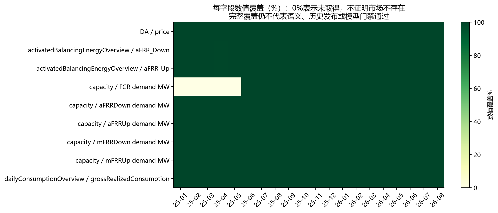

## 2. 装机与储能规模（3.3）

F：Transelectrica 2025年报PDF p64/印刷p58表14列出许可商业运行发电装机，排除试运行机组，粗分类合计有四舍五入差异。2023/2024/2025总量分别18,210/18,610/19,368MW；火电5,447/5,476/4,897，核电均1,413，水电6,643/6,633/6,688，可再生4,708/5,088/6,369MW。可再生在该表与水电分列，不能另加一次水电。原件、逐数值定位与口径见[已审年度表](../data_samples_20260930/annual_structure_samples.csv)。

I：同表可比粗分类下，2024→2025火电减少579MW、可再生增加1,281MW，总装机增加758MW；可再生份额约由27.34%升至32.88%。这不说明可再生随时可调，更不说明容量市场资格。

F：储能截面分别为2025-12-05的494MW（年报，该日不是年末）、2026-04-01的599MW/1,129.7MWh（Q1 PDF p24/印刷p22）、2026-07-01的924.43MW/1,762.50MWh（H1 PDF p24/印刷p20）。最新XLS Stocare页A5明确01.09.2026，汇总D63 Pi=1,161.488MW、E63 Pg=1,084.628MW、F63 Pc=1,085.828MW、G63 E=2,310.221MWh，54个groups。**Pg/Pc保留原名，未擅自改称净功率或可用功率。** Pi和E不是本站可用SOC，也未据Pi证明全量商业在运。

最新发电装机Sheet1为01.09.2026：Pi licenta ANRE总量20,336.18MW，P netă总量19,033.236MW；二者有不同定义。Prosumatori页日期另为01.08.2026，不能视为同日或自动加进发电总量。最新截面位于研究交付期之后、资料截点以内，不能插值为08.31实值。跨年度储能类型、抽蓄和许可/实际在运的完整可比链仍待确认。

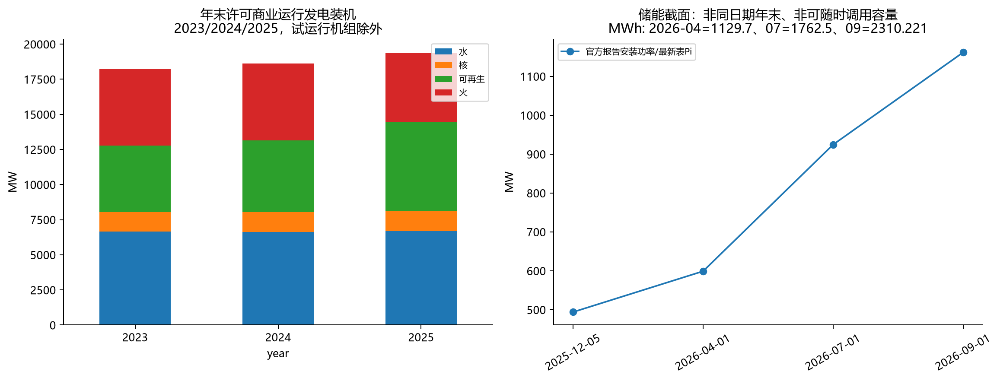

## 3. 负荷、分技术出力和交换（3.4）

I（原生数值统计）：DAMAS毛负荷在58,364个QH均有实际值。全期最大9,297.336MW发生于2026-01-21T07:15Z。月均值、已观测电量、峰谷、15分钟连续爬坡、钟点和周末样本见load系列CSV。电量按实际MW×0.25h，预测列没有代替实际列，没有缺月年化。

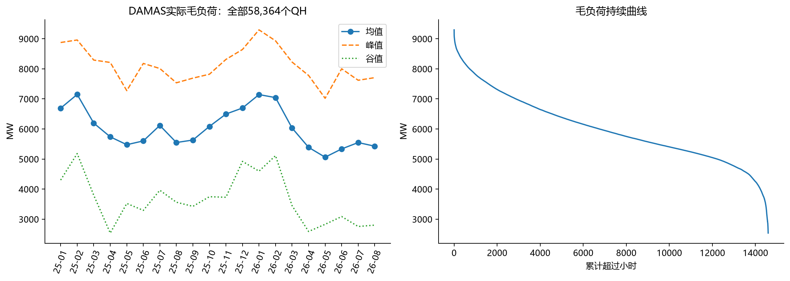

F：生产页第17项及XLS A2将数据定义为小时平均，13列表头含Consum、Productie、煤、烃类、水、核、Sold、风、光、生物质、Stocare、frecventa。MW单位采用同机构SENGrafic字段表的交叉证据，该图表为瞬时数据，未拿它代替小时档案。档案URL虽为.rar，实际签名为ZIP；XLS原件保存扩展名虽为.html，实际签名为OLE，派生登记修正格式描述，原回执字节不改。

F：2025-03-30及2026-03-29源表缺03标签、23个数字小时；2025-10-26保留03 bis、25个数字小时，日均行不是额外一小时。2026年7月文件sheet17的F1为2027-06-17，未凭文件名修正，实际缺2026-07-17。原值与排除记录见[原生SCADA](scada_native_hourly.csv)、[日期排除](scada_excluded_date_records.csv)和[时钟问题](scada_clock_issues.csv)。有111个含负技术数值的原生行；例如2025-08-02风电−3.958MW，原因待核，未裁成0。

I：[小时画像](scada_hourly_profiles.csv)逐月×原生小时标签给出MW均值、native_row_count和各字段*_valid_count（次数），均值跳过字段缺值、不补0；当前有效数均等于原生组内行数。481组保留01及03 bis等原标签，2025-10的03/03 bis分别31/1行，2025-03和2026-03的03各30行，比较均值时需同时看样本支持。

I：同表全部有效行复算Consum=Productie+Sold，以及Productie为八技术字段之和，最大浮点差约10^-12MW。它证明派生解析忠实于同表数值，**不证明完成第二来源系统平衡校验**。Sold只作为表内代数平衡字段；不称逐边界实测物理流。DAMAS毛负荷、SCADA消费和年报净消费分表保存，没有把差额压成0。A：SCADA非DST日按Bucharest、01标签对应00:00—01:00作跨源时钟映射，仍待直接定义；三个DST日和错日期日全部排除跨源相关/事件映射，保留本表独立统计，联合样本14,496小时。

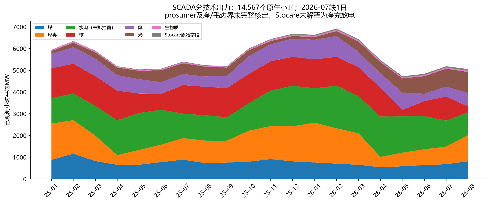

商业计划按huro/mdro/uaro/bgro/rsro进口减反向出口，保留所有原生分量，分析只使用commercial，不再叠加contractual等可能重叠分量。各月计划净进口见[边界表](commercial_exchange_monthly.csv)，这不是实际物理流或发用电差额。

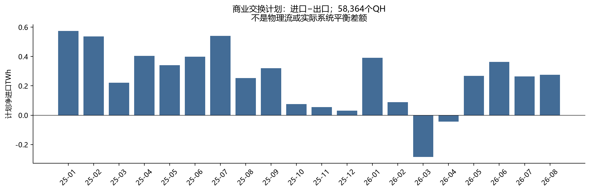

Q1/H1报告PDF p24另有逐边界物理交换**季度/半年GWh图**，只能作聚合参考，不能替代全期分时物理流/NTC/ATC。H1正文出口年份标签重复写S1 2025，图中2025/2026图例清楚，保留该源标签问题；未把正文重复年份自行改写成官方事实。逐时独立发用电平衡、抽蓄拆分、净/毛和分布式覆盖仍未完成。

## 4. 日前、日内价格与2h/4h窗口（3.5）

F：已审制度分界为2025-10-01交付转15分钟；新取原件逐日按源时钟核真实23/24/25小时及92/96/100个QH。I：目标期间时间加权DA均价112.7603EUR/MWh，负价355.75小时，零价220.75小时，极值−100.63/1,015.65EUR/MWh。每个源合同仍有native_contract_id；小时价格复制到QH仅为描述映射，不能增加交易自由度。

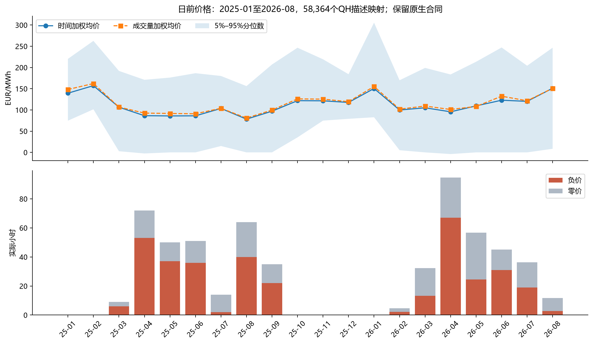
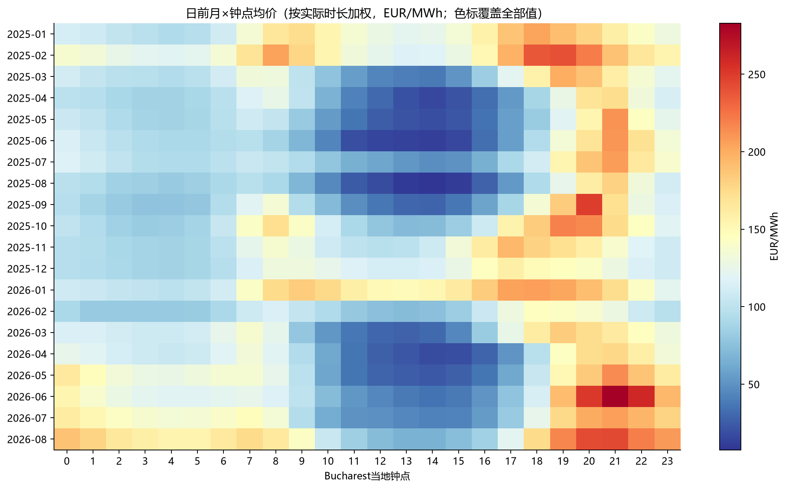

20个月原生源月成交量、量加权价及Σ价格×MW×小时，与OPCOM月报p2全部对账吻合（成交量0.1MWh显示精度、价格0.01EUR/MWh精度、金额采用登记的公开精度误差上界）。[对账表](monthly_official_reconciliation.csv)保存官方数值、差额和界限。**这是同一发布机构内部控制，不是ENTSO-E/ANRE独立同口径逐区间核验。** 月报算术均价与本报告Bucharest月、实际时长加权均价不能要求机械相等。2025-10-01日汇总成交量与原生MW×时长有差异，沿用原件异常记录，以原生量作描述，不偷偷改源汇总。

I：每目标日对8/16个连续QH的平均价分别取最高和最低，2h/4h日价格窗口极差中位数157.8956/136.6500EUR/MWh，均值160.2895/137.1431。全期重叠连续窗口另外允许跨日，见[全期窗口表](price_windows_2h_4h_full.csv)。日窗口未约束先充后放、窗口不重叠、效率、SOC、费用、退化和终端存量，**不是套利收益或设备优劣结论**。4h窗口平滑价格的统计效果不能推出2h储能更经济。

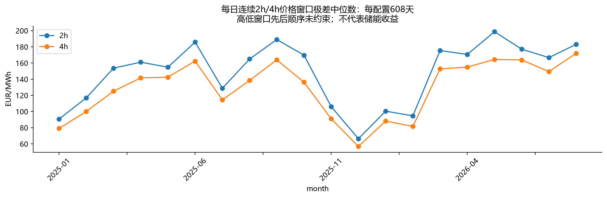

日内月报20月加权价量已提取见[intraday_monthly_aggregate.csv](intraday_monthly_aggregate.csv)。现有IDA样本仍只有2025-10-01 IDA2的46个数字价量对，其他轮日缺数字及原因未核。此次公开模板GET复核没有提供完整历史导出，不把模板“-”或显示0总量当作无成交。连续日内沿用143行局部成交样本，缺trade_time、trade_id和完整交付日期。**未完成IDA逐轮价差和连续日内全期流动性研究**，月均值没有补成交易价格。

## 5. 残余需求、价格关联与事件（3.6）

I：仅在同一SCADA行计算R=Consum−Eoliana−Foto，单位MW，名称为“SCADA表内残余需求指标”。prosumer、自用电和净/毛范围尚未完整核定，它不等于全国全部负荷减全部风光；没有把DAMAS毛负荷混入公式。水电未拆常规/抽蓄，Stocare不解释为净充放电。

在明确A时钟假设、排除四个日期后的14,496个小时，将DA四个QH按时长平均到同小时；月度Pearson相关约0.6594—0.8582。[相关表](scada_residual_price_correlations.csv)及[分箱表](scada_residual_price_bins.csv)同时记录样本数和假设。I：这组样本存在正相关形态，但季节、钟点、进口、燃料、水文及停运等未控制；不能解释成因果或识别定价机组。

另将时钟假设偏移−1/+1小时作敏感性：[时钟敏感性表](scada_residual_clock_sensitivity.csv)有60个“月×偏移”记录，对应月相关范围分别0.6085—0.7615及0.6127—0.8504，边界配对数分别记录。统计关联对时钟有变化；相关最高的映射不能反过来作为官方时间定义证明。

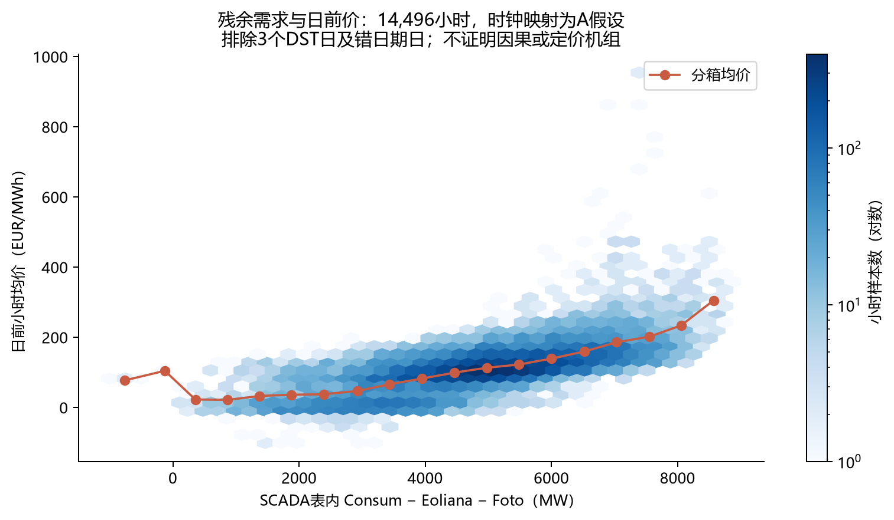

事件统一选全期首次最小/最大DA、最大毛负荷、最长连续负价、最长aFRR正激活，不按结论挑日：[事件卡](deterministic_event_cards.csv)。最低DA发生2025-05-01T12:00Z；最高发生2026-06-30T16:45Z；最长负价为2026-06-14T05:30—14:30Z，共9h。事件前后12小时及整个连续段的价、负荷、计划交换、aFRR原值另存[event_context_qh.csv](event_context_qh.csv)，不对缺值插值。官方天气、停机、燃料/水文原生解释变量及报价技术身份未齐，事件卡描述同时发生的过程，不写确定原因。

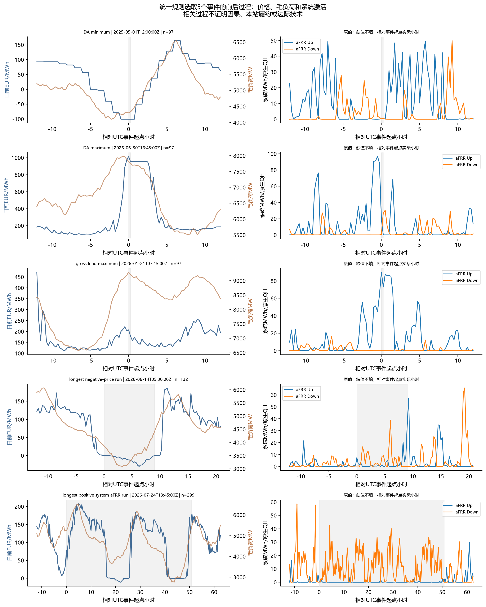

## 6. 备用容量统计及供方（3.7）

F：原生服务码分别FCR、aFRRUp、aFRRDown、mFRRUp、mFRRDown。价格字段tenderPrice、averageOfferedPrice、averageAcceptedPrice分开；source priceScheme保留，不能由统计均价替代pay-as-bid逐报价支付。I：FRR四方向各14,590个交付期内小时，FCR自2025-06-01可见10,967小时。早期FCR无记录不证明没有采购；现有事实与已审专章生效日相容，但实际历史采购链未因此关闭。

2025-10-26五产品各少一个小时；春季超出tender边界的小时保留原件、排除描述表，没有重新分配或补造。需求和满足率按字段统计，未以满足率当本站中标概率。各月需求及原始LEI统计价格见[容量月表](capacity_monthly_statistics.csv)，100个产品月组合显式保留缺记录。

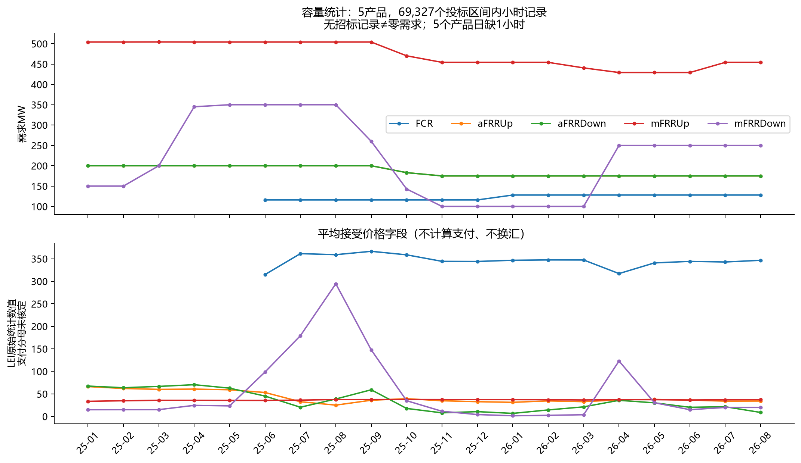

contractedPower内原始供方标签与小时功率共564,677个交付期内行。69,327个产品小时中，57,202个能以1e-6MW数值界限复算Σ供方power=需求×源满足率，其余12,125个未对齐；比例显示精度、供方范围及修订关系待核，不归因机构错误。集中度只在复算吻合的小时子样本上以ΣMW×h计算标签份额和HHI（0—10,000），见[标签份额](capacity_provider_label_shares.csv)、[标签集中度](capacity_provider_label_concentration.csv)和[逐小时复算](capacity_provider_sum_checks.csv)。未合并法人别名，未称完整竞争集中度，也未从样本推本站中标率。

DA与原始容量统计价格的UTC相关表另存；未换汇、未计算现金差额或机会成本金额。容量报价分母、MW带宽、实际合同/发票、DST修正、逐项目资格和主体历史映射继续限制支付及经济性研究。

## 7. 激活、不平衡与跨市场联系（3.8）

I：系统aFRR上/下原生字段MWh直接求和，未再乘0.25。45/46个null是缺值，不是零电量；缺值、零、正值各月分列。其他产品亦保留null，不以全表结构完整宣称它们价格/量均完整。两方向同时为正28,959个QH；系统净量为0并不能证明电池QH内SOC全过程可行。

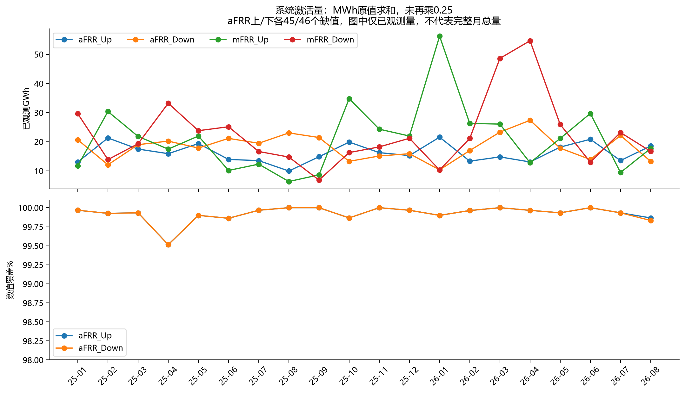

最长系统aFRR正值连续事件为2026-07-24T13:45Z至07-26T16:30Z、50.75h；缺值/零/时钟断档切断事件。这是系统正值持续，不是本站连续承担50.75h，也不能由此判定2h或4h设备不可履约。能量恢复、可交易窗口、备用义务之间的关系须在已审规则、资源分配和策略阶段检验；本轮不求解SOC或收益。

F：正式结算栏目本次可以读取，Anexa2四份样本均解析2,976个QH，表头是系统平衡成本、收入、网络限制成本及有效成本，单位**lei金额**，没有缺额/余量LEI/MWh价格列。页面“Data finalizării”和附件Data是完成/记录日期，未当作公开发布时间。目录有47条相关版本入口及一条月标签/URL月份冲突，见[版本目录](../../../project/romania_full_period_20261001/settlement_version_catalog.json)。因此DS01仍未关闭，未用成本除系统量造偏差价。

I：2025年1月VM→VMA有效成本700个区间变化、合计−497,220.71lei；VM→2026年1月更正版本2,967个区间变化、合计−719,748.17lei。见[修订演示](settlement_revision_demonstration.csv)。它证实取得日最新成本快照与早期版本不同，但不提供偏差价格、更不恢复决策时发布序列。2026年8月只取得VM成本样本，不称最终偏差结算齐全。

## 8. 面向模型的用途结论（3.9）

详见[D01—D19用途及缺口](stage_completion_and_gaps.md)。日前、毛负荷、商业计划具备全目标描述性分析基础，SCADA和容量/激活分别带日期、单位、范围和覆盖限制；这些是后续候选输入资料，不是模型批准。纯DA事后基准仍须完成历史规则/费用/工程参数及模型阶段审核；DA+IDA缺逐轮完整价格；联合备用/激活缺现金单位、最终偏差、资格及履约映射；现实信息策略缺历史发布vintage。

BNR公共专用XML服务器已取得413个RON/EUR参考值。2025/2026根命名空间分别http/https，解析兼容并校验，不静默丢2026年；非银行日没有新数值就留空。官方说明参考汇率不强制用于实际交易或账务，所以DS10只补上序列获取，使用日/结算规则仍待确认。

A：通用储能继续P参数及名义2h/4h；不继承西班牙效率、SOC、退化、费用或项目资格。本文全部分析为事后描述，不称真实可执行策略。F/I/A/U的字段级边界见数据字典；规则U01—U12与原DS01—DS12均保留，只记录子缺口进展。

## 9. 验证、审核与退出条件

自动检查：核心216,167项哈希、逐日合同/区间、分页和转换检查全部通过；补充994项原件/旧交付/冻结基线保持、20个月控制对账、BNR双年度解析、SCADA原生标签/负值、2h/4h共同样本等检查全部通过。计数包含逐行/逐字段检查，不是独立市场规则数量。12张PNG/SVG以及6页官方PDF渲染已目视核对。记录见[核心验证](verification.json)、[补充验证](supplement_verification.json)和[视觉核对](../../../project/romania_full_period_20261001/visual_validation.md)。源异常与未确认语义另列，不会因自动PASS消失。

第一轮Astra high给出记录范围PASS_WITH_RESTRICTIONS，P0=0/P1=0/P2=2：[原审核意见](review_round1.md)。两项P2为SCADA定位标签丢前导零及小时画像缺分组数。现已从原件恢复三表标签、固定字符串读取回写，并补481组行数及5,772个逐字段有效计数；23项定点检查全部通过，直接回查14,567条原生行、14,496条联合行及111条负值行，数值没有实质变化（最大浮点差约4.55×10^-13），已有均值一致。见[定点验证](p2_repair_verification.json)及[修复记录](../../../project/romania_full_period_20261001/review_repairs.md)。第二轮独立复审关闭两项P2，最终P0/P1/P2=0/0/0，结论PASS_WITH_RESTRICTIONS；[最终审核](review_final.md)、[主线程限定验收](acceptance.md)和[验收检查](acceptance_checks.json)已保存。

**可接受对象为本次数据研究记录及明确限制的描述分析；完整第三步退出条件保持false。** 未完整IDA/IDCT、最终偏差单价、容量现金单位、全历史发布/独立核验、基本面精确边界和工程参数等关键输入前，不自动启动策略、MILP、实现或收益测算。
