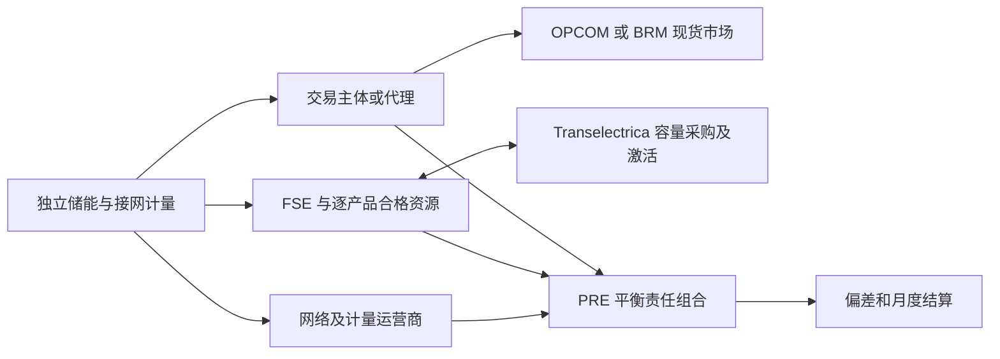

# 罗马尼亚独立储能研究报告：步骤 1 官方规则

研究日期及资料截点：2026-09-30。历史研究期：2025-01-01—2026-08-31。对象：通用独立电化学储能，功率 P 保留参数，名义能量/功率比比较 2h 和 4h。

本报告由主线程编制，覆盖冻结工作明细 1.1—1.8。状态：**gpt-6-astra/high最终复核PASS_WITH_RESTRICTIONS，主线程限定验收；审核未关闭P0/P1/P2均为0**。该结论只批准本轮规则研究记录，不表示全部工作退出条件已满足。它是完整国家研究报告的规则部分；数据可得性、历史价格分析、交易策略、MILP、实际项目准入和收益结论尚未完成，也未获建模批准。

证据附件：[来源目录](rules_20260930/sources.csv)、[规则登记](rules_20260930/rule_register.csv)、[历史时间线](rules_20260930/historical_rule_timeline.md)、[结算算例](rules_20260930/settlement_examples.md)、[未决事项](rules_20260930/open_questions.md)。来源编号 E## 对应原件和获取记录；页面位置均优先指 PDF 文件页，不与公报印刷页混用。

## 1. 结论和证据边界

罗马尼亚为独立储能设置了许可、并网及平衡服务参与路径。可研究的收入分别来自现货交易、备用容量和被激活的平衡能量；剩余偏差另行结算。实际进入每个收入入口，仍取决于对应主体注册、资源认证、可用能力和合同。没有具体项目时，不能写成“2h/4h 储能已经可以参加全部市场”。

目前最影响后续模型的六项规则是：

| 规则事实 F | 研究解释 I | 历史适用限制 |
|---|---|---|
| 日前交付自 2025-10-01 改为 15 分钟粒度，交易启动日为 2025-09-30 | 之前的小时合同应保留为一笔合同，对应四个物理 QH；之后不能再以小时平均价替代成交价 | RO-R010；E37 公告、E58 p1 实际运行确认 |
| 备用容量按接受的报价支付，平衡能量另有激活和定价 | 容量统计均价不能直接当成本站中标价；不能套用西班牙支付规则 | RO-R020—021；E15 p1 修订 BSP art.161—162、213—214 |
| FCR 容量专章自 2025-06-01 适用 | 2025 年前五个月不能直接套用该专章作为已确认历史机制 | RO-R004；E15 p1 修改 Order127 art.7(4) |
| aFRR 完全激活时限由 7.5 分钟变为 5 分钟，分界为 2025-12-18 | 时限变化与是否实际接入 PICASSO 是两件事 | RO-R025；E14 p9、E46 art.62 表5 |
| 最终偏差价格存在条件性单价及双价分支 | 不能把“估算单价”作为所有时段的最终结算价 | RO-R032；E17 p2—3 修改 BRP art.195 |
| 储存后返送电网的合格电量有指定费用减免；损耗及其他费用仍须核算 | 不应给充电电量简单设置所有网络费和税费为零 | RO-R035—036；E23 art.3—5，E50 §5.2.1.1 |

历史版本链已确认主要变化点，但并未逐条闭合 20 个月内全部运行程序。容量报价/结算单位、实际招标块和关门时刻、2025 年初旧许可版本、早期 FCR 采购、跨区关门调整及项目费用等继续保留 U 项。已确认规则可以进入下一步数据字段核验；上述缺口禁止被静默填成模型常数。

## 2. 研究方法与三层标识

**F（规则事实）**只指官方正式文件直接支持的内容，规则表记录机构、标题、公布/适用日期、URL、条款位置及访问日期。**I（研究解释）**说明经济或流程含义，不增添法律要求。**A（建模假设）**为以后考虑采用的简化，本阶段不写入模型。**U（待确认）**说明证据缺口以及由此禁用的结论。

本次保存的是法规、程序、实施公告和用于确认制度事件的官方报告。E58 周报只用于确认 15 分钟制度实际运行，未展开时序数据样本研究。原件按获取日和来源编号保存，附 SHA256；提取文本及 OCR 是辅助检索材料。E14 与 E54 的 ANRE PDF 字节相同，却包含不同年代的条文，**不是一份可靠的“纯 2021 原始版”或“全条款最新合并版”**：其旧容量支付条款须由 E15 修订覆盖，不能直接照抄。

E33 是旧式二进制 Word 合同，当前自动提取不可信，未作为关键事实依据。政府法规门户部分文件未能直接下载，网页核对结果作为派生记录保存，来源目录明确区分网页核对与本地原件。无法确认的发布日期保留“未标明”，不以下载日代替。

## 3. 机构、主体与独立储能准入

### 3.1 谁交易、谁调度、谁承担偏差

| 机构或角色 | 已确认职责 F | 对独立储能研究的含义 I |
|---|---|---|
| ANRE | 制定监管、许可、并网及市场规则 | 资产商业许可、市场注册和产品认证分别核对 |
| Transelectrica（OTS/TSO） | 运行系统，组织 PE 平衡市场，采购备用并下达调度；办理 FSE、PRE 登记 | 容量承诺和激活指令须追溯到 TSO，不由现货交易所决定 |
| OPCOM（OPEED/NEMO） | 组织日前 PZU、日内拍卖 IDA、连续日内 IDCT，作为相应交易的对手方并组织收付款 | 本报告详细交易卡以 OPCOM 正式程序为依据 |
| BRM（另一 NEMO） | ANRE Dec.1739/2023 指定；其耦合日前自 2024-11-19、连续日内自 2024-05-22、IDA 自 2025-08-05 运行 | 罗马尼亚并非只有 OPCOM；BRM 的费率、担保、注册和交易细节需另查，不能继承 OPCOM 程序 |
| FSE/BSP | 经登记，以合格 UFR/GFR 提供平衡服务 | 法人登记与资源的逐产品资格均需成立 |
| PRE/BRP | 承担其组合的计划、计量差额及财务偏差责任 | 单站偏差不是自动等于所属 PRE 的净偏差 |
| 网络/计量运营商 | 接网、计量、数据确认及指定费用减免执行 | 可出口功率与可进口功率需分别取得，计量边界决定账本 |

依据：E38/E39 官方登记说明；E56《2025 年 12 月电力监测》p4 及现货章节；E26 §7.1.7—10、§8.1.5。主体/资源名册属于动态快照，本阶段未统计市场参与者或合格 BESS 数量。

图为 I 流程解释，不代表必须采用代理，也不表示同一法人不能兼任多角色。跨 PRE 的聚合资源还需要电量转移和合同安排（BRP art.148—149）。

### 3.2 准入顺序与阈值

F：2025 年许可条例由 Order6/2025 批准，公布于 2025-03-26；条例 art.6 对最大出口功率 **大于 1MW** 的相关建设设置设立授权要求。art.7 的授权例外不能与商业许可例外混为一谈。art.10(1)(i) 列出独立储能的商业运营许可；art.10(3)(b) 对总功率 **小于 1MW** 的设施规定商业许可例外。恰好 1MW 不能按“小于 1MW”处理。E19 art.6—7、10；E48 批准令。

F：Order3/2023 建立储能接网技术要求；Order89/2021 是系统服务技术认证依据之一。2026-04-07 公布的 TEL07.51 是储能 FCR 认证的正式专项程序，2025-12-22 咨询公告不是同等效力的正式规则。E22、E30、E34、E42—43。FCR采购程序另要求供方在PE登记为PRE、具有EIC代码并进入FCR投标名册；不能把普通代理安排直接当成已经满足该FCR主体条件（E66“Participanţii la licitaţie”及登记章节）。

| 顺序 | 要取得或核实的事项 | 本阶段结论 |
|---|---|---|
| 1 | 资产许可、建设授权及适用例外 | 2025-03-26 后主要条款已核；2025 年初旧版保留 U01 |
| 2 | 接网技术意见 ATR、接网合同、符合性与计量 | 已确认存在独立要求；具体进口/出口上限与接网日期未知 U02 |
| 3 | 正式运行、PRE 登记或合法转移责任 | 已确认责任路径；试运行不能按正常商业运行处理 |
| 4 | NEMO 注册、交易协议、银行账户与担保 | OPCOM 当前程序已取得；历史修订和 BRM 专项程序 U04/U11 |
| 5 | FSE 注册及 UFR/GFR 按产品资格 | FCR、aFRR、mFRR、RR 逐项取得，不能用一次接网测试代替 |
| 6 | 容量采购协议、报价、调度/遥测及支付接口 | 实际招标与履约记录须在后续核验 U05—U07 |

F：2025-12-18 的 Order80/2025 修改试运行规则并废止许可条例部分旧试运行条款：临时 PRE、测试安排及 PE 报价限制单独适用。BRP art.140 的正价支付 min(PZU,400 RON/MWh) 是**测试期间送出电量**规定，不能解释为正常独立储能的一般售价上限。既有场址新增设备有 art.142¹ 特别安排，通用新建独立项目不能自动套用该例外。E51 p1—2。

I：Order26/2025、Order16/2026 进一步修改许可材料、时限和担保等要求。E21 新 art.19¹ 包含 30 EUR/kW 建设担保文字，但按发电技术/设立授权描述；独立储能的实际适用、过渡条款及已建设项目处理未闭合 U02，暂不作为运营收益的逐 MWh 成本。

### 3.3 2h 与 4h 的产品资格比较

| 产品 | 已核实的核心要求 F | 2h/4h 的研究解释 I |
|---|---|---|
| FCR / RSF | 对称容量；2026 储能程序 §8.11(b) 认证值为每方向 1—20MW 整数，对应总带宽 2—40MW；§8.18 要求不晚于 2秒开始、15秒至少50%、30秒100%响应（对应频差条件） | 20MW 是该认证程序中的每方向认证值，不是储能电站装机总上限；须同时核实基点、SOC 与充放电两方向余量 |
| FCR 储能持续能力 | 专项程序的测试及预留SOC涉及30分钟；§8.18清单另有至少15分钟要求；容量采购程序对有限能量资源明确维持30分钟 | 不能压缩成“只要15分钟”；名义2h/4h不证明通过全部试验或全天可报 |
| aFRR / RRFa | 自动激活；至少1MW、步长1MW；15分钟报价有效期；完全激活7.5→5分钟 | 可用功率、自动控制和能量恢复均须认证；总容量不是无条件全天可报容量 |
| mFRR / RRFm | 手动、计划或直接激活；完全激活12.5分钟；最少1MW、步长1MW；表3满请求量最短交付5分钟；直接激活可跨下一ID | 不能把实际激活电量固定成“中标MW×一个QH”，需核实激活形状与跨期 |
| RR / RI | 完全激活30分钟，至少1MW；产品交付参数15—30分钟 | 本地产品存在不代表储能已有该产品资格或已经连接TERRE |

依据：E14 art.56—63（p8—9）；E46 相同条款核对；E43 §8.10—11（p11—12）、§8.18（p15）；E66“Contractarea şi derularea contractelor”持续能力段。产品响应要求不能用西班牙认证参数替换。程序中的 SOC 告警值也不直接构成通用储能 10%—90% 运行边界。

## 4. 日前和两类日内交易

以下时刻采用文件所称 CET 市场时钟，随欧洲夏令时变换；转换到罗马尼亚民用时间通常加一小时，不能全年按 UTC+1 解释。分析索引采用 UTC，展示和日界采用 Europe/Bucharest；交易日、民用日及交付区间分别保存。

| 市场 | 交易对象、单位和机制 F | 正常关门或窗口 F | 版本及限制 |
|---|---|---|---|
| 日前 PZU / DAM | 耦合拍卖；Rev7允许15/30/60分钟报价分辨率，交付出清15分钟；最小0.1MW；本地报价/收付款RON，耦合EUR价格按规定转换 | D-1 12:00市场时钟，即罗马尼亚13:00；异常/解耦另行公告 | E24 §6.2、§6.3.44 p22；QH仅自2025-10-01交付适用。之前小时市场；完整旧订单卡 U04 |
| IDA1 | 15分钟拍卖；隐式容量与能量耦合 | D-1 15:00，覆盖D全天 | E26 §8.1.1 p26；正常96QH，DST按实际时段 |
| IDA2 | 同上 | D-1 22:00，覆盖D全天 | 同上 |
| IDA3 | 同上 | D 10:00，覆盖市场时钟12:00—24:00 | 同上；不是罗马尼亚民用日12:00开始 |
| IDCT / IDC | 匿名连续匹配；15及60分钟合同；订单价格EUR、两位小数；数量MW、一位小数、最小0.1MW；现金收付款RON | 2024 Rev5 §7.1.4：D-1 15:00开放，交付前1小时关闭 | E26 p17、§7.3、§7.5 p21；2025—2026期间本地及逐边界关门修订 U04，不能将欧洲跨区30分钟要求直接改成所有OPCOM订单规则 |

E24 规定本地报价验证、冻结后不得修改、块报价及解耦/取消流程。E26 包含限价、市价/条件订单、块订单及订单状态，并按价格和时间优先匹配（§7.4—7.8）。价格边界是随程序、耦合决议变化的规则：Rev5 的 IDCT ±9999 EUR/MWh 等数值仅作为该版本文字记录，不冻结为全期常数。

F：OPCOM IDA 于 2024-06-13 商业启动，最初罗马尼亚以孤立拍卖方式运行；2025-03-18 是罗马尼亚边界整合变化；2025-08-05 是多 NEMO IDA 项目启动。三者不能合并成“罗马尼亚2025年8月才开始IDA”。E57 p10、p16—17及日内专题；确切交易/交付事件另见版本时间线。

I：日前、IDA、IDC 的交易分别形成增量买卖和有效计划。反向交易改变净合约头寸，但不会消除已经发生的购售现金。小时成交量转为 QH 执行量属于合同与交付映射，不能制造四笔独立、可以事后分别调整的小时合同。

F：E27（2025-09-30 Rev0）将 PZU/IDCT/IDA 收付款放在统一程序中，中央账户、支付授权、负价交易及月度调整仍区分市场。E28 当前担保程序日期为 2026-07-31，E29 是当前注册包；这些文件不能证明2025年初相同版本已适用。担保余额是流动资金/可报价约束，不直接等于支出；担保费用、交易费、VAT 和融资成本另记。

## 5. 备用容量采购与履约

F：BSP 规章第VII章采购 RR/aFRR/mFRR 平衡容量，第IX章采购 FCR。Order18/2024 修改 art.161—162、213—214：平衡容量按价格升序、同价按时间排序，最后一笔允许部分接受；FCR 最后一笔必须整体接受，可能超额采购。两类均按接受的报价支付。E15 p1。不能使用 E14 旧条文中的统一边际容量价。

| 项目 | 已确认 F | 必须保留的限制 U |
|---|---|---|
| 平衡容量数量 | art.150表7最小及步长1MW；上/下方向分别组织 | 实际产品块、报价文件字段和启用情况 U05 |
| 产品时长 | art.152 列出15分钟、1h、4h、一天等采购菜单 | 法律菜单不证明历史每一天均使用4h块 |
| 招标频率 | art.153 日采购，合同最长一天；公告确定采购时段 | 不设全期统一关门时刻、结果时刻或固定6个块 |
| 容量价格单位 | FCR采购E66明确每方向MW及lei/hMW；FRR/RR采购E67 §8.5.3仍写lei/MWh，与E14表7一致；E15过渡费率写lei/hMW | FCR报价字段已有直接证据；FRR/RR运行字段、时長、可用性与发票换算仍须U06闭合。不把MW当MWh，也不对未知字段任意乘0.25或除4 |
| 能量报价义务 | art.165 中标容量须提供对应能量报价；art.39允许符合要求的无容量合同能量报价 | 后者不表示无需资格、无需可用能力 |
| 可用性、确认和支付 | art.167、173 按实际可用容量确认及月度汇总；art.177 对不可用容量（包括未提交规定能量报价）设合同价100%惩罚 | 该比例对应条文的不可用容量处罚，不能扩展成任何响应误差的通用罚率 |
| 转让 | art.182—186 有资格、系统安全与通知条件 | 不能视为关门后任意撤销承诺 |
| FCR 数量 | art.202对称；art.204每方向至少1MW；E66报价量为每方向R、价格lei/hMW，整体带宽2R | 不把2R带宽代替报价量使收入翻倍；历史合同/发票和可用性计费仍核U06 |

补充取证：E66为TEL04.01 Ed.I Rev1，封面“2024年11月”，档案文件名含“2024-10-09”；E67为TEL04.05 Ed.I Rev2。官方档案均为RAR，已保留原字节并解出可读DOCX/PDF及成员哈希。程序要求公告载明开关门和结果发布时刻，未提供一组可直接冻结为20个月所有场次通用的时刻。E66的有限能量资源持续30分钟也不证明2025年初适用同一采购程序；历史部署仍为U05。

I：容量费购买的是可用备用能力，激活费购买的是调度形成的能量。重复出售同一功率、容量中标后缺能量报价、或能量耗尽但仍记全部容量收入，都可能错误。多产品并行应依据认证、接网及实际条款验证，不能仅靠三个收益项相加。

## 6. 激活、定价与欧洲平台

F：本地报价关门在 RR 为交付前50分钟，aFRR/mFRR 为前25分钟，见 E31 PO138 §8.4、BSP art.42/69。这不是现货关门时刻；容量投标时刻也不是激活能量关门时刻。

F：BSP art.64—65 规定方向报价优先顺序及本地/欧洲模式。E32 PO240 分别描述本地 RR、mFRR 计划/直接、aFRR 选择流程；本地未接入模式仍存在。标准平衡能量支付按照各产品承诺交易量及适用边际价格计算（art.90—93）；拥塞管理或其他补偿交易必须单列，不能一律算标准激活。

F：本地 PE 价格使用 RON/MWh、欧洲平台使用 EUR/MWh，见 art.61表4、63表6；产品静态价格步长表出现 EUR 不代表所有本地历史现金均以 EUR 结算。上调正价：TSO向BSP付款；上调负价：BSP付款；下调正价：BSP付款；下调负价：TSO付款。见 E14 art.91—93。

I：上调是相对基点增加净注入，下调是减少净注入；对储能可涉及增加放电、减少充电等物理路径，实际可申报组合由资源认证和运行边界决定。系统总激活量不提供“本站收到多少指令”的确定分配，后续不能按本站容量占比直接当成真实历史指令。

| 平台 | 官方证据 F | 可采用的解释 I / 未决 U |
|---|---|---|
| PICASSO（aFRR能量） | 2026-02-26路线图未列Transelectrica为已接入，脚注计划2027年4月 | 参与建设项目≠操作接入。该时间是计划；全历史实际接入/中断须进一步事件证明 U08 |
| MARI（mFRR能量） | 2026-02-26路线图的罗马尼亚新目标为2026年11月，旧目标为2026Q2 | 不能用旧预计日期作2026Q2实际投产日。截止本次检索未找到罗马尼亚实际go-live公告 U08 |
| TERRE（RR能量） | 本地RI规则与未来平台安排分离（art.66） | 不能从法规描述推出已加入TERRE；实际状态 U08 |

依据 E35/E36 p2、E40/E41 历史路线图、E10/E11 官方平台页。路线图不作为法律生效或投产证明；在事件链闭合前仅支持研究本地机制，不足以为全期模型签发“始终本地”的历史配置。

## 7. 电量桥接、偏差与收付款

F：BRP art.147—153 将现货交易、PE 承诺交易、FCR 按规定计算的激活电量及有关转移纳入净合约头寸；art.158 定义净计量，art.167 按 PRE 和 ID 计算“净计量减净合约”。PE 承诺量与实际响应量不能混为同一字段。容量中标量不是该公式中的 MWh。依据 E52 当前门户条文，并与 E14 附件2基础条款及BSP art.237—238对照；后续仍须核全历史版本。

I：采用“售电/净注入为正”的说明约定，简单单 PRE 算例可写：净合约 = 日前净售 + 日内净售 + PE 上调承诺 − PE 下调承诺 + FCR/其他规定调整；偏差 = 净计量 − 净合约。跨 PRE 转移须再记 SB，不可同时计入两边。此式用于解释，不替代多主体正式通知与计量规则。

F：Order9/2025 有分段适用：BRP art.189 初始价和 art.195 最终价修改自 **2025-04-01** 适用，art.187 估算单价修改自 **2025-05-01** 适用。起效依据为E17 **art.IV，PDF p4／公报p15**。art.195 单价分支有同时满足的系统电量条件，另有双价分支和价格限界。其阈值涉及0.1%、0.5%及4倍关系，应保留正式公式与单位；在字段核验前不自行重建全国价格。公式正文位于E17 PDF p2—3。

U03：Order9 **art.V（PDF p4／公报p15）**对art.I(2)修改BRP art.171另有与Order124/2022特定条款实施相联系的条件；Order14/2025 延迟这些条款。门户合并显示与修订令附带实施条件不能混作同一时间证明。本阶段不把最新 art.171 公式用于2025全期，完整分段确认待继续。

| 现金科目 | 电量/能力基础 | 核验要求 |
|---|---|---|
| 日前、IDA、IDC | 逐笔成交量及价格 | 本地币种、汇率规则、合同粒度及正负价格 |
| 备用容量 | 合同与确认可用能力 | 价格单位、计费长度、方向/带宽及不可用罚款 |
| 标准激活能量 | 承诺交易量及产品结算价格 | 与实测履约区分；同一激活不能再当未调整偏差 |
| PRE 偏差 | PRE净计量−净合约 | 最终单价/双价、VM/VMA版本及组合归属 |
| 月度中性化及调整 | BRP规则规定的月度分配基础 | art.221—227 等附加收入/成本不能默认为零 |
| 市场、网络、代理和税费 | 合同、计量及适用费率 | 分固定费、逐电量费、担保费用及可回收税款 |

I：当 PE 承诺上调0.5MWh但实际未完成全部响应时，剩余差额仍进入有效计划对实测的偏差或相应履约处理；不能先把激活承诺收入保留，再取消同笔偏差。FCR 能量按BSP art.237计算、art.238进入PRE净合约；这两条不提供独立激活能量支付价格，不能直接套FRR边际价或自行增加一笔FCR能量现金收入，具体合同与现金处理保留U07。FCR容量罚则另在art.239—240，不与能量价混用。

六类数字算例见附件，覆盖无激活、上调、下调、双向、响应不足、负价；所有数字均标 A，验证符号和账本，不是市场收益预测。结算改版后才能发布最终价格，VM/VMA 和更正公告须保存发布时间；最终价格可以作为事后结算输入，不能假装在报价时已知。

## 8. 网络费用、贡献和减免

F：OUG134/2024（2024-11-26公布）修改 Law123/2012 art.66³，列出储能取电输电成分 TL、配电、购买系统服务费，以及绿证和热电联产贡献减免。ANRE Order56/2025（2025-07-10公布）对储存并随后返送电网的电量制定指定网络费减免方法，其他适用费用继续有效。E65 art.I/66³；E23 art.3—5。

F：网络运营商实施、计量及申报有要求。E50 的配电运营程序 §5.2.1.1（p6—7）对独立储能按月考虑提取电量Eex和返送电量Ei（本报告算例记作Ein），以Eex−Ei作为相关费用计算基础。其p9“Facturarea energiei stocate”及p10 §5.3.1表3明确允许期末存量在以后月份返送后调整，产生负计费电量；例示上月100−80=20，本月0−18=−18，两月合计100−98=2。缺少必要计量或资料可能使减免无法正常确认。该程序是DSO执行证据，不能替代全体网络运营商的每份项目合同，也不能从网址目录“2025”推定其精确生效日。

I：月度损耗与辅助负荷、计量边界、跨月SOC变化都影响可减免量。不能按每个QH独立把充电网络费全部删除，也不能把月度差额直接与逐时套利毛利混算。该DSO程序中的负计费电量有明确结转含义，不得按max(0,Eex−Ei)裁剪；它并不证明含固定费、其他费用和税项的整张账单必为负数。具体网络方历史采用、费率变化和项目特殊情况继续保留U09。

| 费用 | 本阶段处理 |
|---|---|
| TL、系统服务、配电 | 指定合格返送量按法定及运营方法减免；剩余量和费率另核 |
| TG 注入输电成分 | Order56 的列举不能证明其全面豁免，保留适用性 U09 |
| 绿证、热电联产贡献 | 上位法列明减免；实际计量、账单和实施方法核对，不能与网络方法混为同一程序 |
| CfD 贡献、消费税、VAT | 储能个别适用与回收处理尚待确认 U09；未设为零 |
| NEMO交易费、BRP/BSP/聚合/银行/通信费 | 商业条款及历史费率 U09/U11；按市场和主体分别取得 |
| 设立、接网、交易担保 | 资金占用、收费和没收风险分别记账；不作为同一种现金支出 |

历史收费在2025年7月方法出台之前还受2024年上位法及实际计量/合同约束，不能推定2025年1—7月一律全额收费，也不能推定所有账单已自动享受减免。

## 9. 2026 年补充规则与未决事项

已登记 Order15/2026 的接网文本修改（E62）、Order16/2026 的许可修订（E21）、Order54/2026 的可调度消费灵活性机制（E60）及 Order55/2026 的 NEMO 指定修订（E59）。E63/E64 的接网容量分配文件取得了扫描原件，但全文及过渡适用尚未闭合，保留 U02。

F：Order54/2026 附件 art.1 明确针对日前市场的可调度消费、聚合商和供应商；合格终端消费计量有要求，并排除已作为平衡服务提供者参加相应市场的终端客户。该危机触发机制不能直接加成通用独立储能日常收益，也不能覆盖整个研究期。2027 年才适用的部分拥塞/电压采购规则不回填2025—2026。

本轮最优先继续核实的事项是 U01—U06：早期许可与 FCR 规则、程序历史版本、招标事件和容量现金单位；U08—U11 为平台实际事件、费用、主体资源及 BRM 专项程序。详细清单记录所缺文件、影响和关闭标准；这是一份有限范围的规则研究交付，不是全历史规则无缺口认证。

## 10. 后续交接和验收

可交接至步骤2的工作：优先验证 OPCOM 日前小时/QH样本、日内成交口径，Transelectrica 各产品容量/激活/偏差版本、最终单价/双价字段及月度费用字段。先确认单位、时区、发布日期及历史有效期，再决定全期下载。需要的原件类型已在未决表对应到既有数据清单，未据此开始批量时序下载。

候选假设 A01：只研究已正式运行且取得对应资格的虚拟独立储能；A02：P为参数，E=2P或4P，其他SOC、效率、衰减不继承西班牙数值；A03：在解释算例里使用单独 PRE、统一 RON 和假设价格；A04：数据缺口时禁用相关收入，不造真实可执行利润；A05：未来如做完美信息优化，标为事后理论上限。以上等待后续策略及数学阶段独立审批。

本阶段验证包括：冻结基线哈希、规则原件哈希、来源与规则编号引用、日期/位置字段、数值算例和关键扫描页面原图核对。审核及主线程验收记录在 [阶段验收](rules_20260930/acceptance.md) 更新。国家总体仍保持 researching；modeling_approved、implementation_approved 均为 false。
