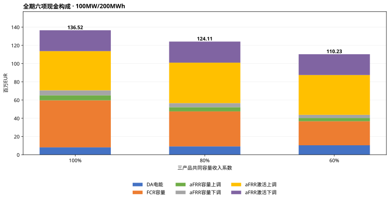
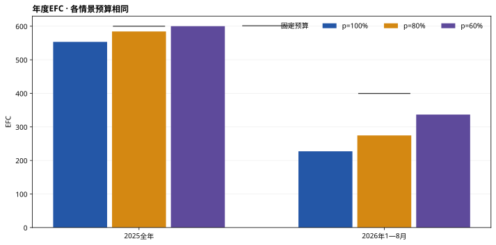
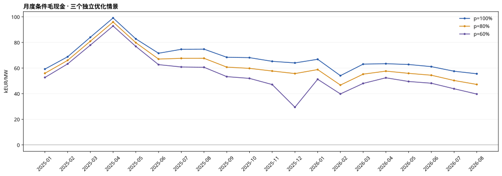
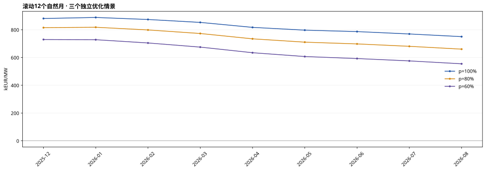
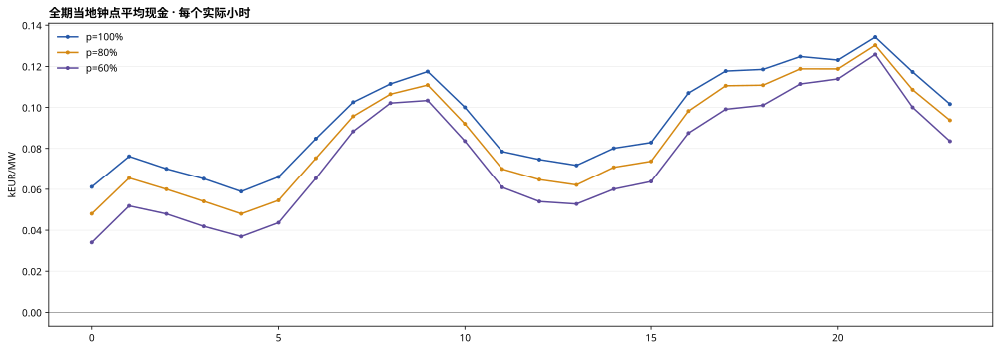

# 罗马尼亚100MW/200MWh：容量收入系数100% / 80% / 60%敏感性

正式期2025-01-01至2026-08-31，共608个Bucharest当地日。三个情景均按同一数值求解修复后的代码从头独立优化，各完成608窗/58,364QH。此前100%和80%完成结果保留并核对，不混用不同版本生成最终比较。

**p含义：** 同时作用于aFRR上调容量、下调容量和FCR容量三项现金，是外生研究系数，不是实测中标率。不直接折减DA或激活现金，也不削减备用功率、SOC缓冲及激活义务。它不是“总收益乘80%或60%”。

## 三情景汇总

| 容量系数 | 全期现金（百万EUR） | kEUR/MW | 较100%变化 | 全期EFC | 最新12月kEUR/MW |
|---|---|---|---|---|---|
| 100% | 136.52 | 1,365.23 | 0.00% | 780.54 | 750.22 |
| 80% | 124.11 | 1,241.14 | -9.09% | 858.85 | 660.12 |
| 60% | 110.23 | 1,102.26 | -19.26% | 936.74 | 554.53 |

最新完整12个月均为2025-09至2026-08；2026自然年列仅含1—8月，不年化。所有现金均为EUR条件毛现金，未扣投资、运维、税费等成本。

## 自然年现金与EFC

| 情景 | 期间 | 现金（百万EUR） | kEUR/MW | EFC | 预算使用率 |
|---|---|---|---|---|---|
| p100 | 2025全年 | 88.08 | 880.85 | 553.26 | 92.21% |
| p100 | 2026年1—8月 | 48.44 | 484.39 | 227.28 | 56.90% |
| p80 | 2025全年 | 81.49 | 814.93 | 584.36 | 97.39% |
| p80 | 2026年1—8月 | 42.62 | 426.21 | 274.49 | 68.72% |
| p60 | 2025全年 | 72.95 | 729.54 | 600.00 | 100.00% |
| p60 | 2026年1—8月 | 37.27 | 372.71 | 336.74 | 84.30% |

## 六项市场现金

| 市场 | 100%（百万EUR） | 80%（百万EUR） | 60%（百万EUR） |
|---|---|---|---|
| DA电能 | 8.08 | 9.14 | 10.35 |
| FCR容量 | 51.59 | 38.39 | 26.37 |
| aFRR容量上调 | 5.53 | 4.59 | 3.57 |
| aFRR容量下调 | 5.45 | 4.47 | 3.45 |
| aFRR激活上调 | 42.99 | 44.40 | 43.69 |
| aFRR激活下调 | 22.89 | 23.13 | 22.80 |

负现金与原价格符号保留；容量项减价后，最优预留与DA/aFRR激活电量可以变化，故激活现金也可能改变。

## 调度与敏感性解释

| 指标 | 100% | 80% | 60% |
|---|---|---|---|
| DA平均净MW | -1.01 | -1.03 | -1.01 |
| FCR平均预留MW | 52.06 | 48.39 | 44.29 |
| aFRR上调平均预留MW | 38.13 | 40.39 | 42.48 |
| aFRR下调平均预留MW | 37.15 | 39.40 | 41.72 |
| aFRR上调激活MWh | 81,980.45 | 87,311.70 | 89,726.33 |
| aFRR下调激活MWh | 90,736.82 | 98,039.53 | 103,116.01 |

平均MW分母为全部正式QH，包含首日零承诺和源失效禁用订单；不是仅参与时段的平均值。容量均值不能相加作为电站容量分配比例。

为区分价格系数与重新调度的影响，另计算固定100%轨迹只调整三项容量现金的算术参照；这不是另一个MILP运行，不替代上表独立重优化主结果。

| 情景 | 固定100%轨迹重计价（百万EUR） | 实际重优化（百万EUR） | 差额（百万EUR） |
|---|---|---|---|
| p100 | 136.52 | 136.52 | 0.00 |
| p80 | 124.01 | 124.11 | 0.10 |
| p60 | 111.50 | 110.23 | -1.27 |

上述差额包含调度变化和两日滚动路径效应，不宣称是全时域优化增益，也不保证在所有其他情景中非负。

## 月度现金

| 月份 | 100% kEUR/MW | 80% kEUR/MW | 60% kEUR/MW |
|---|---|---|---|
| 2025-01 | 59.20 | 55.92 | 52.66 |
| 2025-02 | 68.82 | 66.02 | 63.25 |
| 2025-03 | 84.07 | 80.98 | 77.93 |
| 2025-04 | 99.13 | 95.98 | 92.86 |
| 2025-05 | 82.80 | 79.84 | 76.90 |
| 2025-06 | 71.56 | 67.03 | 62.68 |
| 2025-07 | 74.66 | 67.61 | 60.84 |
| 2025-08 | 74.76 | 67.64 | 60.62 |
| 2025-09 | 68.43 | 60.74 | 53.31 |
| 2025-10 | 68.13 | 59.77 | 51.94 |
| 2025-11 | 65.25 | 57.70 | 47.13 |
| 2025-12 | 64.02 | 55.70 | 29.43 |
| 2026-01 | 66.85 | 58.81 | 51.25 |
| 2026-02 | 54.06 | 46.73 | 39.82 |
| 2026-03 | 63.07 | 55.24 | 48.02 |
| 2026-04 | 63.41 | 57.62 | 52.41 |
| 2026-05 | 62.79 | 55.88 | 49.52 |
| 2026-06 | 61.11 | 54.41 | 48.16 |
| 2026-07 | 57.54 | 50.30 | 43.84 |
| 2026-08 | 55.54 | 47.21 | 39.71 |

## 滚动12个月

| 窗口终月 | 100% kEUR/MW | 80% kEUR/MW | 60% kEUR/MW |
|---|---|---|---|
| 2025-12 | 880.85 | 814.93 | 729.54 |
| 2026-01 | 888.50 | 817.82 | 728.13 |
| 2026-02 | 873.74 | 798.53 | 704.70 |
| 2026-03 | 852.74 | 772.79 | 674.80 |
| 2026-04 | 817.02 | 734.43 | 634.35 |
| 2026-05 | 797.02 | 710.48 | 606.96 |
| 2026-06 | 786.57 | 697.86 | 592.44 |
| 2026-07 | 769.44 | 680.55 | 575.44 |
| 2026-08 | 750.22 | 660.12 | 554.53 |

## 小时曲线

先合计每个实际小时的四个QH，再按当地钟点平均；每情景14,591个小时。秋季重复小时单独计样本。

## 同口径与验证

- 已逐项确认：除p_up/p_down/p_fcr外，三情景配置、输入/代码身份、正式期和年度预算一致；逐QH网格及市场有效性标记完全一致。
- 每情景首末SOC10MWh，年度预算600/399.452054795；观察日不计正式现金和执行EFC。
- 60%初次及v2在额度耗尽附近发生数值阻断。最终v3将内部保守余量改为g=min(1e-6,A/2)，A为扣除既定终端留存后的经济余额，窗口上限A−g仍不超经济预算。它是数值政策修订，不是原矩阵等价变换。HiGHS可行性精度收紧至1e-8；status2仍可在剩余时限内关闭presolve重试。SOC、冻结订单和原审计容差不变。
- 全期自动独立回放现金、SOC、EFC、冻结、FCR缓冲、两日目标及年度资源约束；展示聚合另独立验证。reviewer结论见任务审核记录。

| 情景 | 成功窗口status0 | 限时可行窗口status1 | 最大目标尺度gap |
|---|---|---|---|
| p100 | 608 | 0 | 9.2541473e-05 |
| p80 | 608 | 0 | 9.7783022e-05 |
| p60 | 608 | 0 | 7.2527717e-05 |

status0是满足所设1e-4容许gap的单窗求解成功，不等于精确零gap或完整时域最优。

## 文件与边界

- scenario_summary.csv：总现金、变化、EFC、平均预留和重计价参照。market_comparison.csv：六项分解。
- annual_comparison.csv、monthly_comparison.csv、rolling_12m_comparison.csv、hourly_comparison.csv：按情景并列完整明细。
- 三组独立ES格式报告在上级p100_report、p80_report、p60_report，各含月/年/日、季度、热图等9张图；位置与来源由comparison_manifest.json记录。

**来源事实**：沿用OPCOM、Transelectrica/DAMAS、BNR的已审EUR数据，未新增来源或覆盖数据缺口。

**研究解释**：收入系数变化引发市场间调度替代，比较同时呈现容量、DA、激活与EFC变化。

**建模假设**：p、代理价格、名义时表、资格/研究单元、三相、FCR静态0.5h缓冲均沿用基线。FCR只计容量机会价值，未模拟频率激活损耗及额外循环。真实结算、历史信息可见性和项目资格限制仍未关闭。输出不是实际可执行净利润。
