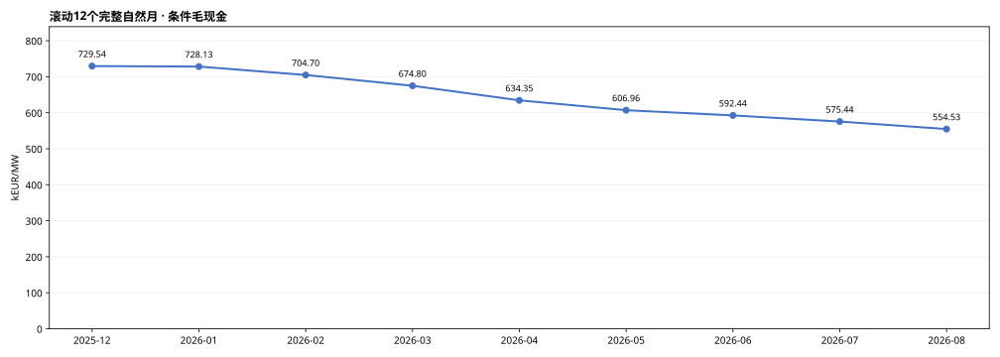
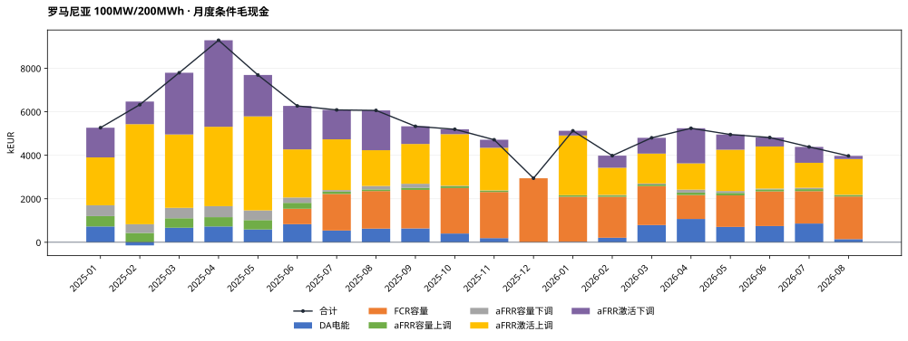
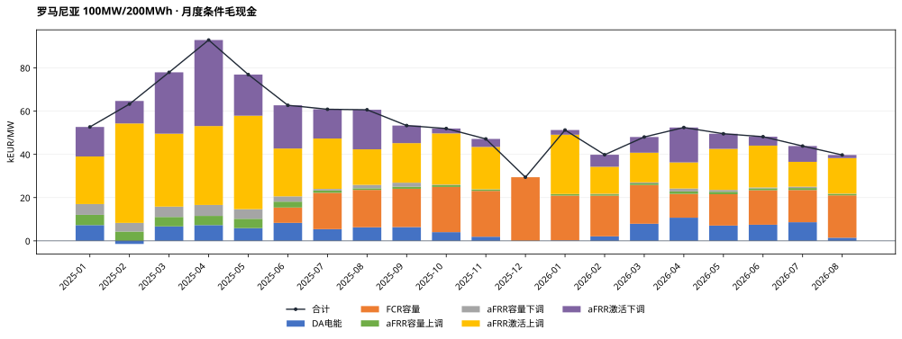
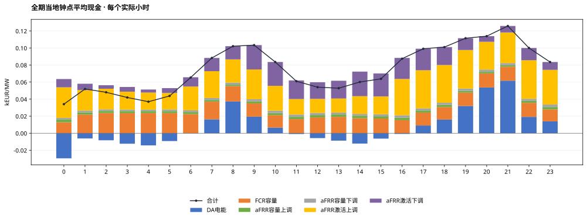
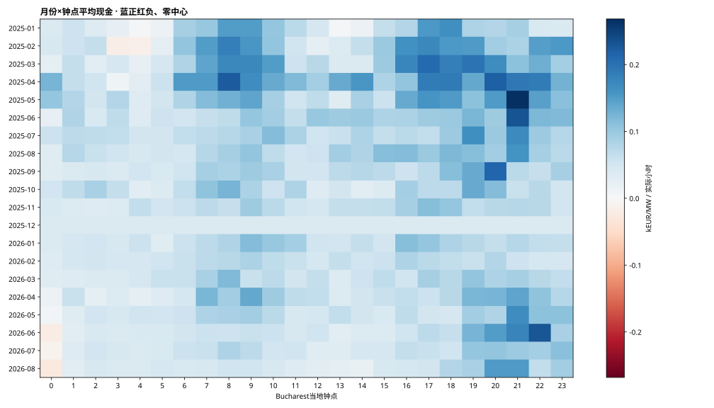
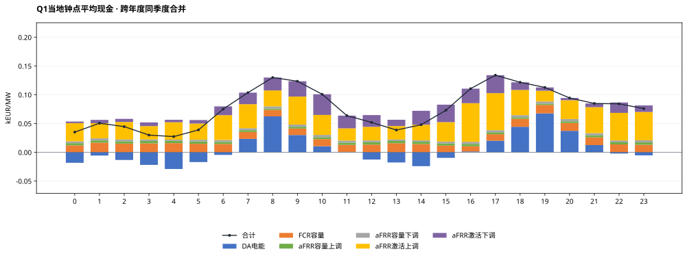
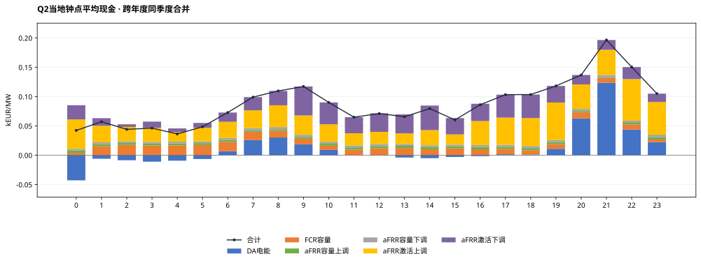
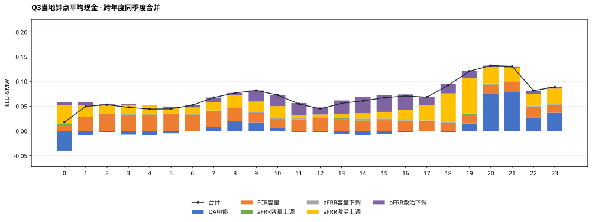
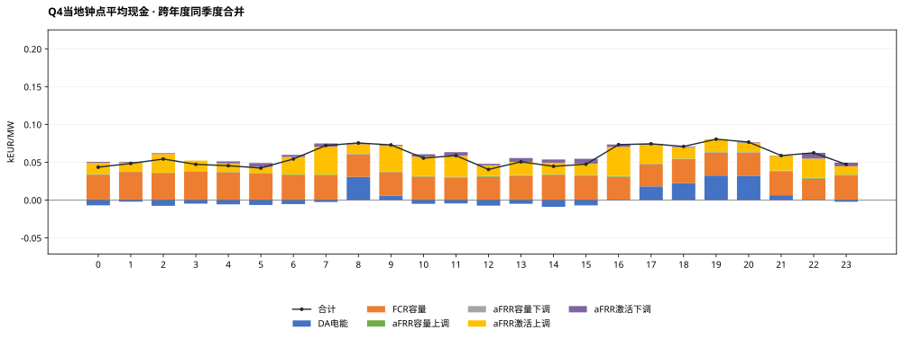

# 罗马尼亚MILP完整测算结果：100MW / 200MWh · 容量收入系数60%

正式统计期：2025-01-01至2026-08-31（Bucharest当地交付日），608天。运行COMPLETE，608个窗口、58,364个正式QH；2026-09-01观察日不计正式现金。

## 假设概览

| 项目 | 本次配置 |
|---|---|
| 电池规模与SOC | 100MW / 200MWh直流名义容量；SOC10—190MWh，可用180MWh；初末10MWh |
| 效率/年度EFC | 单向92%；DC吞吐/360MWh；2025预算600，2026年1—8月399.452054795 |
| 优化与币种 | 全EUR；两当地日规划首日执行；完美历史信息、价格接受者 |
| 容量系数 | p上调=p下调=pFCR=60%，独立重新优化；外生现金系数，不是实测中标率 |
| 名义事件时表 | 交付前一当地日：容量09关闸/10结果，DA13关闸/14结果；研究假设 |
| FCR | 对称研究单元5×20MW、共享能量池；30分钟双向静态缓冲，仅容量机会价值 |
| aFRR | 严格三相下→上→基准；不归一化；无效QH覆盖的完整小时上下订单禁用 |
| 源数据/汇率 | OPCOM DA、Transelectrica DAMAS容量/激活价量、BNR；按Bucharest交付日严格前序参考日换汇 |
| 数据覆盖 | DA 58,364/58,364；aFRR 53,500/58,364；FCR 43,292/43,872（6月起范围） |
| 首日 | 过去已关闸且无历史账本订单为0，96QH；容量/激活与日前均不补报 |
| 求解状态 | 608窗status0，0窗限时可行解（按1e-4容许gap）；最大还原目标gap=7.2527717e-05 |
| 求解耗时 | 累计182.72秒；单窗中位0.238秒，最大13.435秒 |
| 审核状态 | 全期独立自动复算PASS；reviewer最终结论见本任务review_and_acceptance.md |

**解释边界：** 以下为条件事后市场毛现金，未扣投资、运维、税费等成本。系统容量均价和激活字段采用已批准代理口径，不等于本站结算发票。FCR没有频率激活电量、损耗及额外循环。两日滚动不是已证明的全时域全局最优上界。

## 结果概览

### 全期与自然年市场现金

| 期间 | kEUR | kEUR/MW | EFC |
|---|---|---|---|
| 全期20个月 | 110,225.69 | 1,102.26 | 936.74 |
| 月均（20个月、不外推） | 5,511.28 | 55.11 | 46.84 |
| 2025年 2025-01-01—2025-12-31 | 72,954.42 | 729.54 | 600.00 |
| 2026年 2026-01-01—2026-08-31 | 37,271.27 | 372.71 | 336.74 |

2026年只含1—8月，不年化。模型执行覆盖为100%，不代表各市场原始字段都完整；aFRR/FCR源失效订单按既定规则禁用，缺失收益不补算。

### 最新及逐月滚动12个月

最新窗口：2025-09—2026-08，55,452.74 kEUR，554.53 kEUR/MW。

本报告为p=60%独立重优化情景，三情景比较另见汇总报告。每窗为12个完整自然月，不对市场缺口按比例外推。

| 窗口终月 | 12个月范围 | kEUR/MW | aFRR数据覆盖 | FCR数据覆盖（全窗口） |
|---|---|---|---|---|
| 2025-12 | 2025-01—2025-12 | 729.54 | 92.69% | 56.99% |
| 2026-01 | 2025-02—2026-01 | 728.13 | 92.32% | 65.48% |
| 2026-02 | 2025-03—2026-02 | 704.70 | 92.24% | 73.15% |
| 2026-03 | 2025-04—2026-03 | 674.80 | 91.85% | 81.63% |
| 2026-04 | 2025-05—2026-04 | 634.35 | 91.15% | 89.85% |
| 2026-05 | 2025-06—2026-05 | 606.96 | 90.87% | 98.34% |
| 2026-06 | 2025-07—2026-06 | 592.44 | 90.68% | 99.99% |
| 2026-07 | 2025-08—2026-07 | 575.44 | 90.57% | 99.99% |
| 2026-08 | 2025-09—2026-08 | 554.53 | 90.57% | 99.99% |

### EFC及能量

| 年份 | 已执行EFC | 固定预算 | 使用率 |
|---|---|---|---|
| 2025 | 600.000000 | 600.000000 | 100.00% |
| 2026 | 336.744502 | 399.452055 | 84.30% |

全期AC物理充电183,276.10MWh，放电155,124.89MWh；EFC直接累加相位DC吞吐，非QH净SOC差，亦非完整充放事件计数。正式末SOC=10.000000000MWh。

### 六项市场现金与占比

| 市场 | kEUR | kEUR/MW | 占总现金 |
|---|---|---|---|
| DA电能 | 10,346.20 | 103.46 | 9.39% |
| FCR容量 | 26,371.85 | 263.72 | 23.93% |
| aFRR容量上调 | 3,571.03 | 35.71 | 3.24% |
| aFRR容量下调 | 3,448.38 | 34.48 | 3.13% |
| aFRR激活上调 | 43,685.23 | 436.85 | 39.63% |
| aFRR激活下调 | 22,803.00 | 228.03 | 20.69% |
| 合计 | 110,225.69 | 1,102.26 | 100.00% |

所有现金保持符号，负价不裁剪；下调现金＝−原价格×下调激活电量，负下调价格可产生正现金。占比以带符号总现金为分母，正项合计可能超过100%。

### 平均功率与预留容量

| 市场 | 平均MW | 含义 |
|---|---|---|
| DA | -1.01 | 售正购负，净额可抵消 |
| FCR容量 | 44.29 | 对称预留、收入只计一次 |
| aFRR容量上调 | 42.48 | 全额物理预留 |
| aFRR容量下调 | 41.72 | 全额物理预留 |
| aFRR激活上调 | 6.15 | 模型激活MWh/全期小时 |
| aFRR激活下调 | 7.07 | 方向电量为正，现金另按价格符号 |

均值分母包含全部58,364个正式QH和首日零承诺；不是各市场可用时段条件均值。各行不可相加解释为电站容量分配比例。

## 月度结果概览

### 月度明细与年汇总 · kEUR

| 月份 | DA电能 | FCR容量 | aFRR容量上调 | aFRR容量下调 | aFRR激活上调 | aFRR激活下调 | 合计 |
|---|---|---|---|---|---|---|---|
| 2025-01 | 726.74 | 0.00 | 475.51 | 499.21 | 2,199.48 | 1,364.92 | 5,265.86 |
| 2025-02 | -143.83 | 0.00 | 429.62 | 400.45 | 4,598.41 | 1,039.93 | 6,324.59 |
| 2025-03 | 668.34 | 0.00 | 436.32 | 478.05 | 3,373.07 | 2,836.76 | 7,792.54 |
| 2025-04 | 726.72 | 0.00 | 427.48 | 505.30 | 3,649.64 | 3,976.86 | 9,286.00 |
| 2025-05 | 589.29 | 0.00 | 430.39 | 444.92 | 4,322.69 | 1,902.68 | 7,689.97 |
| 2025-06 | 831.62 | 709.40 | 271.80 | 244.93 | 2,212.10 | 1,998.15 | 6,268.00 |
| 2025-07 | 540.27 | 1,680.21 | 108.17 | 72.01 | 2,331.00 | 1,352.60 | 6,084.26 |
| 2025-08 | 627.88 | 1,727.27 | 75.37 | 157.70 | 1,643.92 | 1,829.61 | 6,061.74 |
| 2025-09 | 636.87 | 1,770.25 | 95.59 | 187.42 | 1,828.39 | 812.65 | 5,331.18 |
| 2025-10 | 402.66 | 2,088.97 | 81.86 | 27.30 | 2,368.61 | 224.92 | 5,194.33 |
| 2025-11 | 191.13 | 2,119.67 | 63.17 | 12.33 | 1,957.72 | 368.79 | 4,712.80 |
| 2025-12 | 0.00 | 2,942.06 | 1.01 | 0.09 | 0.00 | -0.00 | 2,943.16 |
| 2025年月均 | 483.14 | 1,086.49 | 241.36 | 252.47 | 2,540.42 | 1,475.66 | 6,079.54 |
| 2025年合计 | 5,797.70 | 13,037.83 | 2,896.30 | 3,029.70 | 30,485.02 | 17,707.89 | 72,954.42 |
| 2026-01 | 20.49 | 2,072.23 | 63.96 | 8.84 | 2,742.55 | 216.79 | 5,124.84 |
| 2026-02 | 208.86 | 1,880.97 | 62.07 | 24.06 | 1,249.86 | 555.77 | 3,981.60 |
| 2026-03 | 790.93 | 1,791.52 | 71.30 | 49.56 | 1,373.15 | 725.29 | 4,801.75 |
| 2026-04 | 1,071.62 | 1,098.10 | 113.94 | 135.71 | 1,208.27 | 1,613.31 | 5,240.96 |
| 2026-05 | 705.76 | 1,449.25 | 114.46 | 86.55 | 1,898.52 | 697.26 | 4,951.81 |
| 2026-06 | 745.03 | 1,594.28 | 89.26 | 39.47 | 1,935.26 | 412.29 | 4,815.59 |
| 2026-07 | 861.71 | 1,487.52 | 93.34 | 61.99 | 1,149.08 | 730.40 | 4,384.02 |
| 2026-08 | 144.10 | 1,960.16 | 66.41 | 12.50 | 1,643.51 | 144.01 | 3,970.70 |
| 2026年月均 | 568.56 | 1,666.75 | 84.34 | 52.34 | 1,650.03 | 636.89 | 4,658.91 |
| 2026年合计 | 4,548.51 | 13,334.02 | 674.74 | 418.68 | 13,200.21 | 5,095.11 | 37,271.27 |

### 月度明细与年汇总 · kEUR/MW

| 月份 | DA电能 | FCR容量 | aFRR容量上调 | aFRR容量下调 | aFRR激活上调 | aFRR激活下调 | 合计 |
|---|---|---|---|---|---|---|---|
| 2025-01 | 7.27 | 0.00 | 4.76 | 4.99 | 21.99 | 13.65 | 52.66 |
| 2025-02 | -1.44 | 0.00 | 4.30 | 4.00 | 45.98 | 10.40 | 63.25 |
| 2025-03 | 6.68 | 0.00 | 4.36 | 4.78 | 33.73 | 28.37 | 77.93 |
| 2025-04 | 7.27 | 0.00 | 4.27 | 5.05 | 36.50 | 39.77 | 92.86 |
| 2025-05 | 5.89 | 0.00 | 4.30 | 4.45 | 43.23 | 19.03 | 76.90 |
| 2025-06 | 8.32 | 7.09 | 2.72 | 2.45 | 22.12 | 19.98 | 62.68 |
| 2025-07 | 5.40 | 16.80 | 1.08 | 0.72 | 23.31 | 13.53 | 60.84 |
| 2025-08 | 6.28 | 17.27 | 0.75 | 1.58 | 16.44 | 18.30 | 60.62 |
| 2025-09 | 6.37 | 17.70 | 0.96 | 1.87 | 18.28 | 8.13 | 53.31 |
| 2025-10 | 4.03 | 20.89 | 0.82 | 0.27 | 23.69 | 2.25 | 51.94 |
| 2025-11 | 1.91 | 21.20 | 0.63 | 0.12 | 19.58 | 3.69 | 47.13 |
| 2025-12 | 0.00 | 29.42 | 0.01 | 0.00 | 0.00 | -0.00 | 29.43 |
| 2025年月均 | 4.83 | 10.86 | 2.41 | 2.52 | 25.40 | 14.76 | 60.80 |
| 2025年合计 | 57.98 | 130.38 | 28.96 | 30.30 | 304.85 | 177.08 | 729.54 |
| 2026-01 | 0.20 | 20.72 | 0.64 | 0.09 | 27.43 | 2.17 | 51.25 |
| 2026-02 | 2.09 | 18.81 | 0.62 | 0.24 | 12.50 | 5.56 | 39.82 |
| 2026-03 | 7.91 | 17.92 | 0.71 | 0.50 | 13.73 | 7.25 | 48.02 |
| 2026-04 | 10.72 | 10.98 | 1.14 | 1.36 | 12.08 | 16.13 | 52.41 |
| 2026-05 | 7.06 | 14.49 | 1.14 | 0.87 | 18.99 | 6.97 | 49.52 |
| 2026-06 | 7.45 | 15.94 | 0.89 | 0.39 | 19.35 | 4.12 | 48.16 |
| 2026-07 | 8.62 | 14.88 | 0.93 | 0.62 | 11.49 | 7.30 | 43.84 |
| 2026-08 | 1.44 | 19.60 | 0.66 | 0.13 | 16.44 | 1.44 | 39.71 |
| 2026年月均 | 5.69 | 16.67 | 0.84 | 0.52 | 16.50 | 6.37 | 46.59 |
| 2026年合计 | 45.49 | 133.34 | 6.75 | 4.19 | 132.00 | 50.95 | 372.71 |

### 月度六项现金占比

| 月份 | DA电能 | FCR容量 | aFRR容量上调 | aFRR容量下调 | aFRR激活上调 | aFRR激活下调 |
|---|---|---|---|---|---|---|
| 2025-01 | 13.80% | 0.00% | 9.03% | 9.48% | 41.77% | 25.92% |
| 2025-02 | -2.27% | 0.00% | 6.79% | 6.33% | 72.71% | 16.44% |
| 2025-03 | 8.58% | 0.00% | 5.60% | 6.13% | 43.29% | 36.40% |
| 2025-04 | 7.83% | 0.00% | 4.60% | 5.44% | 39.30% | 42.83% |
| 2025-05 | 7.66% | 0.00% | 5.60% | 5.79% | 56.21% | 24.74% |
| 2025-06 | 13.27% | 11.32% | 4.34% | 3.91% | 35.29% | 31.88% |
| 2025-07 | 8.88% | 27.62% | 1.78% | 1.18% | 38.31% | 22.23% |
| 2025-08 | 10.36% | 28.49% | 1.24% | 2.60% | 27.12% | 30.18% |
| 2025-09 | 11.95% | 33.21% | 1.79% | 3.52% | 34.30% | 15.24% |
| 2025-10 | 7.75% | 40.22% | 1.58% | 0.53% | 45.60% | 4.33% |
| 2025-11 | 4.06% | 44.98% | 1.34% | 0.26% | 41.54% | 7.83% |
| 2025-12 | 0.00% | 99.96% | 0.03% | 0.00% | 0.00% | -0.00% |
| 2026-01 | 0.40% | 40.43% | 1.25% | 0.17% | 53.51% | 4.23% |
| 2026-02 | 5.25% | 47.24% | 1.56% | 0.60% | 31.39% | 13.96% |
| 2026-03 | 16.47% | 37.31% | 1.48% | 1.03% | 28.60% | 15.10% |
| 2026-04 | 20.45% | 20.95% | 2.17% | 2.59% | 23.05% | 30.78% |
| 2026-05 | 14.25% | 29.27% | 2.31% | 1.75% | 38.34% | 14.08% |
| 2026-06 | 15.47% | 33.11% | 1.85% | 0.82% | 40.19% | 8.56% |
| 2026-07 | 19.66% | 33.93% | 2.13% | 1.41% | 26.21% | 16.66% |
| 2026-08 | 3.63% | 49.37% | 1.67% | 0.31% | 41.39% | 3.63% |

### 月度数据覆盖与EFC

| 月份 | 执行QH | aFRR有效QH | FCR有效/范围内QH | EFC |
|---|---|---|---|---|
| 2025-01 | 2976 | 2840 | 0/0 | 66.41 |
| 2025-02 | 2688 | 2524 | 0/0 | 66.01 |
| 2025-03 | 2972 | 2740 | 0/0 | 73.78 |
| 2025-04 | 2880 | 2688 | 0/0 | 71.40 |
| 2025-05 | 2976 | 2792 | 0/0 | 73.40 |
| 2025-06 | 2880 | 2664 | 2304/2880 | 56.50 |
| 2025-07 | 2976 | 2756 | 2976/2976 | 42.12 |
| 2025-08 | 2976 | 2760 | 2976/2976 | 40.37 |
| 2025-09 | 2880 | 2624 | 2880/2880 | 43.92 |
| 2025-10 | 2980 | 2716 | 2976/2980 | 39.04 |
| 2025-11 | 2880 | 2652 | 2880/2880 | 27.04 |
| 2025-12 | 2976 | 2724 | 2976/2976 | 0.00 |
| 2026-01 | 2976 | 2708 | 2976/2976 | 31.66 |
| 2026-02 | 2688 | 2496 | 2688/2688 | 28.71 |
| 2026-03 | 2972 | 2604 | 2972/2972 | 43.69 |
| 2026-04 | 2880 | 2444 | 2880/2880 | 54.29 |
| 2026-05 | 2976 | 2692 | 2976/2976 | 48.89 |
| 2026-06 | 2880 | 2600 | 2880/2880 | 44.10 |
| 2026-07 | 2976 | 2716 | 2976/2976 | 48.51 |
| 2026-08 | 2976 | 2760 | 2976/2976 | 36.90 |

## 小时级结果概览

先合计每个实际小时的四个执行QH，再按Bucharest当地钟点取均值；秋季重复小时按不同UTC偏移分别计样本。全期14,591个完整执行小时，源失效市场的模型零订单保留，数据有效小时数在CSV单列。

所有小时曲线与热图均用kEUR/MW/实际小时；图上0.03表示30EUR/MW。季度图跨年度同季度合并，四图共用纵轴。

### 月份×小时热力图

蓝正红负，零中心；每格为该月该钟点每个实际小时平均现金，不是该月累计。

### Q1

样本月份：2025-01, 2025-02, 2025-03, 2026-01, 2026-02, 2026-03；实际小时样本4,318。

### Q2

样本月份：2025-04, 2025-05, 2025-06, 2026-04, 2026-05, 2026-06；实际小时样本4,368。

### Q3

样本月份：2025-07, 2025-08, 2025-09, 2026-07, 2026-08；实际小时样本3,696。

### Q4

样本月份：2025-10, 2025-11, 2025-12；实际小时样本2,209。

## 输出、来源和适用范围

- monthly.csv、annual.csv、daily.csv：六项现金（kEUR/kEUR每MW）、EFC、物理电量、逐市场数据覆盖。2026年不外推全年。
- market_totals.csv、monthly_market_shares.csv：带符号金额及占比。
- hourly.csv、quarterly_hourly.csv、monthly_hourly_heatmap.csv：小时均值和实际样本数；DST分别处理。
- rolling_12m.csv：9个滚动12自然月窗口。SVG共9张，PNG为对应预览。
- report_manifest.json：生成脚本/原始执行文件/完整验证/参考ES版本哈希和报告环境。核心run_v1保留QH、相位、订单、窗口指标、年度预算和不可变事务链。

**F（事实）**：OPCOM/DAMAS/BNR官方来源及价格/数量/空值证据见输入数据包source_registry。

**I（解释）**：本报告按Bucharest交付日归集已执行现金；数据缺口、执行完整性与市场参与量分列。

**A（假设）**：已确认代理字段、名义时表、资格/单元、p=60%、三相及FCR静态机会价值仍是研究假设。p仅折减容量现金，不折减物理预留或激活义务。API最终结算语义、真实项目资格、实际历史信息可见性和FCR频率轨迹未因本次计算而得到确认。

格式参照[ES_MILP固定提交的报告生成代码](https://github.com/hutianyi326/ES_MILP/blob/70651210d0ad98ac820644754508f76363d2c799/code/project/build_es_result_presentation.py)，并将ES的ID分项替换为RO的FCR容量分项。只参考展示结构，不导入西班牙市场规则、预算或测算结果。
