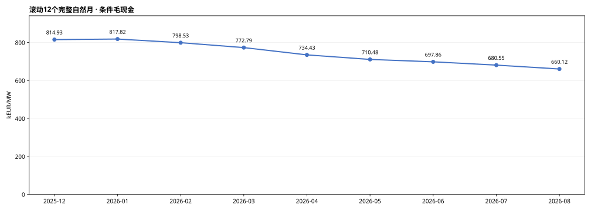
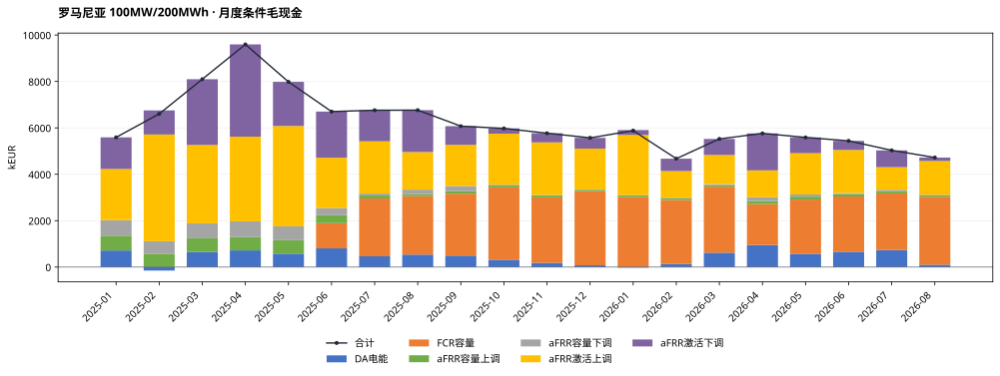
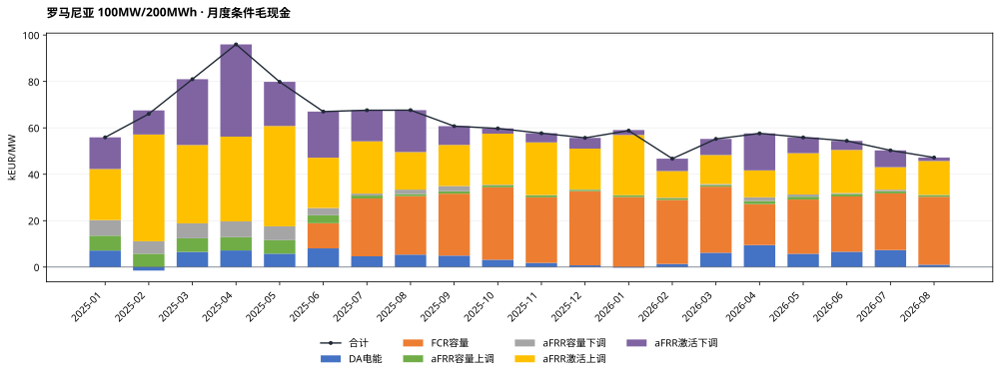
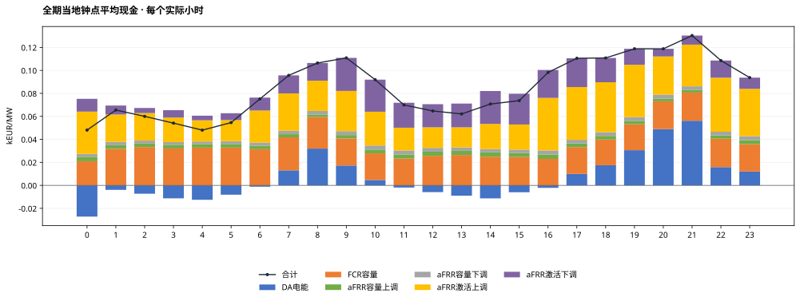
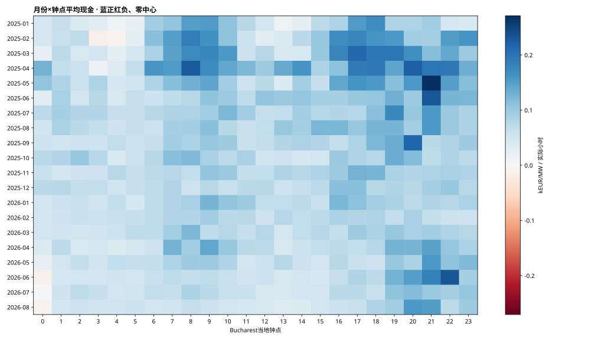
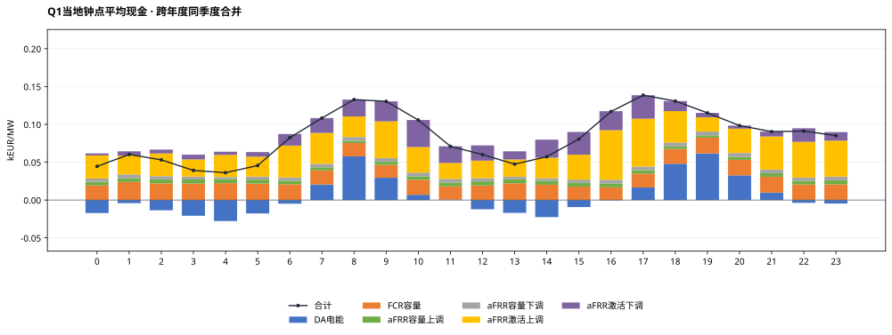
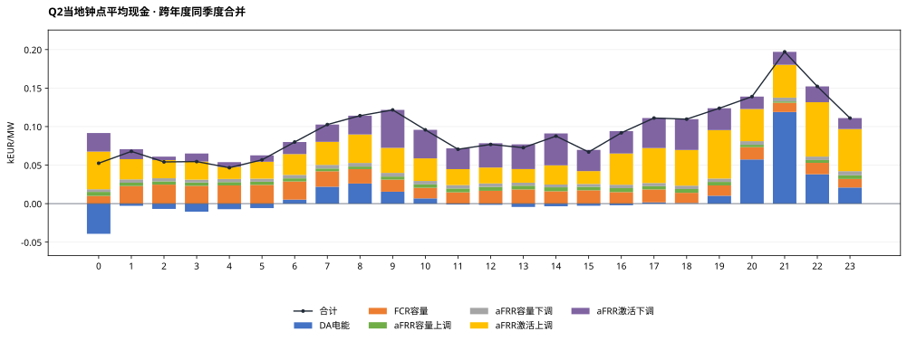
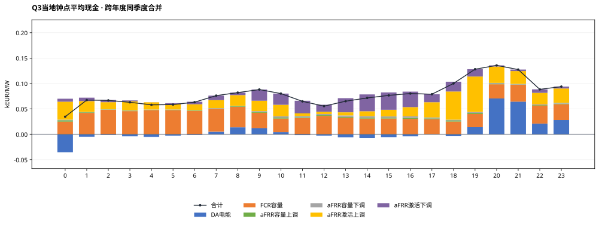
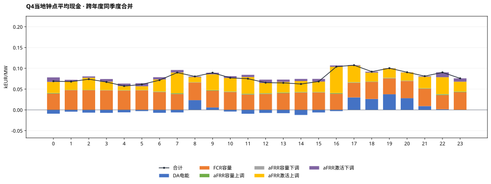

# 罗马尼亚MILP完整测算结果：100MW / 200MWh · 容量收入系数80%

正式统计期：2025-01-01至2026-08-31（Bucharest当地交付日），608天。运行COMPLETE，608个窗口、58,364个正式QH；2026-09-01观察日不计正式现金。

## 假设概览

| 项目 | 本次配置 |
|---|---|
| 电池规模与SOC | 100MW / 200MWh直流名义容量；SOC10—190MWh，可用180MWh；初末10MWh |
| 效率/年度EFC | 单向92%；DC吞吐/360MWh；2025预算600，2026年1—8月399.452054795 |
| 优化与币种 | 全EUR；两当地日规划首日执行；完美历史信息、价格接受者 |
| 容量系数 | p上调=p下调=pFCR=80%，独立重新优化；外生现金系数，不是实测中标率 |
| 名义事件时表 | 交付前一当地日：容量09关闸/10结果，DA13关闸/14结果；研究假设 |
| FCR | 对称研究单元5×20MW、共享能量池；30分钟双向静态缓冲，仅容量机会价值 |
| aFRR | 严格三相下→上→基准；不归一化；无效QH覆盖的完整小时上下订单禁用 |
| 源数据/汇率 | OPCOM DA、Transelectrica DAMAS容量/激活价量、BNR；按Bucharest交付日严格前序参考日换汇 |
| 数据覆盖 | DA 58,364/58,364；aFRR 53,500/58,364；FCR 43,292/43,872（6月起范围） |
| 首日 | 过去已关闸且无历史账本订单为0，96QH；容量/激活与日前均不补报 |
| 求解状态 | 608窗status0，0窗限时可行解（按1e-4容许gap）；最大还原目标gap=9.7783022e-05 |
| 求解耗时 | 累计152.25秒；单窗中位0.213秒，最大3.031秒 |
| 审核状态 | 全期独立自动复算PASS；reviewer最终结论见本任务review_and_acceptance.md |

**解释边界：** 以下为条件事后市场毛现金，未扣投资、运维、税费等成本。系统容量均价和激活字段采用已批准代理口径，不等于本站结算发票。FCR没有频率激活电量、损耗及额外循环。两日滚动不是已证明的全时域全局最优上界。

## 结果概览

### 全期与自然年市场现金

| 期间 | kEUR | kEUR/MW | EFC |
|---|---|---|---|
| 全期20个月 | 124,114.05 | 1,241.14 | 858.85 |
| 月均（20个月、不外推） | 6,205.70 | 62.06 | 42.94 |
| 2025年 2025-01-01—2025-12-31 | 81,492.99 | 814.93 | 584.36 |
| 2026年 2026-01-01—2026-08-31 | 42,621.06 | 426.21 | 274.49 |

2026年只含1—8月，不年化。模型执行覆盖为100%，不代表各市场原始字段都完整；aFRR/FCR源失效订单按既定规则禁用，缺失收益不补算。

### 最新及逐月滚动12个月

最新窗口：2025-09—2026-08，66,012.38 kEUR，660.12 kEUR/MW。

本报告为p=80%独立重优化情景，三情景比较另见汇总报告。每窗为12个完整自然月，不对市场缺口按比例外推。

| 窗口终月 | 12个月范围 | kEUR/MW | aFRR数据覆盖 | FCR数据覆盖（全窗口） |
|---|---|---|---|---|
| 2025-12 | 2025-01—2025-12 | 814.93 | 92.69% | 56.99% |
| 2026-01 | 2025-02—2026-01 | 817.82 | 92.32% | 65.48% |
| 2026-02 | 2025-03—2026-02 | 798.53 | 92.24% | 73.15% |
| 2026-03 | 2025-04—2026-03 | 772.79 | 91.85% | 81.63% |
| 2026-04 | 2025-05—2026-04 | 734.43 | 91.15% | 89.85% |
| 2026-05 | 2025-06—2026-05 | 710.48 | 90.87% | 98.34% |
| 2026-06 | 2025-07—2026-06 | 697.86 | 90.68% | 99.99% |
| 2026-07 | 2025-08—2026-07 | 680.55 | 90.57% | 99.99% |
| 2026-08 | 2025-09—2026-08 | 660.12 | 90.57% | 99.99% |

### EFC及能量

| 年份 | 已执行EFC | 固定预算 | 使用率 |
|---|---|---|---|
| 2025 | 584.359979 | 600.000000 | 97.39% |
| 2026 | 274.486486 | 399.452055 | 68.72% |

全期AC物理充电168,035.18MWh，放电142,224.97MWh；EFC直接累加相位DC吞吐，非QH净SOC差，亦非完整充放事件计数。正式末SOC=10.000000000MWh。

### 六项市场现金与占比

| 市场 | kEUR | kEUR/MW | 占总现金 |
|---|---|---|---|
| DA电能 | 9,139.55 | 91.40 | 7.36% |
| FCR容量 | 38,389.69 | 383.90 | 30.93% |
| aFRR容量上调 | 4,590.66 | 45.91 | 3.70% |
| aFRR容量下调 | 4,466.42 | 44.66 | 3.60% |
| aFRR激活上调 | 44,402.54 | 444.03 | 35.78% |
| aFRR激活下调 | 23,125.20 | 231.25 | 18.63% |
| 合计 | 124,114.05 | 1,241.14 | 100.00% |

所有现金保持符号，负价不裁剪；下调现金＝−原价格×下调激活电量，负下调价格可产生正现金。占比以带符号总现金为分母，正项合计可能超过100%。

### 平均功率与预留容量

| 市场 | 平均MW | 含义 |
|---|---|---|
| DA | -1.03 | 售正购负，净额可抵消 |
| FCR容量 | 48.39 | 对称预留、收入只计一次 |
| aFRR容量上调 | 40.39 | 全额物理预留 |
| aFRR容量下调 | 39.40 | 全额物理预留 |
| aFRR激活上调 | 5.98 | 模型激活MWh/全期小时 |
| aFRR激活下调 | 6.72 | 方向电量为正，现金另按价格符号 |

均值分母包含全部58,364个正式QH和首日零承诺；不是各市场可用时段条件均值。各行不可相加解释为电站容量分配比例。

## 月度结果概览

### 月度明细与年汇总 · kEUR

| 月份 | DA电能 | FCR容量 | aFRR容量上调 | aFRR容量下调 | aFRR激活上调 | aFRR激活下调 | 合计 |
|---|---|---|---|---|---|---|---|
| 2025-01 | 714.10 | 0.00 | 639.22 | 671.34 | 2,202.66 | 1,364.70 | 5,592.02 |
| 2025-02 | -150.65 | 0.00 | 575.21 | 538.44 | 4,600.34 | 1,039.10 | 6,602.44 |
| 2025-03 | 654.28 | 0.00 | 587.41 | 643.73 | 3,376.47 | 2,836.08 | 8,097.97 |
| 2025-04 | 717.91 | 0.00 | 573.03 | 679.86 | 3,650.92 | 3,976.48 | 9,598.20 |
| 2025-05 | 577.97 | 0.00 | 579.39 | 600.00 | 4,324.30 | 1,901.90 | 7,983.56 |
| 2025-06 | 806.62 | 1,084.25 | 344.37 | 313.06 | 2,166.19 | 1,988.16 | 6,702.65 |
| 2025-07 | 463.74 | 2,491.49 | 127.68 | 85.76 | 2,252.81 | 1,339.21 | 6,760.68 |
| 2025-08 | 537.93 | 2,520.47 | 89.27 | 192.34 | 1,617.92 | 1,806.22 | 6,764.15 |
| 2025-09 | 493.70 | 2,670.27 | 105.62 | 224.82 | 1,770.73 | 809.04 | 6,074.19 |
| 2025-10 | 316.80 | 3,121.82 | 84.59 | 26.99 | 2,200.34 | 226.63 | 5,977.17 |
| 2025-11 | 181.83 | 2,825.23 | 84.27 | 14.10 | 2,269.35 | 394.99 | 5,769.78 |
| 2025-12 | 75.97 | 3,196.50 | 60.97 | 15.82 | 1,756.92 | 464.01 | 5,570.19 |
| 2025年月均 | 449.18 | 1,492.50 | 320.92 | 333.85 | 2,682.41 | 1,512.21 | 6,791.08 |
| 2025年合计 | 5,390.21 | 17,910.02 | 3,851.06 | 4,006.26 | 32,188.94 | 18,146.50 | 81,492.99 |
| 2026-01 | -25.30 | 3,020.28 | 70.22 | 9.22 | 2,593.83 | 212.87 | 5,881.12 |
| 2026-02 | 136.57 | 2,757.65 | 68.53 | 26.95 | 1,148.55 | 534.81 | 4,673.06 |
| 2026-03 | 618.33 | 2,847.20 | 69.49 | 47.64 | 1,247.44 | 694.08 | 5,524.18 |
| 2026-04 | 949.28 | 1,764.02 | 136.11 | 160.63 | 1,159.01 | 1,593.10 | 5,762.15 |
| 2026-05 | 573.86 | 2,337.20 | 124.01 | 93.72 | 1,780.50 | 678.92 | 5,588.21 |
| 2026-06 | 661.08 | 2,382.52 | 106.31 | 43.17 | 1,855.84 | 391.79 | 5,440.71 |
| 2026-07 | 734.53 | 2,440.99 | 94.69 | 65.20 | 970.77 | 724.07 | 5,030.25 |
| 2026-08 | 101.00 | 2,929.81 | 70.25 | 13.63 | 1,457.65 | 149.05 | 4,721.38 |
| 2026年月均 | 468.67 | 2,559.96 | 92.45 | 57.52 | 1,526.70 | 622.34 | 5,327.63 |
| 2026年合计 | 3,749.33 | 20,479.67 | 739.61 | 460.16 | 12,213.60 | 4,978.70 | 42,621.06 |

### 月度明细与年汇总 · kEUR/MW

| 月份 | DA电能 | FCR容量 | aFRR容量上调 | aFRR容量下调 | aFRR激活上调 | aFRR激活下调 | 合计 |
|---|---|---|---|---|---|---|---|
| 2025-01 | 7.14 | 0.00 | 6.39 | 6.71 | 22.03 | 13.65 | 55.92 |
| 2025-02 | -1.51 | 0.00 | 5.75 | 5.38 | 46.00 | 10.39 | 66.02 |
| 2025-03 | 6.54 | 0.00 | 5.87 | 6.44 | 33.76 | 28.36 | 80.98 |
| 2025-04 | 7.18 | 0.00 | 5.73 | 6.80 | 36.51 | 39.76 | 95.98 |
| 2025-05 | 5.78 | 0.00 | 5.79 | 6.00 | 43.24 | 19.02 | 79.84 |
| 2025-06 | 8.07 | 10.84 | 3.44 | 3.13 | 21.66 | 19.88 | 67.03 |
| 2025-07 | 4.64 | 24.91 | 1.28 | 0.86 | 22.53 | 13.39 | 67.61 |
| 2025-08 | 5.38 | 25.20 | 0.89 | 1.92 | 16.18 | 18.06 | 67.64 |
| 2025-09 | 4.94 | 26.70 | 1.06 | 2.25 | 17.71 | 8.09 | 60.74 |
| 2025-10 | 3.17 | 31.22 | 0.85 | 0.27 | 22.00 | 2.27 | 59.77 |
| 2025-11 | 1.82 | 28.25 | 0.84 | 0.14 | 22.69 | 3.95 | 57.70 |
| 2025-12 | 0.76 | 31.96 | 0.61 | 0.16 | 17.57 | 4.64 | 55.70 |
| 2025年月均 | 4.49 | 14.93 | 3.21 | 3.34 | 26.82 | 15.12 | 67.91 |
| 2025年合计 | 53.90 | 179.10 | 38.51 | 40.06 | 321.89 | 181.47 | 814.93 |
| 2026-01 | -0.25 | 30.20 | 0.70 | 0.09 | 25.94 | 2.13 | 58.81 |
| 2026-02 | 1.37 | 27.58 | 0.69 | 0.27 | 11.49 | 5.35 | 46.73 |
| 2026-03 | 6.18 | 28.47 | 0.69 | 0.48 | 12.47 | 6.94 | 55.24 |
| 2026-04 | 9.49 | 17.64 | 1.36 | 1.61 | 11.59 | 15.93 | 57.62 |
| 2026-05 | 5.74 | 23.37 | 1.24 | 0.94 | 17.80 | 6.79 | 55.88 |
| 2026-06 | 6.61 | 23.83 | 1.06 | 0.43 | 18.56 | 3.92 | 54.41 |
| 2026-07 | 7.35 | 24.41 | 0.95 | 0.65 | 9.71 | 7.24 | 50.30 |
| 2026-08 | 1.01 | 29.30 | 0.70 | 0.14 | 14.58 | 1.49 | 47.21 |
| 2026年月均 | 4.69 | 25.60 | 0.92 | 0.58 | 15.27 | 6.22 | 53.28 |
| 2026年合计 | 37.49 | 204.80 | 7.40 | 4.60 | 122.14 | 49.79 | 426.21 |

### 月度六项现金占比

| 月份 | DA电能 | FCR容量 | aFRR容量上调 | aFRR容量下调 | aFRR激活上调 | aFRR激活下调 |
|---|---|---|---|---|---|---|
| 2025-01 | 12.77% | 0.00% | 11.43% | 12.01% | 39.39% | 24.40% |
| 2025-02 | -2.28% | 0.00% | 8.71% | 8.16% | 69.68% | 15.74% |
| 2025-03 | 8.08% | 0.00% | 7.25% | 7.95% | 41.70% | 35.02% |
| 2025-04 | 7.48% | 0.00% | 5.97% | 7.08% | 38.04% | 41.43% |
| 2025-05 | 7.24% | 0.00% | 7.26% | 7.52% | 54.17% | 23.82% |
| 2025-06 | 12.03% | 16.18% | 5.14% | 4.67% | 32.32% | 29.66% |
| 2025-07 | 6.86% | 36.85% | 1.89% | 1.27% | 33.32% | 19.81% |
| 2025-08 | 7.95% | 37.26% | 1.32% | 2.84% | 23.92% | 26.70% |
| 2025-09 | 8.13% | 43.96% | 1.74% | 3.70% | 29.15% | 13.32% |
| 2025-10 | 5.30% | 52.23% | 1.42% | 0.45% | 36.81% | 3.79% |
| 2025-11 | 3.15% | 48.97% | 1.46% | 0.24% | 39.33% | 6.85% |
| 2025-12 | 1.36% | 57.39% | 1.09% | 0.28% | 31.54% | 8.33% |
| 2026-01 | -0.43% | 51.36% | 1.19% | 0.16% | 44.10% | 3.62% |
| 2026-02 | 2.92% | 59.01% | 1.47% | 0.58% | 24.58% | 11.44% |
| 2026-03 | 11.19% | 51.54% | 1.26% | 0.86% | 22.58% | 12.56% |
| 2026-04 | 16.47% | 30.61% | 2.36% | 2.79% | 20.11% | 27.65% |
| 2026-05 | 10.27% | 41.82% | 2.22% | 1.68% | 31.86% | 12.15% |
| 2026-06 | 12.15% | 43.79% | 1.95% | 0.79% | 34.11% | 7.20% |
| 2026-07 | 14.60% | 48.53% | 1.88% | 1.30% | 19.30% | 14.39% |
| 2026-08 | 2.14% | 62.05% | 1.49% | 0.29% | 30.87% | 3.16% |

### 月度数据覆盖与EFC

| 月份 | 执行QH | aFRR有效QH | FCR有效/范围内QH | EFC |
|---|---|---|---|---|
| 2025-01 | 2976 | 2840 | 0/0 | 64.56 |
| 2025-02 | 2688 | 2524 | 0/0 | 66.18 |
| 2025-03 | 2972 | 2740 | 0/0 | 72.09 |
| 2025-04 | 2880 | 2688 | 0/0 | 70.27 |
| 2025-05 | 2976 | 2792 | 0/0 | 71.78 |
| 2025-06 | 2880 | 2664 | 2304/2880 | 53.53 |
| 2025-07 | 2976 | 2756 | 2976/2976 | 36.80 |
| 2025-08 | 2976 | 2760 | 2976/2976 | 36.12 |
| 2025-09 | 2880 | 2624 | 2880/2880 | 35.49 |
| 2025-10 | 2980 | 2716 | 2976/2980 | 30.61 |
| 2025-11 | 2880 | 2652 | 2880/2880 | 27.23 |
| 2025-12 | 2976 | 2724 | 2976/2976 | 19.72 |
| 2026-01 | 2976 | 2708 | 2976/2976 | 25.71 |
| 2026-02 | 2688 | 2496 | 2688/2688 | 22.13 |
| 2026-03 | 2972 | 2604 | 2972/2972 | 33.14 |
| 2026-04 | 2880 | 2444 | 2880/2880 | 47.20 |
| 2026-05 | 2976 | 2692 | 2976/2976 | 40.73 |
| 2026-06 | 2880 | 2600 | 2880/2880 | 37.98 |
| 2026-07 | 2976 | 2716 | 2976/2976 | 38.33 |
| 2026-08 | 2976 | 2760 | 2976/2976 | 29.27 |

## 小时级结果概览

先合计每个实际小时的四个执行QH，再按Bucharest当地钟点取均值；秋季重复小时按不同UTC偏移分别计样本。全期14,591个完整执行小时，源失效市场的模型零订单保留，数据有效小时数在CSV单列。

所有小时曲线与热图均用kEUR/MW/实际小时；图上0.03表示30EUR/MW。季度图跨年度同季度合并，四图共用纵轴。

### 月份×小时热力图

蓝正红负，零中心；每格为该月该钟点每个实际小时平均现金，不是该月累计。

### Q1

样本月份：2025-01, 2025-02, 2025-03, 2026-01, 2026-02, 2026-03；实际小时样本4,318。

### Q2

样本月份：2025-04, 2025-05, 2025-06, 2026-04, 2026-05, 2026-06；实际小时样本4,368。

### Q3

样本月份：2025-07, 2025-08, 2025-09, 2026-07, 2026-08；实际小时样本3,696。

### Q4

样本月份：2025-10, 2025-11, 2025-12；实际小时样本2,209。

## 输出、来源和适用范围

- monthly.csv、annual.csv、daily.csv：六项现金（kEUR/kEUR每MW）、EFC、物理电量、逐市场数据覆盖。2026年不外推全年。
- market_totals.csv、monthly_market_shares.csv：带符号金额及占比。
- hourly.csv、quarterly_hourly.csv、monthly_hourly_heatmap.csv：小时均值和实际样本数；DST分别处理。
- rolling_12m.csv：9个滚动12自然月窗口。SVG共9张，PNG为对应预览。
- report_manifest.json：生成脚本/原始执行文件/完整验证/参考ES版本哈希和报告环境。核心run_v1保留QH、相位、订单、窗口指标、年度预算和不可变事务链。

**F（事实）**：OPCOM/DAMAS/BNR官方来源及价格/数量/空值证据见输入数据包source_registry。

**I（解释）**：本报告按Bucharest交付日归集已执行现金；数据缺口、执行完整性与市场参与量分列。

**A（假设）**：已确认代理字段、名义时表、资格/单元、p=80%、三相及FCR静态机会价值仍是研究假设。p仅折减容量现金，不折减物理预留或激活义务。API最终结算语义、真实项目资格、实际历史信息可见性和FCR频率轨迹未因本次计算而得到确认。

格式参照[ES_MILP固定提交的报告生成代码](https://github.com/hutianyi326/ES_MILP/blob/70651210d0ad98ac820644754508f76363d2c799/code/project/build_es_result_presentation.py)，并将ES的ID分项替换为RO的FCR容量分项。只参考展示结构，不导入西班牙市场规则、预算或测算结果。
