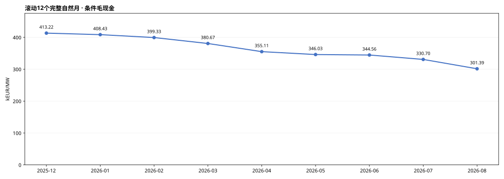
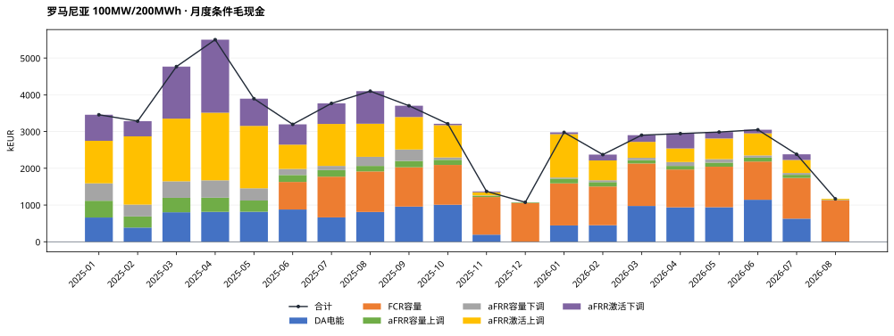
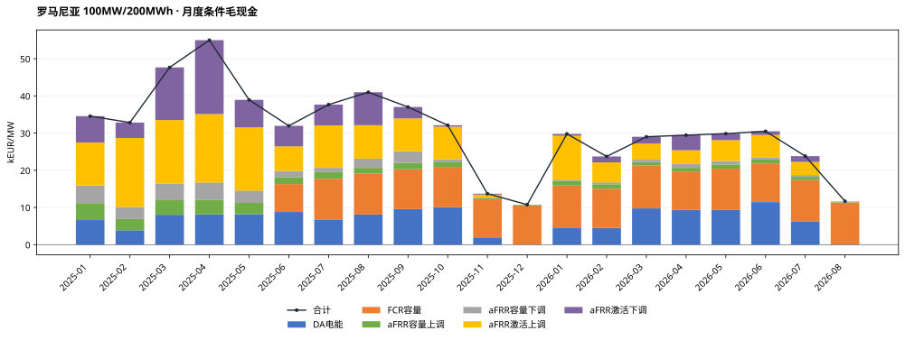
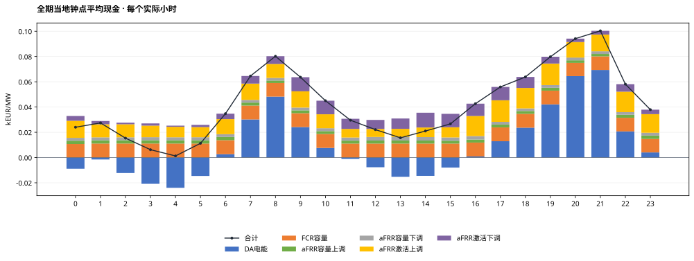
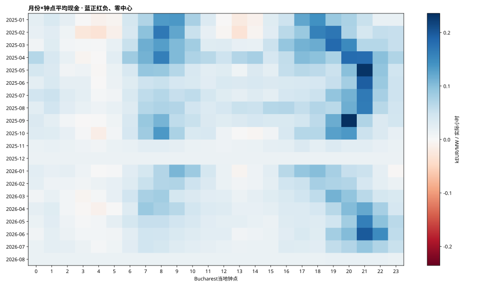
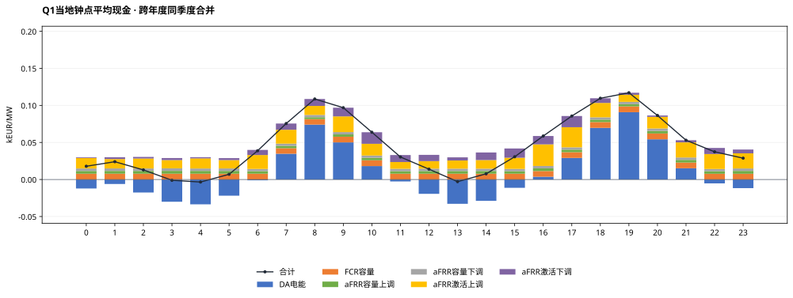
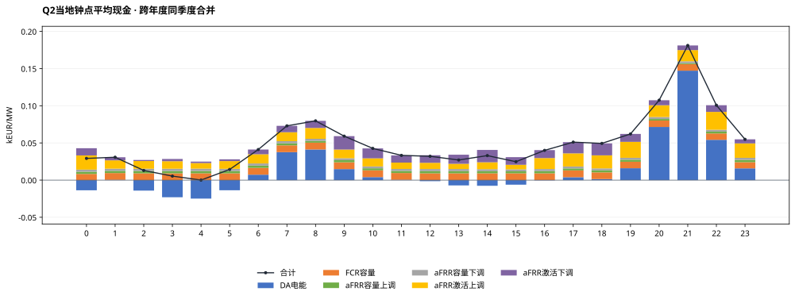
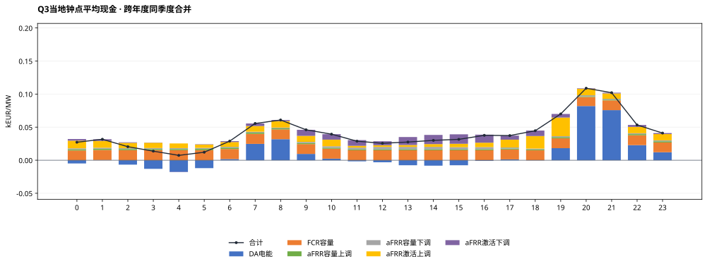
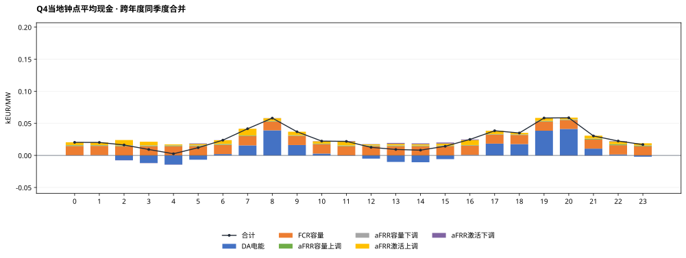

# 罗马尼亚MILP完整测算结果：100MW / 200MWh

正式统计期：2025-01-01至2026-08-31（Bucharest当地交付日），608天。运行COMPLETE，608个窗口、58,364个正式QH；2026-09-01观察日不计正式现金。

## 假设概览

| 项目 | 本次配置 |
|---|---|
| 电池规模与SOC | 100MW / 200MWh直流名义容量；SOC10—190MWh，可用180MWh；初末10MWh |
| 效率/年度EFC | 单向92%；DC吞吐/360MWh；2025预算600，2026年1—8月399.452054795 |
| 优化与币种 | 全EUR；两当地日规划首日执行；完美历史信息、价格接受者 |
| 容量份额 | FCR固定100/550=18.1818%需求份额（整数MW）；aFRR保留原月度份额及代理月份；现金不重复折减 |
| 名义事件时表 | 交付前一当地日：容量09关闸/10结果，DA13关闸/14结果；研究假设 |
| FCR | 对称研究单元5×20MW、共享能量池；30分钟双向静态缓冲，仅容量机会价值 |
| aFRR | 严格三相下→上→基准；不归一化；无效QH覆盖的完整小时上下订单禁用 |
| 源数据/汇率 | OPCOM DA、Transelectrica DAMAS容量/激活价量、BNR；按Bucharest交付日严格前序参考日换汇 |
| 数据覆盖 | DA 58,364/58,364；aFRR 53,500/58,364；FCR 43,292/43,872（6月起范围） |
| 首日 | 过去已关闸且无历史账本订单为0，96QH；容量/激活与日前均不补报 |
| 求解状态 | 状态计数={0: 608}（按1e-4容许gap）；最大还原目标gap=5.7165214e-05 |
| 求解耗时 | 累计102.73秒；单窗中位0.134秒，最大7.027秒 |
| 审核状态 | 全期独立自动复算PASS；本轮未进行review agent复核 |

**解释边界：** 以下为条件事后市场毛现金，未扣投资、运维、税费等成本。系统容量均价和激活字段采用已批准代理口径，不等于本站结算发票。FCR没有频率激活电量、损耗及额外循环。两日滚动不是已证明的全时域全局最优上界。

## 结果概览

### 全期与自然年市场现金

| 期间 | kEUR | kEUR/MW | EFC |
|---|---|---|---|
| 全期20个月 | 62,101.31 | 621.01 | 999.45 |
| 月均（20个月、不外推） | 3,105.07 | 31.05 | 49.97 |
| 2025年 2025-01-01—2025-12-31 | 41,321.56 | 413.22 | 600.00 |
| 2026年 2026-01-01—2026-08-31 | 20,779.75 | 207.80 | 399.45 |

2026年只含1—8月，不年化。模型执行覆盖为100%，不代表各市场原始字段都完整；aFRR/FCR源失效订单按既定规则禁用，缺失收益不补算。

### 最新及逐月滚动12个月

最新窗口：2025-09—2026-08，30,138.62 kEUR，301.39 kEUR/MW。

本次计算月度份额上限版本的单一配置，不叠加未运行的另一情景或西班牙现金。每窗为12个完整自然月，不对市场缺口按比例外推。

| 窗口终月 | 12个月范围 | kEUR/MW | aFRR数据覆盖 | FCR数据覆盖（全窗口） |
|---|---|---|---|---|
| 2025-12 | 2025-01—2025-12 | 413.22 | 92.69% | 56.99% |
| 2026-01 | 2025-02—2026-01 | 408.43 | 92.32% | 65.48% |
| 2026-02 | 2025-03—2026-02 | 399.33 | 92.24% | 73.15% |
| 2026-03 | 2025-04—2026-03 | 380.67 | 91.85% | 81.63% |
| 2026-04 | 2025-05—2026-04 | 355.11 | 91.15% | 89.85% |
| 2026-05 | 2025-06—2026-05 | 346.03 | 90.87% | 98.34% |
| 2026-06 | 2025-07—2026-06 | 344.56 | 90.68% | 99.99% |
| 2026-07 | 2025-08—2026-07 | 330.70 | 90.57% | 99.99% |
| 2026-08 | 2025-09—2026-08 | 301.39 | 90.57% | 99.99% |

### EFC及能量

| 年份 | 已执行EFC | 固定预算 | 使用率 |
|---|---|---|---|
| 2025 | 600.000000 | 600.000000 | 100.00% |
| 2026 | 399.452054 | 399.452055 | 100.00% |

全期AC物理充电195,544.97MWh，放电165,509.26MWh；EFC直接累加相位DC吞吐，非QH净SOC差，亦非完整充放事件计数。正式末SOC=10.000000000MWh。

### 六项市场现金与占比

| 市场 | kEUR | kEUR/MW | 占总现金 |
|---|---|---|---|
| DA电能 | 13,518.89 | 135.19 | 21.77% |
| FCR容量 | 15,960.68 | 159.61 | 25.70% |
| aFRR容量上调 | 3,472.76 | 34.73 | 5.59% |
| aFRR容量下调 | 3,422.50 | 34.22 | 5.51% |
| aFRR激活上调 | 16,867.45 | 168.67 | 27.16% |
| aFRR激活下调 | 8,859.04 | 88.59 | 14.27% |
| 合计 | 62,101.31 | 621.01 | 100.00% |

所有现金保持符号，负价不裁剪；下调现金为负的原价格乘电量，负下调价格可产生正现金。占比以带符号总现金为分母，正项合计可能超过100%。

### 平均功率与预留容量

| 市场 | 平均MW | 含义 |
|---|---|---|
| DA | -1.52 | 售正购负，净额可抵消 |
| FCR容量 | 16.21 | 对称预留、收入只计一次 |
| aFRR容量上调 | 26.66 | 全额物理预留 |
| aFRR容量下调 | 27.29 | 全额物理预留 |
| aFRR激活上调 | 2.63 | 模型激活MWh/全期小时 |
| aFRR激活下调 | 3.17 | 方向电量为正，现金另按价格符号 |

均值分母包含全部58,364个正式QH和首日零承诺；不是各市场可用时段条件均值。各行不可相加解释为电站容量分配比例。

## 月度结果概览

### 月度明细与年汇总 · kEUR

| 月份 | DA电能 | FCR容量 | aFRR容量上调 | aFRR容量下调 | aFRR激活上调 | aFRR激活下调 | 合计 |
|---|---|---|---|---|---|---|---|
| 2025-01 | 660.23 | 0.00 | 456.83 | 474.15 | 1,156.77 | 708.83 | 3,456.81 |
| 2025-02 | 386.74 | 0.00 | 302.81 | 322.19 | 1,857.01 | 414.31 | 3,283.06 |
| 2025-03 | 803.16 | 0.00 | 393.15 | 449.56 | 1,705.22 | 1,415.97 | 4,767.07 |
| 2025-04 | 814.60 | 0.00 | 384.99 | 473.02 | 1,839.96 | 1,987.63 | 5,500.19 |
| 2025-05 | 816.95 | 0.00 | 305.17 | 333.23 | 1,698.28 | 740.58 | 3,894.22 |
| 2025-06 | 878.53 | 750.17 | 188.25 | 165.15 | 660.95 | 552.76 | 3,195.80 |
| 2025-07 | 663.30 | 1,108.85 | 179.60 | 113.19 | 1,141.74 | 559.89 | 3,766.57 |
| 2025-08 | 811.10 | 1,103.83 | 149.74 | 247.83 | 900.24 | 886.24 | 4,098.98 |
| 2025-09 | 957.51 | 1,069.62 | 173.62 | 310.22 | 884.32 | 307.11 | 3,702.40 |
| 2025-10 | 1,007.74 | 1,083.66 | 139.42 | 64.36 | 878.04 | 37.65 | 3,210.88 |
| 2025-11 | 193.96 | 1,023.54 | 35.08 | 11.07 | 82.37 | 24.68 | 1,370.70 |
| 2025-12 | -0.00 | 1,056.10 | 16.07 | 2.71 | 0.00 | 0.00 | 1,074.88 |
| 2025年月均 | 666.15 | 599.65 | 227.06 | 247.22 | 1,067.08 | 636.30 | 3,443.46 |
| 2025年合计 | 7,993.84 | 7,195.76 | 2,724.73 | 2,966.67 | 12,804.90 | 7,635.66 | 41,321.56 |
| 2026-01 | 444.62 | 1,145.08 | 129.26 | 29.03 | 1,181.22 | 49.10 | 2,978.31 |
| 2026-02 | 450.30 | 1,054.22 | 119.84 | 50.80 | 537.57 | 159.87 | 2,372.60 |
| 2026-03 | 974.64 | 1,156.75 | 89.89 | 63.57 | 434.01 | 182.54 | 2,901.40 |
| 2026-04 | 937.33 | 1,029.64 | 98.00 | 105.07 | 369.63 | 404.99 | 2,944.67 |
| 2026-05 | 940.55 | 1,102.48 | 110.99 | 95.25 | 561.54 | 174.89 | 2,985.70 |
| 2026-06 | 1,143.74 | 1,040.07 | 106.42 | 59.41 | 601.41 | 97.88 | 3,048.93 |
| 2026-07 | 628.94 | 1,108.47 | 84.80 | 49.94 | 353.70 | 154.64 | 2,380.49 |
| 2026-08 | 4.93 | 1,128.21 | 8.82 | 2.76 | 23.47 | -0.53 | 1,167.66 |
| 2026年月均 | 690.63 | 1,095.61 | 93.50 | 56.98 | 507.82 | 152.92 | 2,597.47 |
| 2026年合计 | 5,525.05 | 8,764.92 | 748.03 | 455.83 | 4,062.55 | 1,223.38 | 20,779.75 |

### 月度明细与年汇总 · kEUR/MW

| 月份 | DA电能 | FCR容量 | aFRR容量上调 | aFRR容量下调 | aFRR激活上调 | aFRR激活下调 | 合计 |
|---|---|---|---|---|---|---|---|
| 2025-01 | 6.60 | 0.00 | 4.57 | 4.74 | 11.57 | 7.09 | 34.57 |
| 2025-02 | 3.87 | 0.00 | 3.03 | 3.22 | 18.57 | 4.14 | 32.83 |
| 2025-03 | 8.03 | 0.00 | 3.93 | 4.50 | 17.05 | 14.16 | 47.67 |
| 2025-04 | 8.15 | 0.00 | 3.85 | 4.73 | 18.40 | 19.88 | 55.00 |
| 2025-05 | 8.17 | 0.00 | 3.05 | 3.33 | 16.98 | 7.41 | 38.94 |
| 2025-06 | 8.79 | 7.50 | 1.88 | 1.65 | 6.61 | 5.53 | 31.96 |
| 2025-07 | 6.63 | 11.09 | 1.80 | 1.13 | 11.42 | 5.60 | 37.67 |
| 2025-08 | 8.11 | 11.04 | 1.50 | 2.48 | 9.00 | 8.86 | 40.99 |
| 2025-09 | 9.58 | 10.70 | 1.74 | 3.10 | 8.84 | 3.07 | 37.02 |
| 2025-10 | 10.08 | 10.84 | 1.39 | 0.64 | 8.78 | 0.38 | 32.11 |
| 2025-11 | 1.94 | 10.24 | 0.35 | 0.11 | 0.82 | 0.25 | 13.71 |
| 2025-12 | -0.00 | 10.56 | 0.16 | 0.03 | 0.00 | 0.00 | 10.75 |
| 2025年月均 | 6.66 | 6.00 | 2.27 | 2.47 | 10.67 | 6.36 | 34.43 |
| 2025年合计 | 79.94 | 71.96 | 27.25 | 29.67 | 128.05 | 76.36 | 413.22 |
| 2026-01 | 4.45 | 11.45 | 1.29 | 0.29 | 11.81 | 0.49 | 29.78 |
| 2026-02 | 4.50 | 10.54 | 1.20 | 0.51 | 5.38 | 1.60 | 23.73 |
| 2026-03 | 9.75 | 11.57 | 0.90 | 0.64 | 4.34 | 1.83 | 29.01 |
| 2026-04 | 9.37 | 10.30 | 0.98 | 1.05 | 3.70 | 4.05 | 29.45 |
| 2026-05 | 9.41 | 11.02 | 1.11 | 0.95 | 5.62 | 1.75 | 29.86 |
| 2026-06 | 11.44 | 10.40 | 1.06 | 0.59 | 6.01 | 0.98 | 30.49 |
| 2026-07 | 6.29 | 11.08 | 0.85 | 0.50 | 3.54 | 1.55 | 23.80 |
| 2026-08 | 0.05 | 11.28 | 0.09 | 0.03 | 0.23 | -0.01 | 11.68 |
| 2026年月均 | 6.91 | 10.96 | 0.94 | 0.57 | 5.08 | 1.53 | 25.97 |
| 2026年合计 | 55.25 | 87.65 | 7.48 | 4.56 | 40.63 | 12.23 | 207.80 |

### 月度六项现金占比

| 月份 | DA电能 | FCR容量 | aFRR容量上调 | aFRR容量下调 | aFRR激活上调 | aFRR激活下调 |
|---|---|---|---|---|---|---|
| 2025-01 | 19.10% | 0.00% | 13.22% | 13.72% | 33.46% | 20.51% |
| 2025-02 | 11.78% | 0.00% | 9.22% | 9.81% | 56.56% | 12.62% |
| 2025-03 | 16.85% | 0.00% | 8.25% | 9.43% | 35.77% | 29.70% |
| 2025-04 | 14.81% | 0.00% | 7.00% | 8.60% | 33.45% | 36.14% |
| 2025-05 | 20.98% | 0.00% | 7.84% | 8.56% | 43.61% | 19.02% |
| 2025-06 | 27.49% | 23.47% | 5.89% | 5.17% | 20.68% | 17.30% |
| 2025-07 | 17.61% | 29.44% | 4.77% | 3.01% | 30.31% | 14.86% |
| 2025-08 | 19.79% | 26.93% | 3.65% | 6.05% | 21.96% | 21.62% |
| 2025-09 | 25.86% | 28.89% | 4.69% | 8.38% | 23.88% | 8.30% |
| 2025-10 | 31.39% | 33.75% | 4.34% | 2.00% | 27.35% | 1.17% |
| 2025-11 | 14.15% | 74.67% | 2.56% | 0.81% | 6.01% | 1.80% |
| 2025-12 | -0.00% | 98.25% | 1.50% | 0.25% | 0.00% | 0.00% |
| 2026-01 | 14.93% | 38.45% | 4.34% | 0.97% | 39.66% | 1.65% |
| 2026-02 | 18.98% | 44.43% | 5.05% | 2.14% | 22.66% | 6.74% |
| 2026-03 | 33.59% | 39.87% | 3.10% | 2.19% | 14.96% | 6.29% |
| 2026-04 | 31.83% | 34.97% | 3.33% | 3.57% | 12.55% | 13.75% |
| 2026-05 | 31.50% | 36.93% | 3.72% | 3.19% | 18.81% | 5.86% |
| 2026-06 | 37.51% | 34.11% | 3.49% | 1.95% | 19.73% | 3.21% |
| 2026-07 | 26.42% | 46.56% | 3.56% | 2.10% | 14.86% | 6.50% |
| 2026-08 | 0.42% | 96.62% | 0.76% | 0.24% | 2.01% | -0.05% |

### 月度数据覆盖与EFC

| 月份 | 执行QH | aFRR有效QH | FCR有效/范围内QH | EFC |
|---|---|---|---|---|
| 2025-01 | 2976 | 2840 | 0/0 | 61.68 |
| 2025-02 | 2688 | 2524 | 0/0 | 57.21 |
| 2025-03 | 2972 | 2740 | 0/0 | 66.35 |
| 2025-04 | 2880 | 2688 | 0/0 | 63.75 |
| 2025-05 | 2976 | 2792 | 0/0 | 63.12 |
| 2025-06 | 2880 | 2664 | 2304/2880 | 46.13 |
| 2025-07 | 2976 | 2756 | 2976/2976 | 49.93 |
| 2025-08 | 2976 | 2760 | 2976/2976 | 51.57 |
| 2025-09 | 2880 | 2624 | 2880/2880 | 56.57 |
| 2025-10 | 2980 | 2716 | 2976/2980 | 72.11 |
| 2025-11 | 2880 | 2652 | 2880/2880 | 11.57 |
| 2025-12 | 2976 | 2724 | 2976/2976 | 0.00 |
| 2026-01 | 2976 | 2708 | 2976/2976 | 54.52 |
| 2026-02 | 2688 | 2496 | 2688/2688 | 56.07 |
| 2026-03 | 2972 | 2604 | 2972/2972 | 66.69 |
| 2026-04 | 2880 | 2444 | 2880/2880 | 63.90 |
| 2026-05 | 2976 | 2692 | 2976/2976 | 58.90 |
| 2026-06 | 2880 | 2600 | 2880/2880 | 56.24 |
| 2026-07 | 2976 | 2716 | 2976/2976 | 42.59 |
| 2026-08 | 2976 | 2760 | 2976/2976 | 0.54 |

## 小时级结果概览

先合计每个实际小时的四个执行QH，再按Bucharest当地钟点取均值；秋季重复小时按不同UTC偏移分别计样本。全期14,591个完整执行小时，源失效市场的模型零订单保留，数据有效小时数在CSV单列。

所有小时曲线与热图均用kEUR/MW/实际小时；图上0.03表示30EUR/MW。季度图跨年度同季度合并，四图共用纵轴。

### 月份×小时热力图

蓝正红负，零中心；每格为该月该钟点每个实际小时平均现金，不是该月累计。

### Q1

样本月份：2025-01, 2025-02, 2025-03, 2026-01, 2026-02, 2026-03；实际小时样本4,318。

### Q2

样本月份：2025-04, 2025-05, 2025-06, 2026-04, 2026-05, 2026-06；实际小时样本4,368。

### Q3

样本月份：2025-07, 2025-08, 2025-09, 2026-07, 2026-08；实际小时样本3,696。

### Q4

样本月份：2025-10, 2025-11, 2025-12；实际小时样本2,209。

## 输出、来源和适用范围

- monthly.csv、annual.csv、daily.csv：六项现金（kEUR/kEUR每MW）、EFC、物理电量、逐市场数据覆盖。2026年不外推全年。
- market_totals.csv、monthly_market_shares.csv：带符号金额及占比。
- hourly.csv、quarterly_hourly.csv、monthly_hourly_heatmap.csv：小时均值和实际样本数；DST分别处理。
- rolling_12m.csv：9个滚动12自然月窗口。SVG共9张，PNG为对应预览。
- report_manifest.json：生成脚本/原始执行文件/完整验证/参考ES版本哈希和报告环境。核心run目录保留QH、相位、订单、窗口指标、年度预算和不可变事务链。

**F（事实）**：OPCOM/DAMAS/BNR官方来源及价格/数量/空值证据见输入数据包source_registry。

**I（解释）**：本报告按Bucharest交付日归集已执行现金；数据缺口、执行完整性与市场参与量分列。

**A（假设）**：已确认代理字段、名义时表、资格/单元、月度容量份额及代理月份、三相及FCR静态机会价值仍是研究假设。仍有194份供应商附件缺失，代理月份的来源局限保留。API最终结算语义、真实项目资格、实际历史信息可见性和FCR频率轨迹未因本次计算而得到确认。

格式参照[ES_MILP固定提交的报告生成代码](https://github.com/hutianyi326/ES_MILP/blob/70651210d0ad98ac820644754508f76363d2c799/code/project/build_es_result_presentation.py)，并将ES的ID分项替换为RO的FCR容量分项。只参考展示结构，不导入西班牙市场规则、预算或测算结果。
