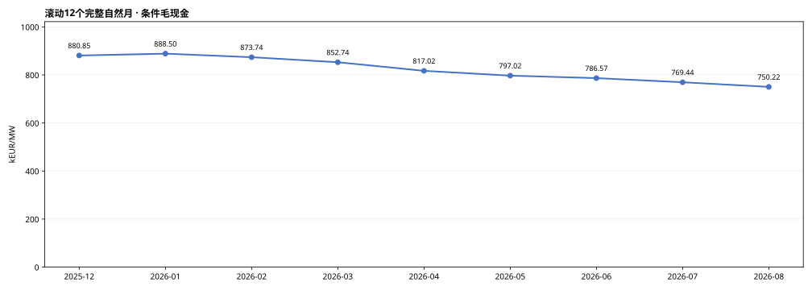
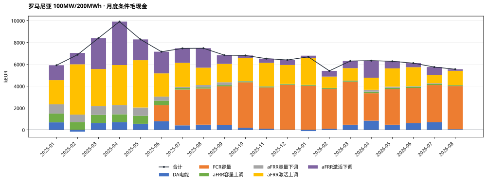
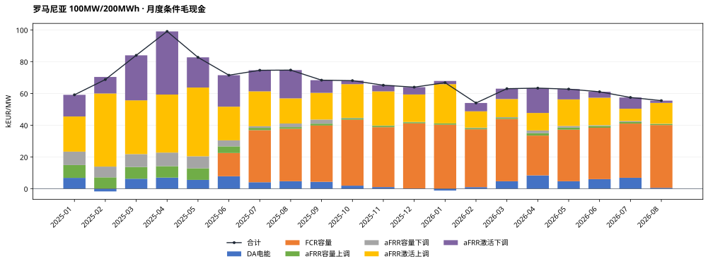
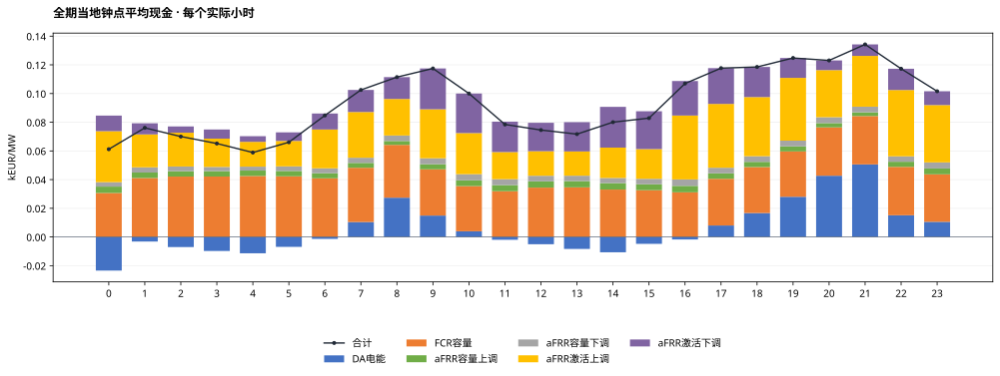
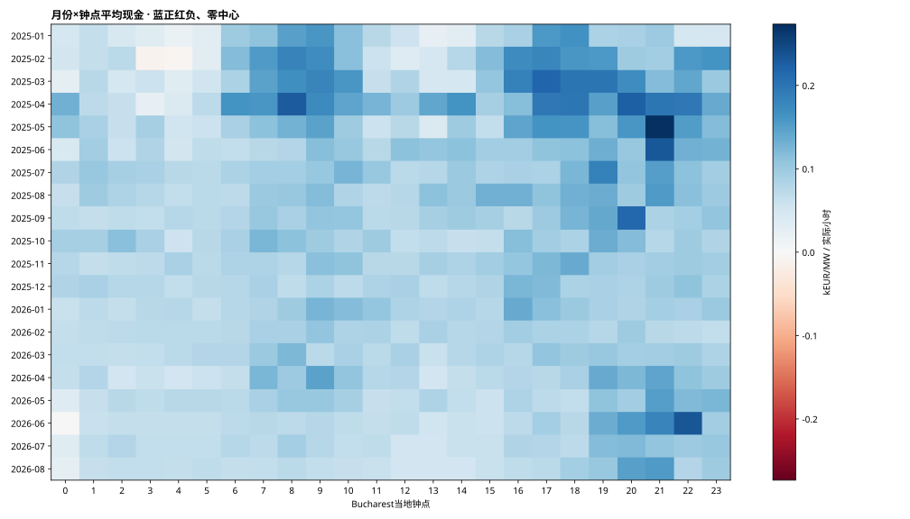
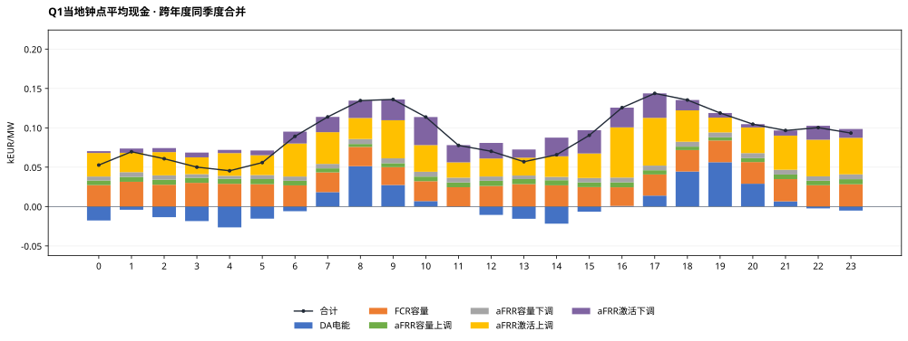
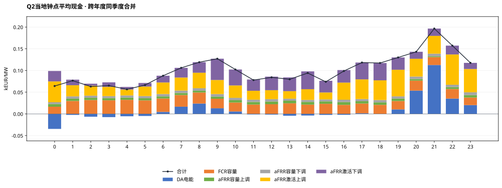
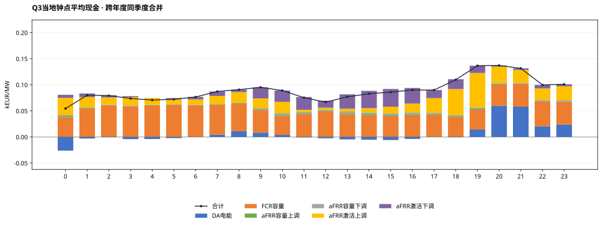
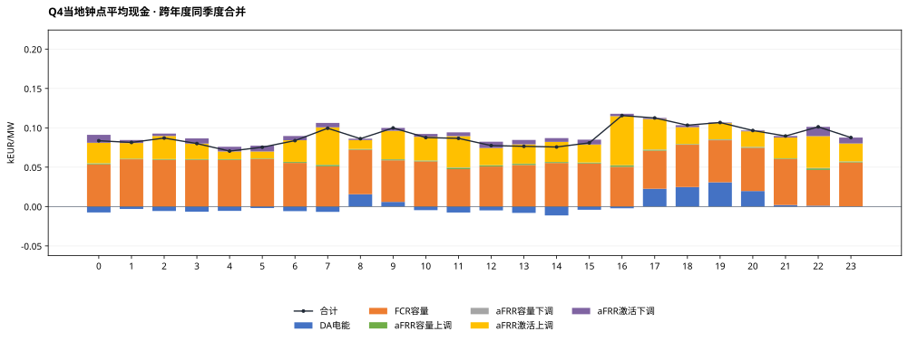

# 罗马尼亚MILP完整测算结果：100MW / 200MWh

正式统计期：2025-01-01至2026-08-31（Bucharest当地交付日），608天。运行COMPLETE，608个窗口、58,364个正式QH；2026-09-01观察日不计正式现金。

## 假设概览

| 项目 | 本次配置 |
|---|---|
| 电池规模与SOC | 100MW / 200MWh直流名义容量；SOC10—190MWh，可用180MWh；初末10MWh |
| 效率/年度EFC | 单向92%；DC吞吐/360MWh；2025预算600，2026年1—8月399.452054795 |
| 优化与币种 | 全EUR；两当地日规划首日执行；完美历史信息、价格接受者 |
| 容量系数 | p上调=p下调=pFCR=100%，外生现金系数；不是实测中标率 |
| 名义事件时表 | 交付前一当地日：容量09关闸/10结果，DA13关闸/14结果；研究假设 |
| FCR | 对称研究单元5×20MW、共享能量池；30分钟双向静态缓冲，仅容量机会价值 |
| aFRR | 严格三相下→上→基准；不归一化；无效QH覆盖的完整小时上下订单禁用 |
| 源数据/汇率 | OPCOM DA、Transelectrica DAMAS容量/激活价量、BNR；按Bucharest交付日严格前序参考日换汇 |
| 数据覆盖 | DA 58,364/58,364；aFRR 53,500/58,364；FCR 43,292/43,872（6月起范围） |
| 首日 | 过去已关闸且无历史账本订单为0，96QH；容量/激活与日前均不补报 |
| 求解状态 | 608窗均status0（按1e-4容许gap）；最大还原目标gap=9.2541473e-05 |
| 求解耗时 | 累计202.79秒；单窗中位0.258秒，最大4.249秒 |
| 审核状态 | 全期独立自动复算PASS；reviewer最终结论见本任务review_and_acceptance.md |

**解释边界：** 以下为条件事后市场毛现金，未扣投资、运维、税费等成本。系统容量均价和激活字段采用已批准代理口径，不等于本站结算发票。FCR没有频率激活电量、损耗及额外循环。两日滚动不是已证明的全时域全局最优上界。

## 结果概览

### 全期与自然年市场现金

| 期间 | kEUR | kEUR/MW | EFC |
|---|---|---|---|
| 全期20个月 | 136,523.49 | 1,365.23 | 780.56 |
| 月均（20个月、不外推） | 6,826.17 | 68.26 | 39.03 |
| 2025年 2025-01-01—2025-12-31 | 88,084.87 | 880.85 | 553.23 |
| 2026年 2026-01-01—2026-08-31 | 48,438.62 | 484.39 | 227.33 |

2026年只含1—8月，不年化。模型执行覆盖为100%，不代表各市场原始字段都完整；aFRR/FCR源失效订单按既定规则禁用，缺失收益不补算。

### 最新及逐月滚动12个月

最新窗口：2025-09—2026-08，75,022.38 kEUR，750.22 kEUR/MW。

本次仅计算p=100%的单一配置，不叠加未运行的另一情景或西班牙现金。每窗为12个完整自然月，不对市场缺口按比例外推。

| 窗口终月 | 12个月范围 | kEUR/MW | aFRR数据覆盖 | FCR数据覆盖（全窗口） |
|---|---|---|---|---|
| 2025-12 | 2025-01—2025-12 | 880.85 | 92.69% | 56.99% |
| 2026-01 | 2025-02—2026-01 | 888.50 | 92.32% | 65.48% |
| 2026-02 | 2025-03—2026-02 | 873.74 | 92.24% | 73.15% |
| 2026-03 | 2025-04—2026-03 | 852.74 | 91.85% | 81.63% |
| 2026-04 | 2025-05—2026-04 | 817.02 | 91.15% | 89.85% |
| 2026-05 | 2025-06—2026-05 | 797.02 | 90.87% | 98.34% |
| 2026-06 | 2025-07—2026-06 | 786.57 | 90.68% | 99.99% |
| 2026-07 | 2025-08—2026-07 | 769.44 | 90.57% | 99.99% |
| 2026-08 | 2025-09—2026-08 | 750.22 | 90.57% | 99.99% |

### EFC及能量

| 年份 | 已执行EFC | 固定预算 | 使用率 |
|---|---|---|---|
| 2025 | 553.229712 | 600.000000 | 92.20% |
| 2026 | 227.331242 | 399.452055 | 56.91% |

全期AC物理充电152,718.45MWh，放电129,260.89MWh；EFC直接累加相位DC吞吐，非QH净SOC差，亦非完整充放事件计数。正式末SOC=10.000000000MWh。

### 六项市场现金与占比

| 市场 | kEUR | kEUR/MW | 占总现金 |
|---|---|---|---|
| DA电能 | 8,080.96 | 80.81 | 5.92% |
| FCR容量 | 51,586.37 | 515.86 | 37.79% |
| aFRR容量上调 | 5,528.78 | 55.29 | 4.05% |
| aFRR容量下调 | 5,454.23 | 54.54 | 4.00% |
| aFRR激活上调 | 42,987.41 | 429.87 | 31.49% |
| aFRR激活下调 | 22,885.74 | 228.86 | 16.76% |
| 合计 | 136,523.49 | 1,365.23 | 100.00% |

所有现金保持符号，负价不裁剪；下调现金为负的原价格乘电量，负下调价格可产生正现金。占比以带符号总现金为分母，正项合计可能超过100%。

### 平均功率与预留容量

| 市场 | 平均MW | 含义 |
|---|---|---|
| DA | -1.01 | 售正购负，净额可抵消 |
| FCR容量 | 52.06 | 对称预留、收入只计一次 |
| aFRR容量上调 | 38.12 | 全额物理预留 |
| aFRR容量下调 | 37.15 | 全额物理预留 |
| aFRR激活上调 | 5.62 | 模型激活MWh/全期小时 |
| aFRR激活下调 | 6.22 | 方向电量为正，现金另按价格符号 |

均值分母包含全部58,364个正式QH和首日零承诺；不是各市场可用时段条件均值。各行不可相加解释为电站容量分配比例。

## 月度结果概览

### 月度明细与年汇总 · kEUR

| 月份 | DA电能 | FCR容量 | aFRR容量上调 | aFRR容量下调 | aFRR激活上调 | aFRR激活下调 | 合计 |
|---|---|---|---|---|---|---|---|
| 2025-01 | 690.26 | 0.00 | 808.60 | 844.56 | 2,212.51 | 1,364.20 | 5,920.13 |
| 2025-02 | -162.72 | 0.00 | 724.14 | 677.78 | 4,604.11 | 1,038.95 | 6,882.27 |
| 2025-03 | 636.22 | 0.00 | 740.27 | 811.05 | 3,384.75 | 2,834.88 | 8,407.18 |
| 2025-04 | 707.15 | 0.00 | 720.83 | 855.90 | 3,652.33 | 3,976.64 | 9,912.85 |
| 2025-05 | 564.67 | 0.00 | 729.96 | 755.53 | 4,328.31 | 1,901.38 | 8,279.85 |
| 2025-06 | 790.79 | 1,465.92 | 417.18 | 380.18 | 2,119.43 | 1,982.89 | 7,156.38 |
| 2025-07 | 415.34 | 3,278.18 | 149.77 | 101.17 | 2,195.26 | 1,326.21 | 7,465.93 |
| 2025-08 | 480.74 | 3,303.77 | 103.10 | 226.41 | 1,583.34 | 1,779.14 | 7,476.52 |
| 2025-09 | 443.01 | 3,545.08 | 117.46 | 258.09 | 1,680.69 | 798.65 | 6,842.97 |
| 2025-10 | 201.46 | 4,154.89 | 89.06 | 26.40 | 2,119.94 | 221.50 | 6,813.24 |
| 2025-11 | 112.64 | 3,770.35 | 88.38 | 14.30 | 2,152.46 | 387.00 | 6,525.13 |
| 2025-12 | 25.88 | 4,100.17 | 70.04 | 17.37 | 1,727.98 | 460.99 | 6,402.43 |
| 2025年月均 | 408.79 | 1,968.20 | 396.56 | 414.06 | 2,646.76 | 1,506.04 | 7,340.41 |
| 2025年合计 | 4,905.45 | 23,618.35 | 4,758.78 | 4,968.75 | 31,761.11 | 18,072.43 | 88,084.87 |
| 2026-01 | -108.05 | 4,042.40 | 73.07 | 8.48 | 2,468.33 | 201.03 | 6,685.25 |
| 2026-02 | 108.25 | 3,642.27 | 73.03 | 28.72 | 1,030.06 | 524.13 | 5,406.46 |
| 2026-03 | 477.66 | 3,924.53 | 65.13 | 45.94 | 1,141.04 | 652.61 | 6,306.91 |
| 2026-04 | 847.50 | 2,505.90 | 148.92 | 175.39 | 1,099.65 | 1,563.62 | 6,340.99 |
| 2026-05 | 478.22 | 3,247.98 | 133.40 | 99.64 | 1,673.85 | 646.42 | 6,279.50 |
| 2026-06 | 610.78 | 3,237.69 | 114.81 | 45.38 | 1,729.21 | 373.58 | 6,111.46 |
| 2026-07 | 697.18 | 3,414.35 | 92.37 | 68.94 | 771.39 | 709.41 | 5,753.63 |
| 2026-08 | 63.96 | 3,952.89 | 69.28 | 13.00 | 1,312.78 | 142.51 | 5,554.42 |
| 2026年月均 | 396.94 | 3,496.00 | 96.25 | 60.69 | 1,403.29 | 601.66 | 6,054.83 |
| 2026年合计 | 3,175.50 | 27,968.01 | 770.01 | 485.48 | 11,226.30 | 4,813.31 | 48,438.62 |

### 月度明细与年汇总 · kEUR/MW

| 月份 | DA电能 | FCR容量 | aFRR容量上调 | aFRR容量下调 | aFRR激活上调 | aFRR激活下调 | 合计 |
|---|---|---|---|---|---|---|---|
| 2025-01 | 6.90 | 0.00 | 8.09 | 8.45 | 22.13 | 13.64 | 59.20 |
| 2025-02 | -1.63 | 0.00 | 7.24 | 6.78 | 46.04 | 10.39 | 68.82 |
| 2025-03 | 6.36 | 0.00 | 7.40 | 8.11 | 33.85 | 28.35 | 84.07 |
| 2025-04 | 7.07 | 0.00 | 7.21 | 8.56 | 36.52 | 39.77 | 99.13 |
| 2025-05 | 5.65 | 0.00 | 7.30 | 7.56 | 43.28 | 19.01 | 82.80 |
| 2025-06 | 7.91 | 14.66 | 4.17 | 3.80 | 21.19 | 19.83 | 71.56 |
| 2025-07 | 4.15 | 32.78 | 1.50 | 1.01 | 21.95 | 13.26 | 74.66 |
| 2025-08 | 4.81 | 33.04 | 1.03 | 2.26 | 15.83 | 17.79 | 74.77 |
| 2025-09 | 4.43 | 35.45 | 1.17 | 2.58 | 16.81 | 7.99 | 68.43 |
| 2025-10 | 2.01 | 41.55 | 0.89 | 0.26 | 21.20 | 2.21 | 68.13 |
| 2025-11 | 1.13 | 37.70 | 0.88 | 0.14 | 21.52 | 3.87 | 65.25 |
| 2025-12 | 0.26 | 41.00 | 0.70 | 0.17 | 17.28 | 4.61 | 64.02 |
| 2025年月均 | 4.09 | 19.68 | 3.97 | 4.14 | 26.47 | 15.06 | 73.40 |
| 2025年合计 | 49.05 | 236.18 | 47.59 | 49.69 | 317.61 | 180.72 | 880.85 |
| 2026-01 | -1.08 | 40.42 | 0.73 | 0.08 | 24.68 | 2.01 | 66.85 |
| 2026-02 | 1.08 | 36.42 | 0.73 | 0.29 | 10.30 | 5.24 | 54.06 |
| 2026-03 | 4.78 | 39.25 | 0.65 | 0.46 | 11.41 | 6.53 | 63.07 |
| 2026-04 | 8.48 | 25.06 | 1.49 | 1.75 | 11.00 | 15.64 | 63.41 |
| 2026-05 | 4.78 | 32.48 | 1.33 | 1.00 | 16.74 | 6.46 | 62.79 |
| 2026-06 | 6.11 | 32.38 | 1.15 | 0.45 | 17.29 | 3.74 | 61.11 |
| 2026-07 | 6.97 | 34.14 | 0.92 | 0.69 | 7.71 | 7.09 | 57.54 |
| 2026-08 | 0.64 | 39.53 | 0.69 | 0.13 | 13.13 | 1.43 | 55.54 |
| 2026年月均 | 3.97 | 34.96 | 0.96 | 0.61 | 14.03 | 6.02 | 60.55 |
| 2026年合计 | 31.76 | 279.68 | 7.70 | 4.85 | 112.26 | 48.13 | 484.39 |

### 月度六项现金占比

| 月份 | DA电能 | FCR容量 | aFRR容量上调 | aFRR容量下调 | aFRR激活上调 | aFRR激活下调 |
|---|---|---|---|---|---|---|
| 2025-01 | 11.66% | 0.00% | 13.66% | 14.27% | 37.37% | 23.04% |
| 2025-02 | -2.36% | 0.00% | 10.52% | 9.85% | 66.90% | 15.10% |
| 2025-03 | 7.57% | 0.00% | 8.81% | 9.65% | 40.26% | 33.72% |
| 2025-04 | 7.13% | 0.00% | 7.27% | 8.63% | 36.84% | 40.12% |
| 2025-05 | 6.82% | 0.00% | 8.82% | 9.12% | 52.28% | 22.96% |
| 2025-06 | 11.05% | 20.48% | 5.83% | 5.31% | 29.62% | 27.71% |
| 2025-07 | 5.56% | 43.91% | 2.01% | 1.36% | 29.40% | 17.76% |
| 2025-08 | 6.43% | 44.19% | 1.38% | 3.03% | 21.18% | 23.80% |
| 2025-09 | 6.47% | 51.81% | 1.72% | 3.77% | 24.56% | 11.67% |
| 2025-10 | 2.96% | 60.98% | 1.31% | 0.39% | 31.11% | 3.25% |
| 2025-11 | 1.73% | 57.78% | 1.35% | 0.22% | 32.99% | 5.93% |
| 2025-12 | 0.40% | 64.04% | 1.09% | 0.27% | 26.99% | 7.20% |
| 2026-01 | -1.62% | 60.47% | 1.09% | 0.13% | 36.92% | 3.01% |
| 2026-02 | 2.00% | 67.37% | 1.35% | 0.53% | 19.05% | 9.69% |
| 2026-03 | 7.57% | 62.23% | 1.03% | 0.73% | 18.09% | 10.35% |
| 2026-04 | 13.37% | 39.52% | 2.35% | 2.77% | 17.34% | 24.66% |
| 2026-05 | 7.62% | 51.72% | 2.12% | 1.59% | 26.66% | 10.29% |
| 2026-06 | 9.99% | 52.98% | 1.88% | 0.74% | 28.29% | 6.11% |
| 2026-07 | 12.12% | 59.34% | 1.61% | 1.20% | 13.41% | 12.33% |
| 2026-08 | 1.15% | 71.17% | 1.25% | 0.23% | 23.63% | 2.57% |

### 月度数据覆盖与EFC

| 月份 | 执行QH | aFRR有效QH | FCR有效/范围内QH | EFC |
|---|---|---|---|---|
| 2025-01 | 2976 | 2840 | 0/0 | 63.19 |
| 2025-02 | 2688 | 2524 | 0/0 | 65.41 |
| 2025-03 | 2972 | 2740 | 0/0 | 70.50 |
| 2025-04 | 2880 | 2688 | 0/0 | 69.40 |
| 2025-05 | 2976 | 2792 | 0/0 | 69.49 |
| 2025-06 | 2880 | 2664 | 2304/2880 | 51.38 |
| 2025-07 | 2976 | 2756 | 2976/2976 | 34.05 |
| 2025-08 | 2976 | 2760 | 2976/2976 | 33.33 |
| 2025-09 | 2880 | 2624 | 2880/2880 | 31.82 |
| 2025-10 | 2980 | 2716 | 2976/2980 | 24.81 |
| 2025-11 | 2880 | 2652 | 2880/2880 | 22.07 |
| 2025-12 | 2976 | 2724 | 2976/2976 | 17.76 |
| 2026-01 | 2976 | 2708 | 2976/2976 | 20.72 |
| 2026-02 | 2688 | 2496 | 2688/2688 | 18.42 |
| 2026-03 | 2972 | 2604 | 2972/2972 | 25.48 |
| 2026-04 | 2880 | 2444 | 2880/2880 | 41.30 |
| 2026-05 | 2976 | 2692 | 2976/2976 | 34.33 |
| 2026-06 | 2880 | 2600 | 2880/2880 | 32.93 |
| 2026-07 | 2976 | 2716 | 2976/2976 | 31.41 |
| 2026-08 | 2976 | 2760 | 2976/2976 | 22.75 |

## 小时级结果概览

先合计每个实际小时的四个执行QH，再按Bucharest当地钟点取均值；秋季重复小时按不同UTC偏移分别计样本。全期14,591个完整执行小时，源失效市场的模型零订单保留，数据有效小时数在CSV单列。

所有小时曲线与热图均用kEUR/MW/实际小时；图上0.03表示30EUR/MW。季度图跨年度同季度合并，四图共用纵轴。

### 月份×小时热力图

蓝正红负，零中心；每格为该月该钟点每个实际小时平均现金，不是该月累计。

### Q1

样本月份：2025-01, 2025-02, 2025-03, 2026-01, 2026-02, 2026-03；实际小时样本4,318。

### Q2

样本月份：2025-04, 2025-05, 2025-06, 2026-04, 2026-05, 2026-06；实际小时样本4,368。

### Q3

样本月份：2025-07, 2025-08, 2025-09, 2026-07, 2026-08；实际小时样本3,696。

### Q4

样本月份：2025-10, 2025-11, 2025-12；实际小时样本2,209。

## 输出、来源和适用范围

- monthly.csv、annual.csv、daily.csv：六项现金（kEUR/kEUR每MW）、EFC、物理电量、逐市场数据覆盖。2026年不外推全年。
- market_totals.csv、monthly_market_shares.csv：带符号金额及占比。
- hourly.csv、quarterly_hourly.csv、monthly_hourly_heatmap.csv：小时均值和实际样本数；DST分别处理。
- rolling_12m.csv：9个滚动12自然月窗口。SVG共9张，PNG为对应预览。
- report_manifest.json：生成脚本/原始执行文件/完整验证/参考ES版本哈希和报告环境。核心run_v1保留QH、相位、订单、窗口指标、年度预算和不可变事务链。

**F（事实）**：OPCOM/DAMAS/BNR官方来源及价格/数量/空值证据见输入数据包source_registry。

**I（解释）**：本报告按Bucharest交付日归集已执行现金；数据缺口、执行完整性与市场参与量分列。

**A（假设）**：已确认代理字段、名义时表、资格/单元、p=1、三相及FCR静态机会价值仍是研究假设。API最终结算语义、真实项目资格、实际历史信息可见性和FCR频率轨迹未因本次计算而得到确认。

格式参照[ES_MILP固定提交的报告生成代码](https://github.com/hutianyi326/ES_MILP/blob/70651210d0ad98ac820644754508f76363d2c799/code/project/build_es_result_presentation.py)，并将ES的ID分项替换为RO的FCR容量分项。只参考展示结构，不导入西班牙市场规则、预算或测算结果。
