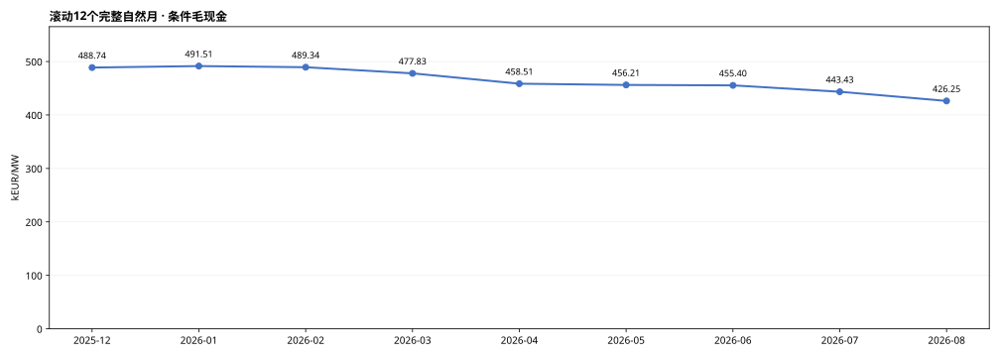
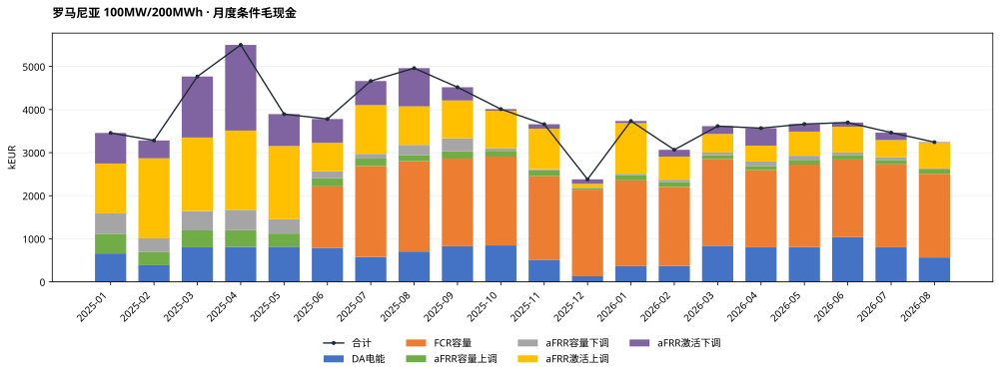
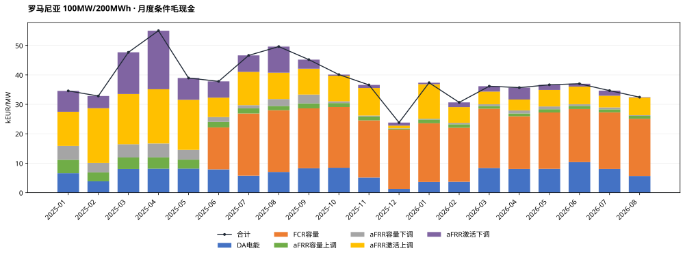
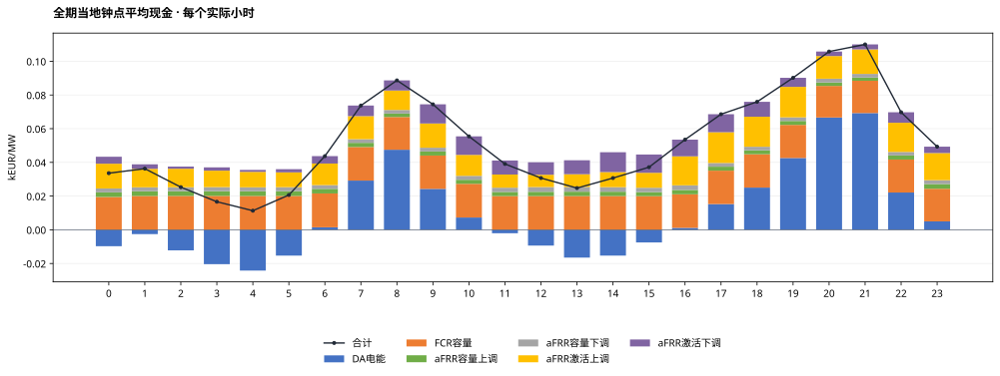
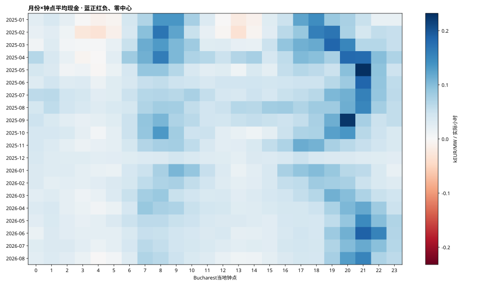
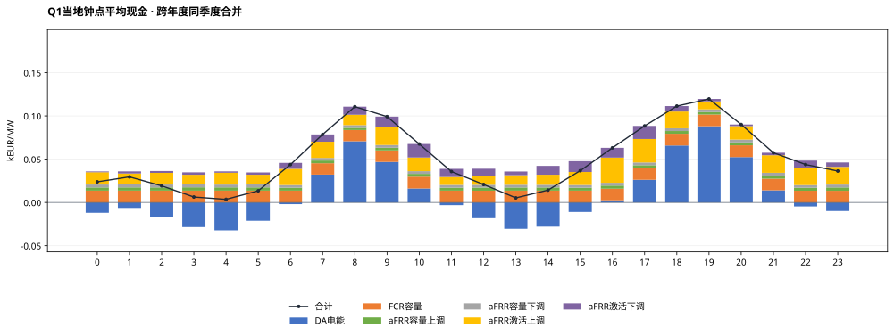
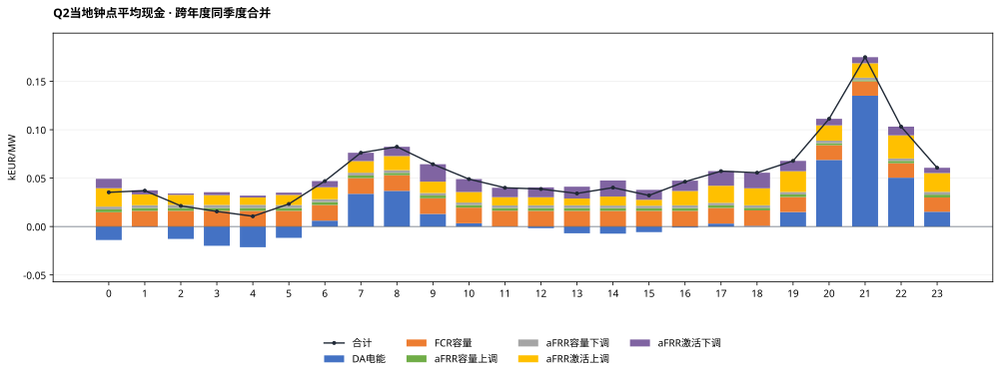
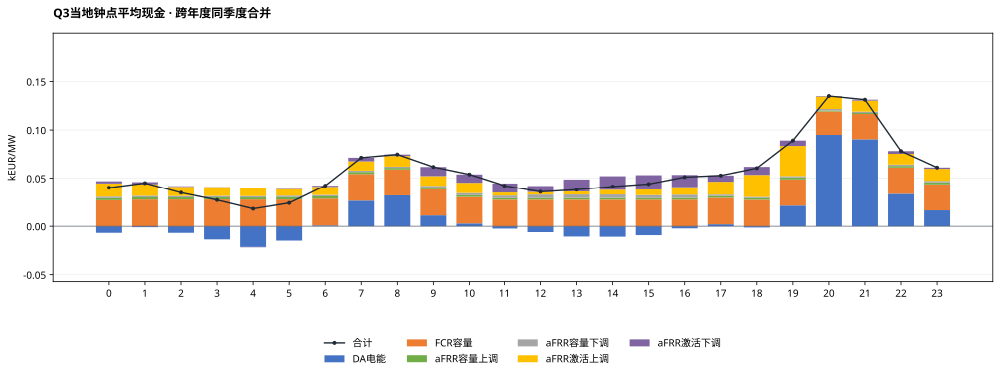
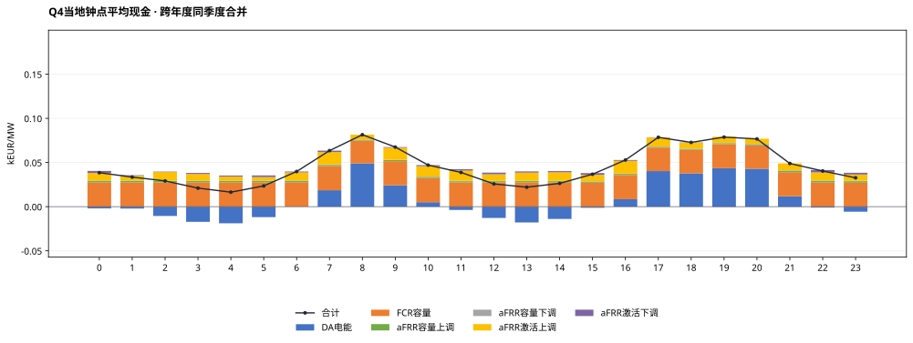

# 罗马尼亚MILP完整测算结果：100MW / 200MWh

正式统计期：2025-01-01至2026-08-31（Bucharest当地交付日），608天。运行COMPLETE，608个窗口、58,364个正式QH；2026-09-01观察日不计正式现金。

## 假设概览

| 项目 | 本次配置 |
|---|---|
| 电池规模与SOC | 100MW / 200MWh直流名义容量；SOC10—190MWh，可用180MWh；初末10MWh |
| 效率/年度EFC | 单向92%；DC吞吐/360MWh；2025预算600，2026年1—8月399.452054795 |
| 优化与币种 | 全EUR；两当地日规划首日执行；完美历史信息、价格接受者 |
| 容量份额 | 月度FCR/aFRR系统需求份额上限；中标MW受限，容量现金不再乘旧p系数；代理月份保留 |
| 名义事件时表 | 交付前一当地日：容量09关闸/10结果，DA13关闸/14结果；研究假设 |
| FCR | 对称研究单元5×20MW、共享能量池；30分钟双向静态缓冲，仅容量机会价值 |
| aFRR | 严格三相下→上→基准；不归一化；无效QH覆盖的完整小时上下订单禁用 |
| 源数据/汇率 | OPCOM DA、Transelectrica DAMAS容量/激活价量、BNR；按Bucharest交付日严格前序参考日换汇 |
| 数据覆盖 | DA 58,364/58,364；aFRR 53,500/58,364；FCR 43,292/43,872（6月起范围） |
| 首日 | 过去已关闸且无历史账本订单为0，96QH；容量/激活与日前均不补报 |
| 求解状态 | 状态计数={0: 608}（按1e-4容许gap）；最大还原目标gap=5.4412229e-05 |
| 求解耗时 | 累计118.00秒；单窗中位0.145秒，最大8.510秒 |
| 审核状态 | 全期独立自动复算PASS；reviewer最终结论见本任务review_and_acceptance.md |

**解释边界：** 以下为条件事后市场毛现金，未扣投资、运维、税费等成本。系统容量均价和激活字段采用已批准代理口径，不等于本站结算发票。FCR没有频率激活电量、损耗及额外循环。两日滚动不是已证明的全时域全局最优上界。

## 结果概览

### 全期与自然年市场现金

| 期间 | kEUR | kEUR/MW | EFC |
|---|---|---|---|
| 全期20个月 | 76,930.37 | 769.30 | 981.34 |
| 月均（20个月、不外推） | 3,846.52 | 38.47 | 49.07 |
| 2025年 2025-01-01—2025-12-31 | 48,873.68 | 488.74 | 600.00 |
| 2026年 2026-01-01—2026-08-31 | 28,056.69 | 280.57 | 381.34 |

2026年只含1—8月，不年化。模型执行覆盖为100%，不代表各市场原始字段都完整；aFRR/FCR源失效订单按既定规则禁用，缺失收益不补算。

### 最新及逐月滚动12个月

最新窗口：2025-09—2026-08，42,625.13 kEUR，426.25 kEUR/MW。

本次计算月度份额上限版本的单一配置，不叠加未运行的另一情景或西班牙现金。每窗为12个完整自然月，不对市场缺口按比例外推。

| 窗口终月 | 12个月范围 | kEUR/MW | aFRR数据覆盖 | FCR数据覆盖（全窗口） |
|---|---|---|---|---|
| 2025-12 | 2025-01—2025-12 | 488.74 | 92.69% | 56.99% |
| 2026-01 | 2025-02—2026-01 | 491.51 | 92.32% | 65.48% |
| 2026-02 | 2025-03—2026-02 | 489.34 | 92.24% | 73.15% |
| 2026-03 | 2025-04—2026-03 | 477.83 | 91.85% | 81.63% |
| 2026-04 | 2025-05—2026-04 | 458.51 | 91.15% | 89.85% |
| 2026-05 | 2025-06—2026-05 | 456.21 | 90.87% | 98.34% |
| 2026-06 | 2025-07—2026-06 | 455.40 | 90.68% | 99.99% |
| 2026-07 | 2025-08—2026-07 | 443.43 | 90.57% | 99.99% |
| 2026-08 | 2025-09—2026-08 | 426.25 | 90.57% | 99.99% |

### EFC及能量

| 年份 | 已执行EFC | 固定预算 | 使用率 |
|---|---|---|---|
| 2025 | 600.000000 | 600.000000 | 100.00% |
| 2026 | 381.337439 | 399.452055 | 95.47% |

全期AC物理充电192,000.80MWh，放电162,509.48MWh；EFC直接累加相位DC吞吐，非QH净SOC差，亦非完整充放事件计数。正式末SOC=10.000000000MWh。

### 六项市场现金与占比

| 市场 | kEUR | kEUR/MW | 占总现金 |
|---|---|---|---|
| DA电能 | 13,474.86 | 134.75 | 17.52% |
| FCR容量 | 28,892.19 | 288.92 | 37.56% |
| aFRR容量上调 | 3,662.61 | 36.63 | 4.76% |
| aFRR容量下调 | 3,449.70 | 34.50 | 4.48% |
| aFRR激活上调 | 18,372.88 | 183.73 | 23.88% |
| aFRR激活下调 | 9,078.14 | 90.78 | 11.80% |
| 合计 | 76,930.37 | 769.30 | 100.00% |

所有现金保持符号，负价不裁剪；下调现金为负的原价格乘电量，负下调价格可产生正现金。占比以带符号总现金为分母，正项合计可能超过100%。

### 平均功率与预留容量

| 市场 | 平均MW | 含义 |
|---|---|---|
| DA | -1.46 | 售正购负，净额可抵消 |
| FCR容量 | 29.32 | 对称预留、收入只计一次 |
| aFRR容量上调 | 28.70 | 全额物理预留 |
| aFRR容量下调 | 29.24 | 全额物理预留 |
| aFRR激活上调 | 2.90 | 模型激活MWh/全期小时 |
| aFRR激活下调 | 3.46 | 方向电量为正，现金另按价格符号 |

均值分母包含全部58,364个正式QH和首日零承诺；不是各市场可用时段条件均值。各行不可相加解释为电站容量分配比例。

## 月度结果概览

### 月度明细与年汇总 · kEUR

| 月份 | DA电能 | FCR容量 | aFRR容量上调 | aFRR容量下调 | aFRR激活上调 | aFRR激活下调 | 合计 |
|---|---|---|---|---|---|---|---|
| 2025-01 | 660.23 | 0.00 | 456.83 | 474.15 | 1,156.77 | 708.83 | 3,456.81 |
| 2025-02 | 386.74 | 0.00 | 302.81 | 322.19 | 1,857.01 | 414.31 | 3,283.06 |
| 2025-03 | 803.16 | 0.00 | 393.15 | 449.56 | 1,705.22 | 1,415.97 | 4,767.07 |
| 2025-04 | 814.60 | 0.00 | 384.99 | 473.02 | 1,839.96 | 1,987.63 | 5,500.19 |
| 2025-05 | 816.95 | 0.00 | 305.17 | 333.23 | 1,698.28 | 740.58 | 3,894.22 |
| 2025-06 | 791.75 | 1,425.04 | 186.99 | 163.81 | 659.77 | 552.82 | 3,780.19 |
| 2025-07 | 577.98 | 2,110.44 | 173.20 | 109.38 | 1,131.39 | 560.06 | 4,662.46 |
| 2025-08 | 703.93 | 2,097.21 | 143.96 | 235.39 | 893.48 | 887.29 | 4,961.25 |
| 2025-09 | 828.67 | 2,034.05 | 168.79 | 300.17 | 878.88 | 307.88 | 4,518.45 |
| 2025-10 | 847.23 | 2,061.50 | 134.03 | 61.30 | 867.83 | 38.04 | 4,009.92 |
| 2025-11 | 514.78 | 1,940.51 | 133.37 | 30.14 | 936.83 | 103.81 | 3,659.45 |
| 2025-12 | 130.83 | 2,010.31 | 35.66 | 11.29 | 89.03 | 103.49 | 2,380.61 |
| 2025年月均 | 656.40 | 1,139.92 | 234.91 | 246.97 | 1,142.87 | 651.73 | 4,072.81 |
| 2025年合计 | 7,876.85 | 13,679.06 | 2,818.96 | 2,963.63 | 13,714.46 | 7,820.72 | 48,873.68 |
| 2026-01 | 365.29 | 1,992.07 | 126.11 | 27.57 | 1,173.87 | 49.43 | 3,734.32 |
| 2026-02 | 371.37 | 1,833.01 | 117.45 | 49.97 | 534.56 | 159.82 | 3,066.18 |
| 2026-03 | 839.10 | 2,013.62 | 88.05 | 62.20 | 430.01 | 182.53 | 3,615.50 |
| 2026-04 | 804.39 | 1,789.15 | 96.84 | 104.70 | 368.30 | 405.07 | 3,568.46 |
| 2026-05 | 808.30 | 1,915.33 | 110.11 | 94.58 | 560.39 | 175.02 | 3,663.72 |
| 2026-06 | 1,037.84 | 1,803.39 | 105.24 | 58.15 | 596.97 | 98.05 | 3,699.64 |
| 2026-07 | 804.28 | 1,924.41 | 101.09 | 65.38 | 397.49 | 172.94 | 3,465.58 |
| 2026-08 | 567.45 | 1,942.16 | 98.76 | 23.52 | 596.84 | 14.56 | 3,243.28 |
| 2026年月均 | 699.75 | 1,901.64 | 105.46 | 60.76 | 582.30 | 157.18 | 3,507.09 |
| 2026年合计 | 5,598.01 | 15,213.13 | 843.65 | 486.06 | 4,658.42 | 1,257.42 | 28,056.69 |

### 月度明细与年汇总 · kEUR/MW

| 月份 | DA电能 | FCR容量 | aFRR容量上调 | aFRR容量下调 | aFRR激活上调 | aFRR激活下调 | 合计 |
|---|---|---|---|---|---|---|---|
| 2025-01 | 6.60 | 0.00 | 4.57 | 4.74 | 11.57 | 7.09 | 34.57 |
| 2025-02 | 3.87 | 0.00 | 3.03 | 3.22 | 18.57 | 4.14 | 32.83 |
| 2025-03 | 8.03 | 0.00 | 3.93 | 4.50 | 17.05 | 14.16 | 47.67 |
| 2025-04 | 8.15 | 0.00 | 3.85 | 4.73 | 18.40 | 19.88 | 55.00 |
| 2025-05 | 8.17 | 0.00 | 3.05 | 3.33 | 16.98 | 7.41 | 38.94 |
| 2025-06 | 7.92 | 14.25 | 1.87 | 1.64 | 6.60 | 5.53 | 37.80 |
| 2025-07 | 5.78 | 21.10 | 1.73 | 1.09 | 11.31 | 5.60 | 46.62 |
| 2025-08 | 7.04 | 20.97 | 1.44 | 2.35 | 8.93 | 8.87 | 49.61 |
| 2025-09 | 8.29 | 20.34 | 1.69 | 3.00 | 8.79 | 3.08 | 45.18 |
| 2025-10 | 8.47 | 20.61 | 1.34 | 0.61 | 8.68 | 0.38 | 40.10 |
| 2025-11 | 5.15 | 19.41 | 1.33 | 0.30 | 9.37 | 1.04 | 36.59 |
| 2025-12 | 1.31 | 20.10 | 0.36 | 0.11 | 0.89 | 1.03 | 23.81 |
| 2025年月均 | 6.56 | 11.40 | 2.35 | 2.47 | 11.43 | 6.52 | 40.73 |
| 2025年合计 | 78.77 | 136.79 | 28.19 | 29.64 | 137.14 | 78.21 | 488.74 |
| 2026-01 | 3.65 | 19.92 | 1.26 | 0.28 | 11.74 | 0.49 | 37.34 |
| 2026-02 | 3.71 | 18.33 | 1.17 | 0.50 | 5.35 | 1.60 | 30.66 |
| 2026-03 | 8.39 | 20.14 | 0.88 | 0.62 | 4.30 | 1.83 | 36.16 |
| 2026-04 | 8.04 | 17.89 | 0.97 | 1.05 | 3.68 | 4.05 | 35.68 |
| 2026-05 | 8.08 | 19.15 | 1.10 | 0.95 | 5.60 | 1.75 | 36.64 |
| 2026-06 | 10.38 | 18.03 | 1.05 | 0.58 | 5.97 | 0.98 | 37.00 |
| 2026-07 | 8.04 | 19.24 | 1.01 | 0.65 | 3.97 | 1.73 | 34.66 |
| 2026-08 | 5.67 | 19.42 | 0.99 | 0.24 | 5.97 | 0.15 | 32.43 |
| 2026年月均 | 7.00 | 19.02 | 1.05 | 0.61 | 5.82 | 1.57 | 35.07 |
| 2026年合计 | 55.98 | 152.13 | 8.44 | 4.86 | 46.58 | 12.57 | 280.57 |

### 月度六项现金占比

| 月份 | DA电能 | FCR容量 | aFRR容量上调 | aFRR容量下调 | aFRR激活上调 | aFRR激活下调 |
|---|---|---|---|---|---|---|
| 2025-01 | 19.10% | 0.00% | 13.22% | 13.72% | 33.46% | 20.51% |
| 2025-02 | 11.78% | 0.00% | 9.22% | 9.81% | 56.56% | 12.62% |
| 2025-03 | 16.85% | 0.00% | 8.25% | 9.43% | 35.77% | 29.70% |
| 2025-04 | 14.81% | 0.00% | 7.00% | 8.60% | 33.45% | 36.14% |
| 2025-05 | 20.98% | 0.00% | 7.84% | 8.56% | 43.61% | 19.02% |
| 2025-06 | 20.94% | 37.70% | 4.95% | 4.33% | 17.45% | 14.62% |
| 2025-07 | 12.40% | 45.26% | 3.71% | 2.35% | 24.27% | 12.01% |
| 2025-08 | 14.19% | 42.27% | 2.90% | 4.74% | 18.01% | 17.88% |
| 2025-09 | 18.34% | 45.02% | 3.74% | 6.64% | 19.45% | 6.81% |
| 2025-10 | 21.13% | 51.41% | 3.34% | 1.53% | 21.64% | 0.95% |
| 2025-11 | 14.07% | 53.03% | 3.64% | 0.82% | 25.60% | 2.84% |
| 2025-12 | 5.50% | 84.45% | 1.50% | 0.47% | 3.74% | 4.35% |
| 2026-01 | 9.78% | 53.34% | 3.38% | 0.74% | 31.43% | 1.32% |
| 2026-02 | 12.11% | 59.78% | 3.83% | 1.63% | 17.43% | 5.21% |
| 2026-03 | 23.21% | 55.69% | 2.44% | 1.72% | 11.89% | 5.05% |
| 2026-04 | 22.54% | 50.14% | 2.71% | 2.93% | 10.32% | 11.35% |
| 2026-05 | 22.06% | 52.28% | 3.01% | 2.58% | 15.30% | 4.78% |
| 2026-06 | 28.05% | 48.75% | 2.84% | 1.57% | 16.14% | 2.65% |
| 2026-07 | 23.21% | 55.53% | 2.92% | 1.89% | 11.47% | 4.99% |
| 2026-08 | 17.50% | 59.88% | 3.05% | 0.73% | 18.40% | 0.45% |

### 月度数据覆盖与EFC

| 月份 | 执行QH | aFRR有效QH | FCR有效/范围内QH | EFC |
|---|---|---|---|---|
| 2025-01 | 2976 | 2840 | 0/0 | 61.68 |
| 2025-02 | 2688 | 2524 | 0/0 | 57.21 |
| 2025-03 | 2972 | 2740 | 0/0 | 66.35 |
| 2025-04 | 2880 | 2688 | 0/0 | 63.75 |
| 2025-05 | 2976 | 2792 | 0/0 | 63.12 |
| 2025-06 | 2880 | 2664 | 2304/2880 | 40.73 |
| 2025-07 | 2976 | 2756 | 2976/2976 | 42.25 |
| 2025-08 | 2976 | 2760 | 2976/2976 | 43.17 |
| 2025-09 | 2880 | 2624 | 2880/2880 | 48.26 |
| 2025-10 | 2980 | 2716 | 2976/2980 | 58.16 |
| 2025-11 | 2880 | 2652 | 2880/2880 | 45.53 |
| 2025-12 | 2976 | 2724 | 2976/2976 | 9.80 |
| 2026-01 | 2976 | 2708 | 2976/2976 | 45.47 |
| 2026-02 | 2688 | 2496 | 2688/2688 | 45.18 |
| 2026-03 | 2972 | 2604 | 2972/2972 | 53.79 |
| 2026-04 | 2880 | 2444 | 2880/2880 | 50.84 |
| 2026-05 | 2976 | 2692 | 2976/2976 | 47.34 |
| 2026-06 | 2880 | 2600 | 2880/2880 | 45.90 |
| 2026-07 | 2976 | 2716 | 2976/2976 | 47.02 |
| 2026-08 | 2976 | 2760 | 2976/2976 | 45.82 |

## 小时级结果概览

先合计每个实际小时的四个执行QH，再按Bucharest当地钟点取均值；秋季重复小时按不同UTC偏移分别计样本。全期14,591个完整执行小时，源失效市场的模型零订单保留，数据有效小时数在CSV单列。

所有小时曲线与热图均用kEUR/MW/实际小时；图上0.03表示30EUR/MW。季度图跨年度同季度合并，四图共用纵轴。

### 月份×小时热力图

蓝正红负，零中心；每格为该月该钟点每个实际小时平均现金，不是该月累计。

### Q1

样本月份：2025-01, 2025-02, 2025-03, 2026-01, 2026-02, 2026-03；实际小时样本4,318。

### Q2

样本月份：2025-04, 2025-05, 2025-06, 2026-04, 2026-05, 2026-06；实际小时样本4,368。

### Q3

样本月份：2025-07, 2025-08, 2025-09, 2026-07, 2026-08；实际小时样本3,696。

### Q4

样本月份：2025-10, 2025-11, 2025-12；实际小时样本2,209。

## 输出、来源和适用范围

- monthly.csv、annual.csv、daily.csv：六项现金（kEUR/kEUR每MW）、EFC、物理电量、逐市场数据覆盖。2026年不外推全年。
- market_totals.csv、monthly_market_shares.csv：带符号金额及占比。
- hourly.csv、quarterly_hourly.csv、monthly_hourly_heatmap.csv：小时均值和实际样本数；DST分别处理。
- rolling_12m.csv：9个滚动12自然月窗口。SVG共9张，PNG为对应预览。
- report_manifest.json：生成脚本/原始执行文件/完整验证/参考ES版本哈希和报告环境。核心run目录保留QH、相位、订单、窗口指标、年度预算和不可变事务链。

**F（事实）**：OPCOM/DAMAS/BNR官方来源及价格/数量/空值证据见输入数据包source_registry。

**I（解释）**：本报告按Bucharest交付日归集已执行现金；数据缺口、执行完整性与市场参与量分列。

**A（假设）**：已确认代理字段、名义时表、资格/单元、月度容量份额及代理月份、三相及FCR静态机会价值仍是研究假设。仍有194份供应商附件缺失，代理月份的来源局限保留。API最终结算语义、真实项目资格、实际历史信息可见性和FCR频率轨迹未因本次计算而得到确认。

格式参照[ES_MILP固定提交的报告生成代码](https://github.com/hutianyi326/ES_MILP/blob/70651210d0ad98ac820644754508f76363d2c799/code/project/build_es_result_presentation.py)，并将ES的ID分项替换为RO的FCR容量分项。只参考展示结构，不导入西班牙市场规则、预算或测算结果。
