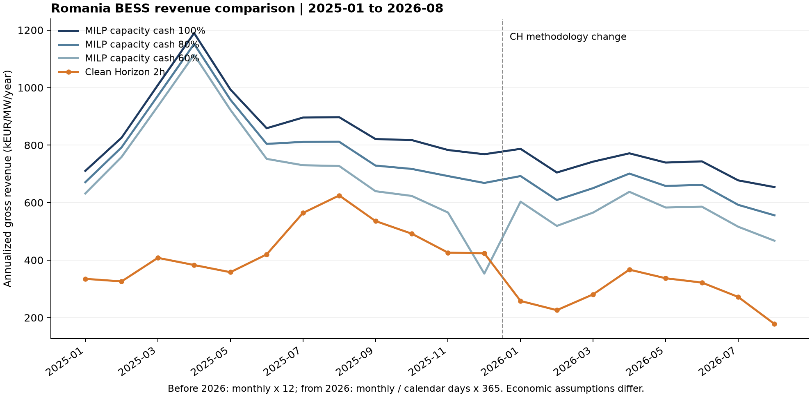

# 罗马尼亚储能收益外部对照

研究日期：2026-10-04。对象：现有100 MW / 200 MWh、容量现金系数100%的v3结果，以及用户提供的Clean Horizon罗马尼亚2h指数。本文对照既有结果，不修改或重跑MILP。

统一8月年化口径后，我们为653.99 kEUR/MW/年，Clean Horizon为178，相差3.67倍。最需要重新检验的是FCR可获得容量及竞争假设，其次是aFRR完美信息及激活分配代理。现有结果应继续标注为假设条件下的事后毛收益机会价值，不能直接解释成平均项目可实现收入。本次尚不能把475.99的差额精确归因到各项假设。

## 1. 时间和单位对齐

用户CSV共44个月，2023-01至2026-08，字段为Category、2h index。8月值178来自该文件。CH方法页[S1]说明2026年起按当月收入÷当月天数×365年化，2026年前按月收入×12；该指数并非滚动12个月收入，也不是下一年收入预测。下表均为2026年8月，币种EUR，功率分母100 MW。

| 口径 | 当月收入 kEUR/MW | 当月价格环境年化 kEUR/MW/年 | 相对CH |
|---|---:|---:|---:|
| CH 2h指数反推 | 15.12 | 178.00 | 1.00 |
| 我们，容量现金系数100% | 55.54 | 653.99 | 3.67 |
| 我们，容量现金系数80% | 47.21 | 555.90 | 3.12 |
| 我们，容量现金系数60% | 39.71 | 467.52 | 2.63 |

100%情景8月现金为5,554,396.81 EUR。年化计算为5,554,396.81÷100÷1,000÷31×365=653.99。CH对应100 MW的8月毛收入约1,511,780.82 EUR，系按其标准单位指数放大，不能视为其对一个100 MW具体项目的报价。我们2025-09至2026-08滚动12个月值750.22不能直接与178比较。

图与monthly_comparison.csv覆盖双方共同20个月。年化因子已经对齐，但经济假设并未对齐；2026年1月CH改变经济方法，因此不宜把方法断点全部解释为市场收益下降。

## 2. 8月现金拆分与FCR规模

| 现有100%结果 | 100 MW当月现金 EUR | 年化 kEUR/MW/年 | 当月现金占比 |
|---|---:|---:|---:|
| DA净现金 | 63,963.45 | 7.53 | 1.15% |
| FCR容量 | 3,952,828.62 | 465.41 | 71.17% |
| aFRR向上容量 | 69,287.41 | 8.16 | 1.25% |
| aFRR向下容量 | 13,005.62 | 1.53 | 0.23% |
| aFRR向上激活 | 1,312,805.75 | 154.57 | 23.64% |
| aFRR向下激活 | 142,505.97 | 16.78 | 2.57% |
| 合计 | 5,554,396.81 | 653.99 | 100% |

这是联合优化的现金分账；DA列包含给其他市场履约所需的充电支出，不能当作独立DA套利策略收益。

从8月2,976个15分钟执行记录与同一时刻输入匹配得到：

- 项目FCR平均预留80.4409 MW；输入中的系统平均已采购FCR容量112.0372 MW，范围51.968—132.992 MW。
- 项目容量时积分÷系统容量时积分=71.7984%。83.33%的交付小时，本站预留至少占系统采购的一半。这是模型隐含规模，绝非真实项目中标份额。
- FCR收入÷容量时积分=66.0478 EUR/MW/h；输入价格简单均值66.0194。按每季小时的EUR价格×预留MW×0.25重算，准确回到3,952,828.62 EUR。

当前约束只要求本站不超过系统已采购容量，未加入本站市场份额或其他BESS竞争约束。一个100 MW项目长期取得约72%的全系统FCR容量，属于很强的机会获取假设。DNV报告[S4]中FCR约70 EUR/MW/h的量级与现有输入接近，但这只能交叉验证量级，不能证明DAMAS每条输入、单位代理和最终结算均正确。

仅在账面扣除FCR后，余项年化为188.57，接近CH的178。这提示FCR需要优先研究；**188.57不是不参加FCR后重新优化的收益，也不能据此说FCR解释了全部偏差**。取消FCR将改变DA、aFRR、SOC和循环分配，CH本身也包含FCR。[S1]

## 3. 方法差异和影响判断

| 项目 | CH公开方法 | 本项目已登记假设 | 研究解释 |
|---|---|---|---|
| 竞争与市场规模 | 2026年起同时考虑市场可用容量/激活量及储能装机，描述平均MW机会[S2] | 价格接受者，只设置系统采购量上限；未限制本站竞争份额 | FCR占本月现金71.17%，应优先检验可获容量；影响未做因果定量 |
| 决策信息 | DA完全已知；辅助服务D-1价格过滤罕见尖峰；其他市场采用统计估计[S1] | 两日窗口事后价格和系统激活比例已知 | 可以提前回避不利激活、选择有利时段，aFRR机会值偏乐观 |
| 激活分配 | 详细算法未公开 | 系统激活电量/系统采购容量构造三相，再按本站预留分配 | 系统比例不能证明本站按其报价会获得相同激活 |
| FCR参与和履约 | 按国家和产品考虑预认证；具体FCR实现未公开[S1] | 假设100 MW组合合格；30分钟静态能量缓冲；不计频率激活、损耗、恢复和额外循环 | 资格和完整履约收益未验证。CH也排除SOC管理费用，不能把遗漏成本全部当作双方差额 |
| 容量系数 | 未公布等同于我们p的系数 | p=1/0.8/0.6仅作用于容量现金，满额预留并按既定方式激活 | 60%情景仍为467.52；折减现金不等于模拟竞争中标 |
| 时长和效率 | 2h为可用AC能量；RTE85%[S1] | 200 MWh名义DC、5%—95%SOC、单向92% | 全可用区间仅能输出165.6 MWh AC，即1.656h；RTE84.64%。该差异通常使我方更受限，不能解释我方大幅偏高 |
| 循环 | 1.5次/日[S1] | 年度600 EFC按覆盖折算，跨日分配 | 8月实际22.75 EFC，最高单日1.314，按我方EFC定义无日超过1.5；不能将年度600简单认定为8月差额主因。双方循环分母仍需确认 |
| 市场和费用 | DA、日内、FCR、aFRR、mFRR；毛收益，不扣电网费用、税及SOC管理费用[S1] | DA、FCR、aFRR；毛收益，无日内/mFRR、无退化等现金成本 | 不能用“CH算净利润、我们算毛收入”解释差异；增加CH市场通常也不解释其更低 |

CH对2026年8月罗马尼亚的原文解释是aFRR激活价差减小、新储能投运加剧小市场竞争，2h与4h收入均环比下降约35%[S3]。用户CSV中2h从272降至178，下降34.56%；我们的同口径100%年化值从677.44降至653.99，仅下降3.46%。这与竞争处理不同的判断一致，但不是对某一假设的独立因果证明。

## 4. 其他第三方数字

| 来源 | 数字与期间 | 可用于什么、不能用于什么 |
|---|---|---|
| DNV，2026-02-16[S4] | 基于2025历史价格、PLEXOS优化2h储能：各月年化约120—180 EUR/kW/年，即120—180 kEUR/MW/年，文中中心描述约140；覆盖批发市场、FCR和aFRR | 独立数量级参考。不是2026年8月，也不是实盘账单；完整约束与竞争份额未公开。其2025数字也明显低于CH同年326—625，说明第三方之间同样不能脱离方法直接比较 |
| Voltcast BESS-v1[S5] | 2026年9月罗马尼亚2h DA套利11,402.95 EUR/MW/月；28个有效日。约11.403 kEUR/MW/月 | 只作DA套利数量级旁证。完美信息、一天一次、RTE90%，并非多市场总收益；月份不同且数据不满30天，不转换成与8月178直接比较的年收益 |

Voltcast公开历史CSV链接本次返回403，未取得其8月历史行；当前页面和公开JSON提供9月数据。未将9月冒充8月，也未以缺失FCR列代表罗马尼亚无FCR市场。DNV与CH都是模拟指标，不能据此宣称真实可实现收入必定位于某个区间。

## 5. 建议的下一版验证

保留当前版本作为与西班牙对照的条件上限。另建商业可实现情景，优先顺序如下；本次未实施修改或新测算。

1. **限制可获容量。** 分产品、分方向引入本站合格MW与可获得市场份额上限；分别展示1 MW边际机会及100 MW项目机会。份额应来自合格资源、市场采购和报价/中标证据，缺失时设明确外生情景，不能为拟合178倒推出所谓经验中标率。
2. **分离预测和结算。** 决策使用关闸前可得的价格及激活估计，结算使用真实价格/电量；进一步建立报价顺序和本站实际激活映射。维持完美信息组作为对照，量化信息价值。
3. **补FCR实际履约。** 核验项目资格及可用单元，加入频率激活、损耗、SOC恢复和循环；没有数据时以参数情景单列，并与CH排除SOC管理成本的口径分别报告。
4. **统一资产参数再比较。** 将CH2h可用AC与我方2h名义DC拆开，统一循环定义；补DA-only结果用于和Voltcast比较。日内/mFRR属于下一步覆盖扩展，不能作为当前收益偏高的解释。
5. **逐项重跑归因。** 容量份额、信息、激活映射、FCR履约逐项改变并报告交互效应；随后审核。没有这些重跑，本文的优先级判断不应改写成已证实的差额分解。

## 6. 证据性质、来源和未解决问题

**规则事实：** 本次没有新增或改变罗马尼亚官方市场规则。CH、DNV、Voltcast官方网页是其自身方法与测算的第一方说明，不是监管/TSO规则证据。既有DAMAS/BNR输入通过本项目既有发布链引用，本次FCR现金重算不构成新的源站逐笔审核。

**研究解释：** 大额FCR容量机会和完美信息是应优先检验的偏高来源。精确贡献未知；不能根据差额直接调整价格或汇率。

**建模假设：** 本项目A01、A06、A09、A10、A11等继续有效且带局限。本文仅进行月度年化、100 MW归一化和现金归类；没有把第三方方法或研究解释直接写进生产模型。

| 编号/机构 | 标题、日期和定位 | URL |
|---|---|---|
| S1 Clean Horizon | Storage Index，动态方法页；What is the Storage Index、How is it computed、Romania、January 2026 Update段 | https://www.cleanhorizon.com/battery-index/ |
| S2 Clean Horizon | Major update to our Storage Index methodology，2026-03-24；What has changed段，适用2026年1月起 | https://www.cleanhorizon.com/news/major-update-to-our-storage-index-methodology/ |
| S3 Clean Horizon | Storage Index: August 2026 is out，2026-09-22；Romania段；该新闻给4h值246，本文2h值178取用户CSV | https://www.cleanhorizon.com/news/storage-index-august-2026-is-out/ |
| S4 DNV | Why Romania is emerging as a prime battery storage market in Europe，2026-02-16；BESS revenue assessment、其前价格/需求段与Conclusion | https://www.dnv.com/article/why-romania-is-emerging-as-a-prime-battery-storage-market-in-europe/ |
| S5 Voltcast | European BESS Revenue Index，BESS-v1，September 2026表RO行及Methodology段；JSON data.month=2026-09、zone=RO | https://voltcast.com/indices/bess ； https://voltcast.com/api/v1/indices/bess |

全部访问日期为2026-10-04。网页快照、URL、SHA256和获取时间见sources/receipts.json。用户CSV另存原样副本，44行月份唯一，原文件未修改。

仍未解决：CH罗马尼亚8月分市场现金、分产品获配比例、储能竞争池和项目资格的具体数值；其报价/激活/预测算法；DNV完整输入和限制；本站真实合格容量及能量报价排序；FCR真实履约电量。未联系第三方或购买资料。

## 7. 复核和文件

主线程运行compare.py（Python312，matplotlib）完成检查：三个情景20个月共60项月现金均与15分钟执行账本相符，误差低于0.01 EUR；8月2,976行对齐；六项现金合计一致；FCR按EUR输入独立重算一致；用户CSV副本哈希一致。结果和输入哈希见summary.json。该检查验证算术及引用版本，不能替代真实中标与履约验证；本轮未安排独立review agent。

新增文件全部位于本研究目录：本文、monthly_comparison.csv、august_revenue_components.csv、summary.json、monthly_benchmark.png、用户CSV副本、compare.py及sources网页证据。未更改历史输入、模型、输出或Git提交。

内部依据：outputs/capacity_sensitivity_100mw_200mwh_20261002/v3各p*_run/executed_qh.csv及p*_report/monthly.csv；data/processed/RO/prices_eur_v1_20261002/prices_eur_qh_20250101_20260831.csv；project/romania_milp_20261002/strategy_and_assumptions.md中A01—A16及同目录数学文件；src/ro_milp/config.py的Config.p/qualified和core.py订单构建。内部路径均相对RO_MILP仓库根目录。
